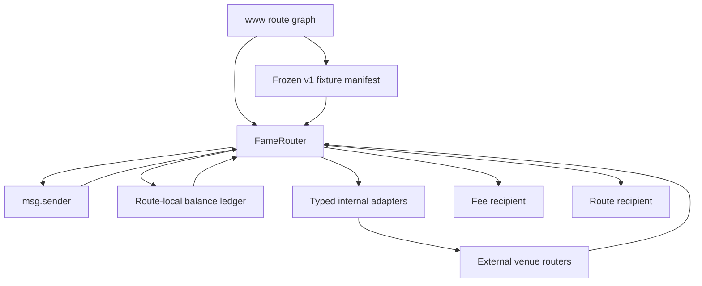
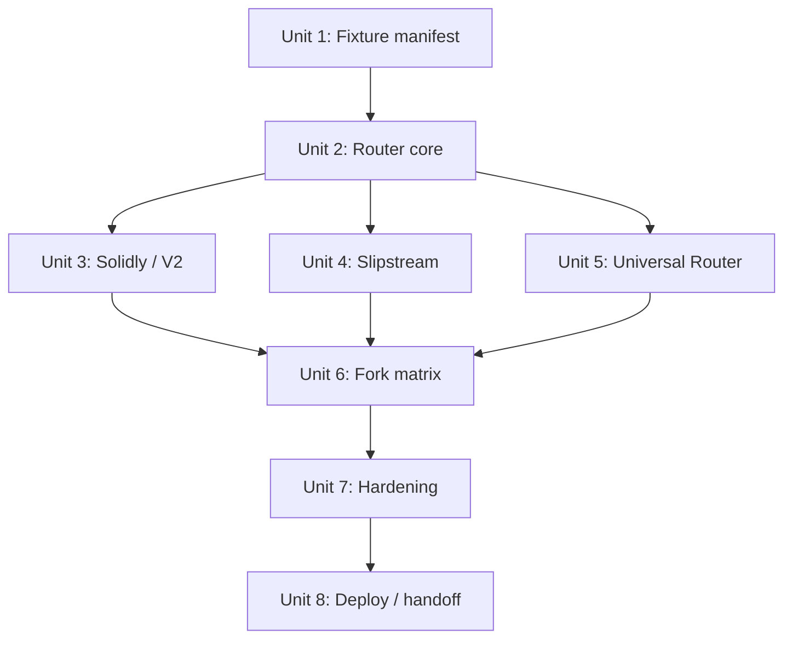

# feat: Build FAME Multi-Leg Router

## Overview

Build a Base-only FAME route executor that accepts offchain-computed exact-input routes from `www`, executes a sequential list of typed legs across the frozen v1 venue universe, enforces route-local balance and slippage invariants, charges the 2222 ppm community fee exactly once on final output, and settles all route-produced assets without stranded funds.

The implementation should be simulation-first. The launch gate is not "one test per venue family"; it is fork coverage for every pool and every production directional route in the frozen v1 fixture manifest. The fixture manifest becomes the contract-side agreement with `www`: every pool fixture must pass metadata/existence validation, and every route fixture must execute on a pinned Base fork before the router is considered launchable.

## Problem Frame

The FAME swap experience needs one execution surface for routes that `www` already discovers across Scale/Equalizer V2, Uniswap V2, Aerodrome Slipstream, Slipstream 2 / Gauge Caps, Uniswap V3, and Uniswap V4. The contract is not a route finder or quote judge. Its job is to custody user input, execute a submitted plan, enforce the route's own minimums, charge the community fee once, and revert atomically if the submitted plan is no longer executable (see origin: `docs/brainstorms/2026-05-11-fame-multi-leg-router-requirements.md`).

Sequential router inputs are suitable for v1 when they are treated as a topologically sorted execution plan, not as the source of route intelligence. `www` can keep a graph of pools and tokens; the contract receives a deterministic `Leg[]` that consumes route-local balances in order. This supports direct, multi-hop, split, and split-then-merge routes while keeping onchain validation auditable. JIT liquidity or quote drift is handled by fresh quoting, deadlines, per-leg minimums, final post-fee minimums, and `ALL` / balance-bps amount modes, not by adding an onchain graph solver.

## Requirements Trace

- R1-R6, R34-R35: Exact-input route execution with typed sequential legs, route-local custody, no onchain route discovery, and `msg.sender` as the only v1 payer.
- R7-R12, R36-R38: Full-venue v1 launch bar across the frozen production route snapshot, including explicit native ETH mode and distinct WETH handling.
- R13-R18: Default 2222 ppm fee, fee cap, initial fee recipient, ownable governance, and coarse venue-family enablement.
- R19-R26, R39-R42: Route-local balance accounting, atomic reverts, no arbitrary external-call routing, rescue controls, reentrancy protection, FAME DN404 skip-NFT behavior, and Universal Router / V4 validation guardrails.
- R27-R33, R43-R47: Foundry and pinned Base fork coverage, all-route/all-pool fixture validation, Base RPC/Basescan config, predeployment live validation, deployed skip-NFT check, and `www` schema / fixture parity.

## Review Update 2026-05-12

Review source: `.context/compound-engineering/ce-review/20260511-193547-router-review/synthesis.md`.

The current branch has a useful router core scaffold, but review confirmed it is not launch-ready. The next implementation work should treat the adapter, fixture, validation, and accounting issues as the route to production rather than as polish.

### Human Review Disposition

- **P1 findings: accepted.** The typed venue adapters, fixture/fork launch gate, and validation path are the highest-priority blockers.
- **P2-4 fail-closed balance accounting: accepted.** Route asset balance reads must not silently return zero when `balanceOf` fails or returns malformed data.
- **P2-5 final settlement with fee-on-transfer tokens: in scope where route execution does not already account for transfer-tax behavior.** Normal venue legs may model fee-on-transfer tokens, but the router still needs either fixture restrictions or delivered-output checks for final settlement when the final asset can under-deliver.
- **P2-6 native ETH leftover refunds: lower priority and partly a caller/integration problem.** Keep it in scope as an integration policy decision, not as a blocker ahead of typed adapters and launch validation.
- **P2-7 schema wire values: clarify for `www`.** This means documenting the Solidity enum integer ordinals, `BalanceBps` denominator/range/rounding, and `All` amount handling so TypeScript/JSON route builders cannot drift from ABI encoding while still submitting schema version `1`.
- **P2-8 route-local accounting hot-path scans: important.** Optimize after fail-closed accounting semantics are chosen, so the optimized path preserves safety.
- **P2-9 deployment venue configuration: important.** Deployment and validation must prove every launch fixture's family/target is configured before go-live.
- **P3 cleanup remains in scope for final cleanup.** Event route identity, unused WETH state, approval clearing policy, future venue enum handling, and balance helper assembly should be handled after the production adapter and validation shape is settled.

### Plan Adjustments

- Replace the current generic `IRouterLegExecutor` adapter scaffold with real typed venue adapters or explicitly split it into a test-only scaffold before any route is considered production-capable.
- Move the fixture manifest from manually synchronized placeholders toward a generated or content-hash-checked source of truth derived from `base-v1-pools.json` and `base-v1-routes.json`.
- Treat the fork matrix as launch-blocking: a nonzero pinned Base block, pool metadata validation, and every production directional route must pass before `isLaunchable()` can return true.
- Make live validation check venue family/target enablement, fixture parity, current Base pool metadata, deployed skip-NFT status, and `www` schema parity. Pinned fork tests remain the deterministic route executability gate.
- Carry the repository environment guidance into all docs and plans: public constants live in `config/fame-public.env`, secrets stay in Doppler, and Foundry aliases such as `base` are preferred over raw RPC URLs.

## Scope Boundaries

- No onchain route search, ranking, quoting, best-price selection, TWAP protection, exact-output routing, limit orders, cross-chain routing, MEV protection, or automated fee conversion.
- No arbitrary calldata execution. All external calls must be reached through typed venue families and constrained adapter payloads.
- No third-party signed payer or delegated payer routes in v1. The route input is funded by `msg.sender`.
- No partial venue launch. A venue family listed in the frozen v1 snapshot blocks launch until its buy/sell fixtures and pool metadata fixtures pass.
- No multisig updates for ordinary `www` route graph changes. The owner controls durable fee and coarse venue-family levers only.

### Deferred to Separate Tasks

- `www` UI implementation: separate work in the `www` repo must submit the final schema, display post-fee minimums, model ETH and WETH distinctly, and maintain fixture parity. This contracts plan creates the ABI, route schema documentation, and fixture manifest that task consumes.
- New post-v1 route families or pools: require a later explicit snapshot promotion, new fixtures, and fork coverage before becoming launch-blocking production routes.

## Context & Research

### Relevant Code and Patterns

- `src/Fame.sol` uses `OwnableRoles`, `SafeTransferLib`, and exposes `setSkipNftForAccount(address,bool)` for FAME DN404 skip behavior.
- `src/DN404.sol` defaults contracts to `getSkipNFT(owner) == true` until explicitly initialized, and `_givePermit2DefaultInfiniteAllowance()` returns false.
- `lib/solady/src/auth/Ownable.sol`, `lib/solady/src/utils/ReentrancyGuard.sol`, and `lib/solady/src/utils/SafeTransferLib.sol` are the local ownership, reentrancy, ETH, and ERC-20 transfer patterns to follow.
- `test/FameLauncher.t.sol` shows the repo's Foundry style for Uniswap-adjacent tests, but the repo has no existing multi-leg router or Base fork fixture matrix.
- `foundry.toml` currently has Sepolia RPC and Etherscan config only; Base RPC and Basescan config must be added in the same style.
- `docs/fame-release-plan.md` already uses Base deployment environment names such as `BASE_RPC`, `BASE_DEPLOYER_PRIVATE_KEY`, `BASE_MULTISIG_ADDRESS`, and Basescan verifier notes.

### Institutional Learnings

- No `docs/solutions/` directory was present, so there are no durable in-repo learnings to incorporate.
- Slack context was not requested for this plan.

### External References

- Foundry fork tests support pinned forks through `createFork` / `createSelectFork`, and Foundry warns that repeated `createSelectFork` calls create independent clean forks. The fixture harness should create and reuse pinned forks deliberately.
- Uniswap Universal Router executes byte command streams with structured inputs; supported commands include `V3_SWAP_EXACT_IN`, `SWEEP`, `WRAP_ETH`, `UNWRAP_WETH`, `BALANCE_CHECK_ERC20`, `V4_SWAP`, and `EXECUTE_SUB_PLAN`. The FAME router should not pass through arbitrary command bytes.
- Permit2 combines signature-transfer and allowance-transfer flows. FAME does not grant Permit2 infinite allowance by default, so the router must own any Permit2 approval flow needed after it has custody.
- Uniswap v4 pool behavior can be extended by hooks attached per pool. V4 route fixtures must validate PoolKey currency ordering, fee or tick spacing, hooks, and hook data boundaries.
- Aerodrome / Solidly-style routers use `Route { from, to, stable, factory }` paths rather than Uniswap V2 `address[]` paths, and Aerodrome Slipstream concentrated pools use tick spacing as the path discriminator.

## Key Technical Decisions

| Decision | Rationale |
|---|---|
| Contract input is a sequential `Leg[]`; `www` keeps the graph. | This covers split and merge routes while avoiding an onchain graph solver and preserving auditable execution order. |
| Use one router contract with internal adapter modules for v1. | Internal adapters reduce deployment and trust surface, keep custody accounting in one place, and can later be extracted if bytecode size or audits demand it. |
| Use a frozen fixture manifest as a launch artifact. | "All routes and all pools" needs machine-checkable coverage. A manifest lets tests fail when a fixture exists without corresponding fork coverage. |
| Charge fee only on route-produced final output. | This keeps split routes explainable and prevents multi-hop or multi-venue routes from being charged multiple times. |
| Treat native ETH as a distinct route asset. | V4 ETH-backed paths cannot be safely modeled as WETH-only without explicit unwrap/wrap and `msg.value` rules. |
| Restrict Universal Router usage to structured V3/V4 flows. | Raw command streams would recreate arbitrary routing risk and weaken custody / fee guarantees. |
| Initial bounds: 16 route legs, 4 hops per venue path, 2048 bytes max venue payload per leg. | These are large enough for the known frozen v1 shapes with margin, while bounding gas and calldata. If the final manifest exceeds them, the snapshot or constants must be revised before implementation. |
| Use scoped router-owned approvals. | After funds enter custody, the router should approve only expected venue targets for the leg amount, clear approvals when practical, and never leave allowance to a target outside the enabled venue family. |

## Open Questions

### Resolved During Planning

- Sequential list vs graph router: use a sequential, topologically sorted execution plan onchain; keep graph discovery in `www`.
- Universal Router adapter shape: accept structured V3/V4 route data or internally constructed command bytes only; reject raw arbitrary Universal Router command payloads.
- Adapter deployment shape: use internal adapter modules and minimal interface files in v1.
- V4 hook metadata policy: the frozen fixture manifest must pin expected PoolKey fields and hook address; schema version `1` rejects non-empty hook data.
- Dust policy: route-local leftovers from successful execution return to `msg.sender`; owner rescue can only move non-route balances outside execution and cannot count toward route-local accounting.
- Bound policy: start with bounded leg, path, and payload sizes, with fixture tests proving all launch routes fit.
- Fork funding policy: each route fixture declares its funding source. Prefer real fork holders, route-acquired balances, or protocol-native funding flows over storage mutation; use direct balance setting only when it preserves the token's invariants. FAME sell fixtures must not bypass DN404 skip-NFT behavior. Prefer 0x499e194d7a106AC1305ed4f96c6CEaAff650462D on a pinned block for testing. Request from user any fundings but wallet contains FAME/WETH/USDC/ETH which are the primary in/out routes (paired with FAME)

### Deferred to Implementation

- Exact pinned Base fork block and deterministic funding accounts: choose during fixture freeze after importing the final `www` production snapshot and confirming liquidity at that block.
- Final Slipstream 2 / Gauge Caps route fixtures: import after the `www` simulator patch lands, then make them launch-blocking fixtures.
- Exact helper and error names: choose while implementing to match bytecode, readability, and Foundry ergonomics.
- Gas and bytecode pressure: if internal adapters exceed practical limits, split pure libraries first; only consider separately deployed adapters after preserving custody invariants.

## Output Structure

```text
src/
  FameRouter.sol
  router/
    FameRouterTypes.sol
    FameRouterAccounting.sol
    adapters/
      SolidlyRouterAdapter.sol
      UniswapV2Adapter.sol
      SlipstreamAdapter.sol
      UniversalRouterAdapter.sol
    interfaces/
      ISolidlyRouter.sol
      IUniswapV2Router02.sol
      ISlipstreamRouter.sol
      IUniversalRouter.sol
      IPermit2.sol
      IWETH9.sol
test/
  router/
    FameRouter.t.sol
    FameRouterForkBase.t.sol
    FameRouterFixtureCoverage.t.sol
    fixtures/
      base-v1-pools.json
      base-v1-routes.json
      FameRouterFixtureManifest.sol
    mocks/
      MockERC20.sol
      MockRouter.sol
      ReentrantToken.sol
script/
  DeployFameRouter.s.sol
  ValidateFameRouterBase.s.sol
docs/
  router/
    fame-router-schema.md
    fame-router-validation.md
```

The tree is a planning shape, not a hard implementation constraint. The implementing agent may collapse or split files if doing so keeps the code simpler while preserving these responsibilities.

## High-Level Technical Design

> *This illustrates the intended approach and is directional guidance for review, not implementation specification. The implementing agent should treat it as context, not code to reproduce.*



Execution shape:

1. Validate deadline, route schema version, leg count, token continuity, venue enablement, native ETH rules, and payload bounds.
2. Pull ERC-20 input from `msg.sender` or require exact `msg.value` for native ETH input.
3. For each leg, calculate its input amount from route-local balance using `EXACT`, `BALANCE_BPS`, or `ALL`.
4. Approve and call the typed venue adapter so produced assets return to router custody.
5. Measure route-local before/after deltas; reject insufficient leg output or unexpected asset continuity.
6. After all legs, compute final route-produced output, charge fee once, transfer net output to `recipient`, and refund route-local non-output leftovers to `msg.sender`.
7. Assert no positive route-local balances remain after settlement.

## Implementation Units

- [x] **Unit 1: Frozen Fixture Manifest And Base Fork Harness**

**Goal:** Establish the launch-blocking fixture manifest and test infrastructure before router behavior depends on it.

**Requirements:** R7-R12, R28-R30, R36-R38, R43, R45.

**Dependencies:** Final route snapshot exported or manually transcribed from current `www` metadata; Slipstream 2 fixtures can be marked expected-pending until the `www` patch lands, but cannot be skipped for launch.

**Files:**
- Create: `test/router/fixtures/base-v1-pools.json`
- Create: `test/router/fixtures/base-v1-routes.json`
- Create: `test/router/fixtures/FameRouterFixtureManifest.sol`
- Create: `test/router/FameRouterFixtureCoverage.t.sol`
- Create: `docs/router/fame-router-validation.md`
- Modify: `foundry.toml`

**Approach:**
- Define pool fixtures separately from route fixtures. Pool fixtures capture token addresses, venue family, pool or factory identity, stable flag / fee / tick spacing / PoolKey / hooks, and expected router addresses. Route fixtures reference pool fixture IDs and define direction, amount, native ETH mode, expected output token, and minimum policy.
- Seed the manifest from the origin route universe: Scale/Equalizer `WETH/FAME`, `USDC/frxUSD/FAME`, `USDC/SCALE/FAME`; standard Slipstream `basedflick/FAME`, `SPX/WETH`, `USDC/frxUSD`, `msUSD/USDC A`, `WETH/msETH`, `ZORA/USDC`, `ZORA/WETH`; Slipstream 2 `msUSD/msETH`, `msUSD/USDC C`; Uniswap V3 `ZORA/USDC`, `ZORA/WETH`; Uniswap V4 `basedflick/ZORA`, `ZORA/ETH`; and the Uniswap V2 direct FAME route from the frozen `www` snapshot.
- Add coverage guards that fail if a pool fixture is not validated by a pool test, or if a route fixture is not executed by a fork test.
- Require each route fixture to declare how test input will be funded on the fork: impersonated holder, acquisition route from a liquid asset, native ETH balance, or an explicitly justified token-specific balance setup.
- Add Base RPC and Basescan config in `foundry.toml` using the repo's existing Sepolia config style and existing Base env names from `docs/fame-release-plan.md`.

**Execution note:** Start with failing fixture coverage tests so missing pools and missing route directions are visible before adapter implementation begins.

**Progress note 2026-05-12:** The fixture files now contain the current production route universe metadata transcribed from `www`, deterministic JSON content hashes, required venue targets, and public config snapshot hash parity. The snapshot is pinned to Base block `45_884_844`, all 19 pool metadata fixtures have PRD-RPC-backed fork coverage, all 19 directional route fixtures execute on the pinned fork, and the manifest is launchable with zero pending launch-blocking fixtures.

**Patterns to follow:**
- `foundry.toml` Sepolia endpoint and Etherscan entries.
- `docs/fame-release-plan.md` Base environment variable names.
- Foundry JSON fixture parsing patterns from `forge-std` if the helper reads JSON at test time.

**Test scenarios:**
- Happy path: every fixture pool ID in `base-v1-pools.json` is reported exactly once by the manifest helper.
- Happy path: every route fixture in `base-v1-routes.json` references only known pool fixture IDs and a known venue family.
- Error path: duplicate pool fixture IDs fail the fixture coverage test.
- Error path: a route fixture that references a missing pool ID fails the fixture coverage test.
- Error path: a route fixture marked launch-blocking without both buy and sell direction coverage for its venue family fails the fixture coverage test.
- Integration: Base fork setup uses one pinned fork block from the manifest and makes that block observable in test assertions.

**Verification:**
- Fixture coverage tests can enumerate all pools and all route fixtures deterministically.
- `foundry.toml` exposes Base RPC and Basescan config without disrupting existing Sepolia workflows.

- [x] **Unit 2: Router Core, Route Schema, Custody, Fee, And Governance**

**Goal:** Implement the route entrypoint, schema validation, route-local accounting, fee settlement, owner controls, and rescue boundaries independent of real venue adapters.

**Requirements:** R1-R6, R13-R24, R34-R35, R39-R40.

**Dependencies:** Unit 1 fixture schema direction; local Solady ownership and reentrancy patterns.

**Files:**
- Create: `src/FameRouter.sol`
- Create: `src/router/FameRouterTypes.sol`
- Create: `src/router/FameRouterAccounting.sol`
- Create: `test/router/FameRouter.t.sol`
- Create: `test/router/mocks/MockERC20.sol`
- Create: `test/router/mocks/MockRouter.sol`
- Create: `docs/router/fame-router-schema.md`

**Approach:**
- Define a versioned route schema with route-level `tokenIn`, `tokenOut`, `amountIn`, `minAmountOutAfterFee`, `recipient`, `deadline`, and typed legs.
- Define asset identity for native ETH separately from ERC-20 addresses. Reject nonzero `msg.value` unless the route starts with native ETH, and require exact `msg.value == amountIn` for native ETH input.
- Track route-local balances as deltas from pre-route baselines. `EXACT`, `BALANCE_BPS`, and `ALL` consume only route-produced or route-funded balances, not ambient contract balances.
- Fee rate starts at 2222 ppm, uses a 1,000,000 denominator, caps at 10,000 ppm, and charges only final route-produced output after all legs pass.
- Venue enablement is coarse by family. Ordinary pool additions in `www` do not require owner updates unless they introduce a new family or disabled family.
- Rescue is owner-only, blocked during execution, and measured outside route-local accounting.
- Approval helpers should approve the exact leg spend to the expected venue target, clear approval after use when practical, and reject any payload that attempts to spend through a target not selected by the active venue family.

**Execution note:** Implement new domain behavior test-first for fee, custody, native ETH validation, and rescue invariants.

**Patterns to follow:**
- `lib/solady/src/auth/Ownable.sol` for ownable behavior.
- `lib/solady/src/utils/ReentrancyGuard.sol` for `nonReentrant`.
- `lib/solady/src/utils/SafeTransferLib.sol` and `src/Fame.sol` transfer patterns.

**Test scenarios:**
- Happy path: ERC-20 route with mock leg output charges 2222 ppm once and transfers fee and net output to the expected recipients.
- Happy path: split-then-merge mock route produces final output from two legs and charges fee once on merged output.
- Happy path: owner updates fee recipient and fee rate within the cap and emits events.
- Edge case: zero fee recipient is rejected at deployment and update time.
- Edge case: fee cap rejects values above 10,000 ppm and accepts 10,000 ppm.
- Edge case: `BALANCE_BPS` rounding cannot consume more than route-local available balance.
- Error path: expired deadline reverts before pulling input.
- Error path: malformed token continuity, empty legs, too many legs, or oversized payload reverts.
- Error path: non-ETH route with nonzero `msg.value` reverts.
- Error path: ETH-starting route with mismatched `msg.value` reverts.
- Error path: unsupported or disabled venue family reverts.
- Error path: approval target outside the selected venue family is rejected before any external swap.
- Error path: leg output below `minAmountOut` reverts atomically with no fee transfer.
- Error path: final post-fee output below `minAmountOutAfterFee` reverts atomically with no fee transfer.
- Integration: successful route refunds non-output route-local leftovers to `msg.sender` and leaves no positive route-local balances.
- Integration: ambient donated balances cannot satisfy leg minimums, final minimums, `ALL`, or `BALANCE_BPS` consumption.

**Verification:**
- Core unit tests prove route schema, custody, fee, governance, and rescue behavior without relying on external venue routers.

- [x] **Unit 3: Solidly / Scale-Equalizer And Uniswap V2 Adapters**

**Goal:** Add typed execution for Solidly-style `Route[]` paths and Uniswap V2 direct or path-based swaps.

**Requirements:** R7-R8, R19-R22, R27-R29, R35, R40.

**Dependencies:** Unit 2 core accounting and adapter dispatch.

**Files:**
- Create: `src/router/adapters/SolidlyRouterAdapter.sol`
- Create: `src/router/adapters/UniswapV2Adapter.sol`
- Create: `src/router/interfaces/ISolidlyRouter.sol`
- Create: `src/router/interfaces/IUniswapV2Router02.sol`
- Modify: `src/FameRouter.sol`
- Modify: `test/router/FameRouter.t.sol`
- Create: `test/router/FameRouterForkBase.t.sol`

**Approach:**
- Encode Solidly path data as typed hops with `from`, `to`, `stable`, and optional factory where the venue requires it. Do not treat Scale/Equalizer as a Uniswap V2 clone.
- Encode Uniswap V2 path data separately as address paths and expected router/factory identity from fixture metadata.
- Router-owned approvals target only the expected venue router after custody begins. `www` only needs the user approval to transfer input into `FameRouter`.
- All adapter calls must set `to` / recipient to the router so the core can measure deltas and perform final settlement.

**Execution note:** Add fork characterization for each Scale/Equalizer and Uniswap V2 fixture route as the adapter becomes executable.

**Patterns to follow:**
- Aerodrome / Solidly `IRouter.Route` shape from official router interfaces.
- Existing vendored Uniswap V2 core and local SafeTransferLib transfer practices.

**Test scenarios:**
- Happy path: Solidly direct `WETH/FAME` buy and sell fixture executes on a pinned Base fork.
- Happy path: Solidly multi-hop `USDC/frxUSD/FAME` route executes on a pinned Base fork.
- Happy path: Solidly multi-hop `USDC/SCALE/FAME` route executes on a pinned Base fork.
- Happy path: Uniswap V2 FAME route from the frozen snapshot executes buy and sell on a pinned Base fork.
- Error path: Solidly stable flag mismatch reverts or fails leg minimum without counting ambient balance.
- Error path: adapter payload targeting a router outside the fixture's venue family is rejected.
- Integration: split route across Solidly and Uniswap V2 produces merged final output and one fee.
- Integration: every Solidly and Uniswap V2 pool fixture has metadata validation and route execution coverage.

**Verification:**
- Unit and fork tests cover all v1 Solidly / Scale-Equalizer and Uniswap V2 pools and routes from the manifest.

- [x] **Unit 4: Aerodrome Slipstream And Slipstream 2 Adapters**

**Goal:** Add concentrated-liquidity adapter support for standard Aerodrome Slipstream and Slipstream 2 / Gauge Caps as distinct venue configurations.

**Requirements:** R7, R9, R19-R22, R27-R29, R35, R40.

**Dependencies:** Unit 2 core accounting; Unit 1 final Slipstream and Slipstream 2 pool fixtures.

**Files:**
- Create: `src/router/adapters/SlipstreamAdapter.sol`
- Create: `src/router/interfaces/ISlipstreamRouter.sol`
- Modify: `src/FameRouter.sol`
- Modify: `test/router/FameRouter.t.sol`
- Modify: `test/router/FameRouterForkBase.t.sol`
- Modify: `test/router/fixtures/base-v1-pools.json`
- Modify: `test/router/fixtures/base-v1-routes.json`

**Approach:**
- Treat standard Slipstream and Slipstream 2 / Gauge Caps as separate venue families or separate configured variants under one adapter, because they use different router/factory addresses.
- Use `int24 tickSpacing` as the concentrated path discriminator. Do not substitute Uniswap V3 `uint24 fee` semantics.
- Support exact-input single-pool and packed multi-hop paths only where the fixture manifest defines the path and expected tick spacing sequence.
- Require produced assets to return to router custody. Reject payloads that set an external recipient.

**Execution note:** Keep all route fixtures pinned. If a live pool moves out of executable range at the selected block, choose a new fixture block or fixture amount during the fixture freeze rather than weakening minimums in code.

**Patterns to follow:**
- Aerodrome docs for concentrated liquidity tick spacing.
- Slipstream periphery interface shape from Aerodrome / Velodrome sources.

**Test scenarios:**
- Happy path: standard Slipstream `basedflick/FAME` buy and sell executes on a pinned Base fork.
- Happy path: standard Slipstream `SPX/WETH`, `USDC/frxUSD`, `msUSD/USDC A`, `WETH/msETH`, `ZORA/USDC`, and `ZORA/WETH` pool fixtures each pass metadata validation and route execution where included in the frozen route set.
- Happy path: Slipstream 2 `msUSD/msETH` and `msUSD/USDC C` buy and sell fixtures execute through the Gauge Caps router/factory configuration.
- Error path: non-tuple Slipstream 2 router encoding is not accepted as a router execution payload.
- Error path: tick spacing mismatch is rejected by metadata validation or fails the leg minimum without consuming ambient balance.
- Error path: standard Slipstream fixture submitted to Slipstream 2 router config, or vice versa, is rejected.
- Integration: every Slipstream and Slipstream 2 pool fixture has metadata validation and every route fixture has execution coverage.

**Verification:**
- Pinned Base fork tests prove all launch-blocking Aerodrome concentrated pools and routes from the manifest execute or fail for the expected reason.

**Progress note 2026-05-12:** The adapter now uses the Aerodrome exact-input-single shape with `int24 tickSpacing`, validates the target router's live factory, and pinned Base fork tests execute the frozen standard Slipstream `basedflick <-> FAME` route plus the Slipstream 2 `msUSD <-> msETH` and `msUSD <-> USDC C` routes. Other Slipstream pools remain metadata fixtures only unless the frozen route manifest adds directional routes for them.

- [x] **Unit 5: Universal Router V3 / V4 Adapter And Native ETH Settlement**

**Goal:** Add constrained Universal Router execution for Uniswap V3 and Uniswap V4 paths, including explicit native ETH handling for V4 ETH-backed routes.

**Requirements:** R10-R12, R19-R22, R26, R30, R38, R40-R42.

**Dependencies:** Unit 2 native ETH accounting; Unit 1 V3/V4 PoolKey and route fixtures.

**Files:**
- Create: `src/router/adapters/UniversalRouterAdapter.sol`
- Create: `src/router/interfaces/IUniversalRouter.sol`
- Create: `src/router/interfaces/IPermit2.sol`
- Create: `src/router/interfaces/IWETH9.sol`
- Modify: `src/FameRouter.sol`
- Modify: `test/router/FameRouter.t.sol`
- Modify: `test/router/FameRouterForkBase.t.sol`
- Modify: `test/router/fixtures/base-v1-pools.json`
- Modify: `test/router/fixtures/base-v1-routes.json`

**Approach:**
- Accept structured V3 exact-input data and internally construct only the needed Universal Router V3 swap flow. ERC-20 Universal Router input must be funded from router custody and cannot rely on FAME Permit2 default infinite allowance.
- Accept structured V4 exact-input data with PoolKey and direction. Validate PoolKey currency ordering, native ETH currency identity, fee or tick spacing, reject non-empty hook data, and require fixture-pinned hook addresses in the pinned fork manifest before execution.
- Permit only the minimal command/action set required for v3/v4 exact-input swaps and necessary wrap/unwrap settlement. Reject raw commands, partial-fill allow-revert flags, subplans, arbitrary transfers, arbitrary sweeps, and position-manager commands.
- For native ETH route input, require exact `msg.value`. For later native ETH legs, fund them only from route-local assets produced earlier, such as WETH unwrap performed by the router.
- Keep Universal Router recipient and payer semantics constrained so all intermediate and final output returns to the FAME router for fee settlement.

**Execution note:** Characterize Universal Router custody behavior with small fork tests before broadening to all V3/V4 route fixtures.

**Patterns to follow:**
- Uniswap Universal Router command documentation for command IDs and payment commands.
- Uniswap Permit2 docs for allowance-transfer behavior.
- Uniswap v4 docs for hooks and v4 swap routing concepts.

**Test scenarios:**
- Happy path: Uniswap V3 `ZORA/USDC` and `ZORA/WETH` buy and sell fixtures execute through the Universal Router on a pinned Base fork.
- Happy path: Uniswap V4 `basedflick/ZORA` buy and sell fixtures execute with the fixture-pinned PoolKey and hook address.
- Happy path: Uniswap V4 `ZORA/ETH` native ETH fixture executes and settles native ETH or WETH exactly as the route declares.
- Edge case: V4 native ETH starting route requires `msg.value == amountIn` and no ERC-20 approval assumption.
- Edge case: later native ETH leg can only use route-local assets from previous legs.
- Error path: raw Universal Router command bytes are rejected.
- Error path: `EXECUTE_SUB_PLAN`, position-manager commands, partial-fill allow-revert flags, arbitrary `TRANSFER`, or arbitrary `SWEEP` are rejected.
- Error path: V4 PoolKey currency, fee, tick spacing, or hook data boundary mismatch reverts before external execution; hook address drift fails pinned/live fixture metadata validation.
- Error path: missing router-owned Permit2 approval for an ERC-20 Universal Router leg cannot be hidden by FAME default allowance.
- Integration: all V3/V4 pool fixtures have metadata validation and all route fixtures execute on the pinned Base fork.

**Verification:**
- Universal Router execution is constrained to the fixture-backed V3/V4 exact-input shapes and preserves router custody through final fee settlement.

**Progress note 2026-05-12:** Universal Router V3 and V4 route fixtures now execute through constrained structured payloads against the pinned Base fork. Coverage includes V3 `ZORA/USDC` and `ZORA/WETH` buy/sell, V4 `basedflick/ZORA` buy/sell with the fixture-pinned hook, and the native ETH `ZORA/ETH` route. The PRD Doppler fork run passed all 22 fork tests, including the 19-route execution table.

- [x] **Unit 6: All-Routes / All-Pools Fork Matrix**

**Goal:** Turn fixture coverage into the formal launch gate: every pool fixture validates and every directional route fixture executes on a pinned Base fork.

**Requirements:** R7-R12, R27-R31, R36-R38, R43-R45.

**Dependencies:** Units 3-5 venue adapters; Unit 1 manifest; Unit 2 core settlement.

**Files:**
- Modify: `test/router/FameRouterForkBase.t.sol`
- Modify: `test/router/FameRouterFixtureCoverage.t.sol`
- Modify: `test/router/fixtures/FameRouterFixtureManifest.sol`
- Modify: `test/router/fixtures/base-v1-pools.json`
- Modify: `test/router/fixtures/base-v1-routes.json`
- Modify: `docs/router/fame-router-validation.md`

**Approach:**
- Separate pool metadata tests from route execution tests. Pool tests validate code exists at expected targets, factories return expected pools, pool token ordering matches metadata, stable flags / fees / tick spacing / PoolKey / hooks match, and expected router addresses are present.
- Route tests execute each fixture direction with deterministic funding and approvals. Every production route in the manifest must appear in the execution coverage table.
- Funding must be deterministic and token-aware. FAME sell fixtures should use a real FAME holder, a controlled transfer from a valid fork source, or another approach that preserves DN404 accounting; avoid direct storage balance mutation unless the fixture proves mirror and skip-NFT invariants remain valid.
- Include at least one split route, one multi-hop route, one split-then-merge route, one native ETH V4 route, and failed-swap atomicity scenarios as named fixtures.
- Add a manifest-level count assertion so adding a route or pool fixture without test coverage fails immediately.
- Keep pinned fork regression separate from fresh predeployment validation. Pinned tests prove regressions; live validation proves current Base state still matches before deployment.

**Execution note:** Do not mark a route family launchable until both its pool metadata fixture and buy/sell execution fixtures pass on the pinned fork.

**Patterns to follow:**
- Foundry fork testing with a single selected fork per pinned block.
- Existing repo convention of Foundry-native tests rather than external test runners.

**Test scenarios:**
- Happy path: every pool fixture across Scale/Equalizer, Uniswap V2, standard Slipstream, Slipstream 2, Uniswap V3, and Uniswap V4 passes metadata validation.
- Happy path: every route fixture across all frozen venue families executes in its declared direction and produces at least its post-fee minimum.
- Happy path: each venue family has at least one buy and one sell route fixture.
- Happy path: split route charges the fee once after merged final output.
- Happy path: multi-hop route charges the fee once after final output.
- Happy path: native ETH V4 route settles ETH/WETH according to route asset identity and leaves no route-local value.
- Error path: failed external swap reverts atomically and leaves no route-local user funds or fee transfer.
- Error path: manifest route count and executed route count mismatch fails the coverage test.
- Error path: manifest pool count and validated pool count mismatch fails the coverage test.
- Integration: changing a fixture pool address, tick spacing, stable flag, PoolKey, or hook to an incorrect value fails on the pinned fork.

**Verification:**
- A reviewer can inspect the manifest and test output to confirm every launch-blocking route and pool has fork evidence.

**Progress note 2026-05-12:** `FameRouterForkBase.t.sol` now separates pool metadata validation from deterministic route execution and iterates every covered route ID from `FameRouterFixtureManifest`. `FameRouterFixtureCoverage.t.sol` asserts JSON hash parity, count parity, pool-reference integrity, zero pending launch blockers, and `isLaunchable() == true`.

- [x] **Unit 7: Security, Edge-Case, And Invariant Hardening**

**Goal:** Add adversarial tests for custody, reentrancy, approval, arbitrary-call, leftover, and FAME DN404 edge cases.

**Requirements:** R19-R26, R31, R39-R42, R44.

**Dependencies:** Units 2-6.

**Files:**
- Modify: `test/router/FameRouter.t.sol`
- Modify: `test/router/FameRouterForkBase.t.sol`
- Create: `test/router/mocks/ReentrantToken.sol`
- Modify: `src/FameRouter.sol`
- Modify: `src/router/FameRouterAccounting.sol`
- Modify: `docs/router/fame-router-validation.md`

**Approach:**
- Treat route-local accounting as the primary safety invariant: no ambient balances satisfy user checks, no route-local leftovers remain after success, and failed routes revert all route-local effects.
- Exercise reentrancy around ERC-20 callbacks, fee transfer, rescue, and settlement.
- Exercise malicious adapter payloads that attempt external recipients, wrong routers, wrong Universal Router commands, wrong V4 hooks, or unexpected native ETH.
- Validate FAME DN404 behavior on the deployed router address and document the launch step for explicit skip-NFT setting if the default contract behavior is ever insufficient.

**Execution note:** Add negative tests as first-class launch blockers, not as optional audit polish.

**Patterns to follow:**
- `src/DN404.sol` skip-NFT and Permit2 behavior.
- Solady `ReentrancyGuard`.

**Test scenarios:**
- Happy path: deployed router address has `Fame.getSkipNFT(router) == true` on fork after deployment setup.
- Happy path: explicit FAME skip-NFT setting by authorized account keeps `getSkipNFT(router) == true`.
- Edge case: output amount exactly equal to `minAmountOutAfterFee` succeeds.
- Edge case: fee rounding on small final output does not underflow and does not overcharge.
- Edge case: successful route with non-output intermediate dust refunds dust to `msg.sender`.
- Error path: malicious token or mock router attempts reentrancy during execution and is rejected.
- Error path: owner rescue during execution is impossible.
- Error path: owner rescue cannot cause later routes to count rescued or donated assets as route-local output.
- Error path: adapter payload attempts an external recipient and is rejected.
- Error path: Universal Router payload attempts unsupported commands or payer/recipient semantics and is rejected.
- Error path: FAME Permit2 default infinite allowance is false and router behavior does not assume otherwise.
- Integration: failed route on fork leaves no route-local ERC-20, native ETH, or FAME NFT mirror balance on the router.

**Verification:**
- Security tests demonstrate the router is a constrained settlement layer, not a general-purpose external-call router.

**Progress note 2026-05-12:** Router tests cover fail-closed malformed balance reads, delivered recipient minimums for taxed final outputs, reentrancy attempts during execution/rescue, target allowlists, raw Universal Router command rejection, external-recipient rejection, V4 amount and PoolKey constraints, Permit2 allowance clearing, and route-local settlement without stranded balances.

- [x] **Unit 8: Deployment, Live Validation, And `www` Handoff Artifacts**

**Goal:** Add deployment and predeployment validation artifacts that prove the pinned fixtures still match live Base state and give `www` the contract schema it must implement.

**Requirements:** R16, R32-R33, R43-R47.

**Dependencies:** Units 1-7; final fee recipient and community Base multisig address available in deployment environment.

**Files:**
- Create: `script/DeployFameRouter.s.sol`
- Create: `script/ValidateFameRouterBase.s.sol`
- Modify: `docs/router/fame-router-schema.md`
- Modify: `docs/router/fame-router-validation.md`
- Modify: `docs/fame-release-plan.md`

**Approach:**
- Deployment script sets the initial fee recipient to `0xC952C53D8B63919e372caa2E6FEe605ee24E4D3D`, deployer as initial owner, Base venue addresses, and default venue enablement.
- Live validation script refreshes current Base metadata for every pool fixture, checks the deployed router's `getSkipNFT(router) == true`, checks fee parameters, and records whether `www` fixture parity is current. Deterministic route execution evidence comes from the pinned fork matrix.
- Ownership transfer to the community Base multisig happens only after pinned fork tests, live validation, deployed skip-NFT validation, and `www` integration validation pass.
- Schema docs define route versioning, venue family enum, amount modes, native ETH identity, fee calculation expectations, and rejected payload shapes for frontend parity.

**Execution note:** Treat deployment and ownership transfer as separate operational milestones. The deployer can own the router during validation; the multisig owns it only after `www` is production-ready.

**Patterns to follow:**
- `script/BaseDeployLaunch.sol` for Base deployment address style.
- `docs/fame-release-plan.md` for existing Base operational environment variables and Basescan verifier notes.

**Test scenarios:**
- Happy path: deploy script initializes fee recipient, fee ppm, owner, WETH/native ETH config, and venue-family enablement as expected.
- Happy path: live validation reports every pool fixture from the manifest and confirms the route fixture snapshot hash matches the pinned execution matrix.
- Happy path: live validation proves deployed router `getSkipNFT(router) == true`.
- Error path: validation fails if current Base metadata differs from a pinned pool fixture.
- Error path: pinned fork validation fails if a route fixture no longer executes above its minimum at the frozen block.
- Error path: validation fails if `www` schema version or fixture snapshot hash does not match the contract-side manifest.
- Integration: ownership transfer checklist requires pinned fork pass, live validation pass, `www` route submission pass, and skip-NFT pass before transfer.

**Verification:**
- Deployment and validation docs make the go/no-go state explicit and prevent ownership transfer before all contract and frontend gates pass.

**Progress note 2026-05-12:** Deployment and validation scripts configure and check the manifest-required venue family/target allowlist, fee recipient, fee ppm, optional owner, chain ID, current Base pool metadata, schema version, fixture snapshot hash, launchability, and deployed FAME skip-NFT status. Public constants live in `config/fame-public.env`; PRD Doppler supplies `RPC_URL`, mapped to `BASE_RPC` for pinned Base fork verification.

## Implementation Unit Dependencies



## System-Wide Impact

- **Interaction graph:** `www` produces the route plan; `FameRouter` owns custody and settlement; adapters constrain external venue calls; Foundry fixtures prove parity; deployment validation checks live Base before handoff.
- **Error propagation:** Any validation error, external venue failure, insufficient output, or settlement failure reverts the full route before fee payment. Adapter errors should remain debuggable without letting unknown external calls proceed.
- **State lifecycle risks:** Route execution should not persist per-route state after the call. Approvals may persist to venue routers, so approval targets must be constrained by venue family and tested.
- **Approval lifecycle:** Router-owned approvals are part of the custody surface. The implementation should prefer exact per-leg approvals with post-call clearing where practical, and tests must prove no allowance is ever granted to an unexpected venue target.
- **API surface parity:** The ABI, route schema docs, and fixture manifest are public contracts with `www`. Schema version mismatch is a launch blocker.
- **Integration coverage:** Unit tests alone are insufficient. Every production route and pool requires pinned Base fork evidence, plus fresh predeployment validation.
- **Unchanged invariants:** `www` remains responsible for route discovery and quote quality. The multisig does not approve every route graph update. Existing FAME token behavior is not changed by this router.

## Risks & Dependencies

| Risk | Likelihood | Impact | Mitigation |
|---|---:|---:|---|
| Fixture drift between `www` and contracts | Medium | High | Use checked-in pool and route manifests, schema versioning, fixture snapshot hash, and predeployment live validation. |
| Fork tests become brittle as liquidity moves | Medium | Medium | Pin block numbers for regressions and use a separate fresh validation script for live state. |
| Universal Router command surface is too broad | Medium | High | Accept structured V3/V4 data, construct commands internally, and reject arbitrary command bytes and unsupported commands. |
| Native ETH / WETH confusion strands value | Medium | High | Model native ETH as a distinct route asset, test `msg.value` rules, and include V4 ETH route fixtures. |
| Route-local accounting accidentally uses ambient balances | Medium | High | Baseline balances before execution and tests with donated dust, `ALL`, and `BALANCE_BPS`. |
| Router leaves standing approval to a bad or compromised target | Medium | High | Approve only expected venue targets for scoped amounts, clear where practical, and test target rejection and allowance lifecycle. |
| Bytecode size grows from all adapters | Medium | Medium | Keep adapters as small internal modules first, split libraries if needed, and consider deployed adapters only after preserving custody invariants. |
| FAME DN404 mirror NFT side effects | Low | Medium | Verify `getSkipNFT(router) == true` on fork and in deployment validation; explicitly set skip if required. |
| Slipstream 2 fixture not ready | Medium | High | Keep it launch-blocking until the corrected `www` simulator metadata lands or the v1 snapshot is explicitly revised. |

## Phased Delivery

### Phase 1: Contract Skeleton And Evidence Harness

- Unit 1 and Unit 2 land the manifest, Base config, route schema, accounting, fee, governance, and mock-backed tests.

### Phase 2: Venue Execution And Full Fork Coverage

- Units 3, 4, 5, and 6 add venue adapters and require every frozen pool and route fixture to pass pinned Base fork validation.

### Phase 3: Launch Hardening And Handoff

- Units 7 and 8 add adversarial coverage, deployment scripts, live validation, docs, and the `www` schema handoff needed before ownership transfer.

## Success Metrics

- Every pool fixture in the frozen v1 manifest has a passing metadata validation test.
- Every production directional route fixture in the frozen v1 manifest has a passing pinned Base fork execution test.
- Split and multi-hop routes charge the 2222 ppm fee exactly once on final output.
- Failed route execution pays no fee and leaves no route-local ERC-20, native ETH, or FAME NFT balance on the router.
- Deployed router validation proves `getSkipNFT(router) == true` before any FAME route family is enabled.
- `www` can generate schema-compatible routes and display post-fee minimums from the same fee parameters.

## Alternative Approaches Considered

- Onchain graph router: rejected for v1. It increases gas, attack surface, and audit complexity while not solving JIT liquidity uncertainty. Offchain graph search plus onchain deterministic settlement is enough for the target use cases.
- Raw Universal Router passthrough: rejected. It would outsource too much custody and payment logic to arbitrary command bytes.
- Separately deployed adapters from day one: deferred. They may help bytecode size later, but a single custody domain is safer for v1.
- Partial venue v1: rejected by the origin requirements. Full-venue coverage is the product bar unless the frozen snapshot is explicitly revised.

## Threat Model Focus

- Malicious route payload redirects funds to an external recipient: typed adapters must constrain router targets, recipients, payers, and Universal Router commands.
- Ambient or donated balances satisfy user minimums: route-local deltas must be measured from pre-route baselines and tested with dust already in the router.
- JIT liquidity or pool movement invalidates a quote: deadlines, per-leg minimums, final post-fee minimums, pinned regression fixtures, and fresh live validation are the mitigation.
- Native ETH / WETH confusion strands value: ETH is a distinct route asset with explicit `msg.value`, wrap, unwrap, refund, and settlement tests.
- FAME DN404 side effects mint or retain mirror NFTs: fork tests and deployment validation must prove `getSkipNFT(router) == true` and no FAME NFT mirror balance remains.

## Documentation / Operational Notes

- `docs/router/fame-router-schema.md` should be the contract/frontend integration reference for route versioning, amount modes, venue payloads, native ETH identity, and fee math.
- `docs/router/fame-router-validation.md` should contain the fixture freeze process, fixture funding sources, pinned fork expectations, live validation checklist, approval policy, skip-NFT check, and ownership transfer gate.
- `docs/fame-release-plan.md` should link to the router validation checklist rather than duplicating it.
- Basescan verification should follow the existing custom verifier note style already present in `docs/fame-release-plan.md`.

## Sources & References

- **Origin document:** [docs/brainstorms/2026-05-11-fame-multi-leg-router-requirements.md](docs/brainstorms/2026-05-11-fame-multi-leg-router-requirements.md)
- **Ideation source:** [docs/ideation/2026-05-10-fame-multi-leg-router-ideation.md](docs/ideation/2026-05-10-fame-multi-leg-router-ideation.md)
- **Local patterns:** `src/Fame.sol`, `src/DN404.sol`, `foundry.toml`, `docs/fame-release-plan.md`, `lib/solady/src/auth/Ownable.sol`, `lib/solady/src/utils/ReentrancyGuard.sol`, `lib/solady/src/utils/SafeTransferLib.sol`
- **Foundry fork testing:** https://getfoundry.sh/forge/fork-testing
- **Foundry `createSelectFork`:** https://getfoundry.sh/cheatcodes/create-select-fork
- **Uniswap Universal Router overview:** https://developers.uniswap.org/docs/protocols/universal-router/overview
- **Uniswap Universal Router commands:** https://developers.uniswap.org/docs/protocols/universal-router/concepts/commands
- **Uniswap Permit2 overview:** https://developers.uniswap.org/docs/protocols/permit2/overview
- **Uniswap Permit2 allowance transfer:** https://developers.uniswap.org/docs/protocols/permit2/concepts/allowance-transfer
- **Uniswap v4 hooks:** https://developers.uniswap.org/docs/protocols/v4/concepts/hooks
- **Uniswap v4 swapping:** https://developers.uniswap.org/docs/protocols/v4/guides/swapping/swapping
- **Aerodrome liquidity and tick spacing docs:** https://github.com/aerodrome-finance/docs/blob/main/content/liquidity.mdx
- **Aerodrome router `Route` interface:** https://github.com/aerodrome-finance/contracts/blob/main/contracts/interfaces/IRouter.sol
- **Velodrome / Aerodrome SDK graph and MixedRouteQuoter notes:** https://github.com/velodrome-finance/docs/blob/main/content/sdk.mdx
