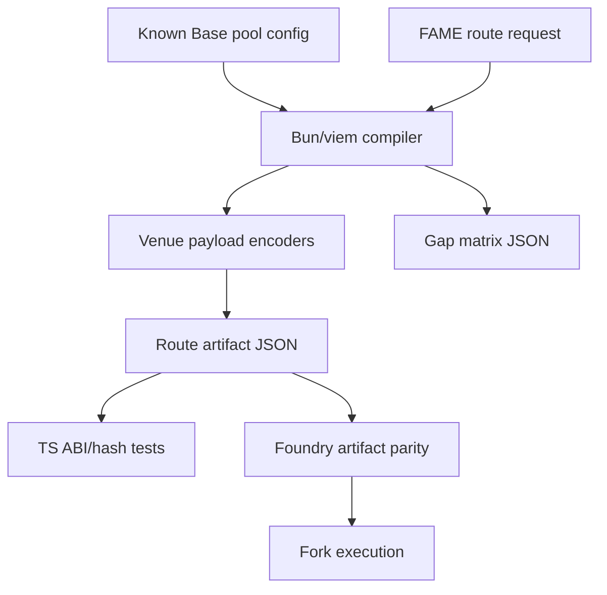
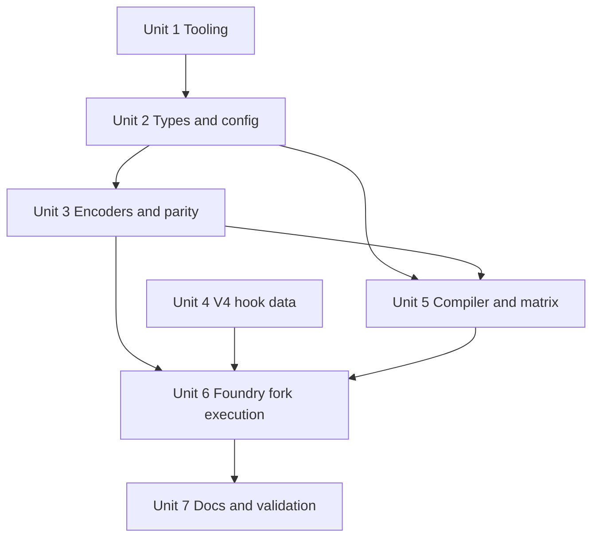

# feat: FAME Route Solver Fork Matrix

## Overview

Build a focused Bun/viem TypeScript reference implementation that compiles known FAME route requests into exact `FameRouterTypes.Route` artifacts, then prove those artifacts with ABI/hash parity and pinned Base fork execution.

This plan treats the TypeScript compiler as the source of truth for new route evidence. Solidity tests may reconstruct in-memory structs for execution, but they must compare against TypeScript-produced `abiEncodedRoute` and `routeHash` before calling `FameRouter.executeRoute`.

## Problem Frame

The router contract now has typed production adapters, custody accounting, final-output fee settlement, and a launchable Base fixture manifest. Current fork coverage executes 19 directional fixtures, but those fixtures are mostly single-route entries rebuilt inside Solidity helper code. The next risk is the offchain integration boundary: whether TypeScript can generate exact route payloads for FAME<->USDC/WETH/ETH, including composed, split, split-then-merge, native ETH/WETH, V3/V4, and hooked V4 routes (see origin: `docs/brainstorms/2026-05-12-fame-route-solver-fork-matrix-requirements.md`).

## Requirements Trace

- R1-R8. Compile from explicit supported config, cover FAME<->USDC/WETH/ETH where viable, stay exact-input, model ETH/WETH distinctly, and reject unsupported schema or venue cases.
- R9-R13. Mirror all production venue families in TypeScript, support non-empty V4 hook data for configured hooked pools, and prove ABI/hash parity with Solidity.
- R14-R17. Add a focused Bun TypeScript harness with strict route types, separate pure tests from RPC-backed checks, and emit reviewable debug artifacts.
- R18-R24. Promote composed, split, split-then-merge, and FAME-facing ETH/WETH fork routes to first-class evidence using TS-generated artifacts as the source of truth.
- R25-R28. Generate a route gap matrix without weakening the existing launchable manifest gate.

## Scope Boundaries

- No dynamic pool discovery.
- No price-first best-route engine.
- No exact-output routing.
- No frontend UI work.
- No backend signer, route authorization service, or API surface.
- No full contracts repo migration into a TypeScript monorepo.
- No wholesale port of the adjacent `fleet` reference repo; only reuse its relevant V3/V4 swap encoding, quoting, and hook-data lessons.
- No weakening of router custody, fee, manifest, or launch-gate requirements.

### Deferred to Separate Tasks

- Dynamic route ranking and price optimization: future solver iteration after artifact correctness is proven.
- `www` integration: separate frontend/application work once the reference compiler and fork matrix are stable.

## Context & Research

### Relevant Code and Patterns

- `src/router/FameRouterTypes.sol` defines schema version `1`, `VenueFamily`, `AmountMode`, `Leg`, and `Route`.
- `src/FameRouter.sol` computes `hashRoute(route)` as `keccak256(abi.encode(route))`, validates `msg.value`, dispatches typed adapters, charges the fee once, and refunds route-local leftovers.
- `src/router/adapters/UniversalRouterAdapter.sol` already models structured V3/V4 Universal Router payloads, Permit2 approval clearing, and native ETH call value. It currently rejects all non-empty V4 `hookData`; this is stale and must change.
- `test/router/FameRouter.t.sol` has the matching stale `test_UniversalRouterRejectsV4HookData` coverage.
- `test/router/FameRouterForkBase.t.sol` executes the launchable Base fixture set and already parses JSON fixture fields, but it rebuilds route structs and payloads in Solidity helpers.
- `test/router/fixtures/base-v1-pools.json`, `test/router/fixtures/base-v1-routes.json`, and `test/router/fixtures/FameRouterFixtureManifest.sol` are the current fixture snapshot.
- `test/router/FameRouterFixtureCoverage.t.sol` enforces manifest counts, JSON hashes, route coverage IDs, and pool-reference integrity.
- `docs/router/fame-router-schema.md` and `docs/router/fame-router-validation.md` are the public schema and launch-gate docs that must stay aligned.
- `package.json` has `typescript`, `ts-node`, and `viem`, but no focused Bun route-solver harness.
- `wagmi.config.ts` generates `js/wagmi/generated.ts` from Foundry, but router contracts are not currently included in the generated ABI surface.
- Adjacent reference repo: `fleet`. Paths prefixed with `fleet:` below are relative to that user-provided local reference repo.
- `fleet:packages/server/src/services/v4SwapEncoder.ts` and `fleet:packages/server/src/services/v4Quoter.ts` provide useful pure viem references for V4 command/action encoding, hook data, native ETH mapping, and quote failure decoding.

### Institutional Learnings

- `docs/solutions/workflow-issues/public-config-doppler-foundry-aliases-2026-05-12.md` reinforces the required split between public config and Doppler secrets. Pure TS tests must not require RPC; RPC-backed validation must follow the repo's Doppler/Foundry alias pattern.

### External References

- Uniswap v4 swap docs describe Universal Router as the recommended v4 swap entrypoint, with `V4_SWAP`, `SWAP_EXACT_IN_SINGLE`, `SETTLE_ALL`, and `TAKE_ALL` action sequencing.
- Uniswap v4 routing docs describe Universal Router command/input pairing and v4 routing through the PoolManager abstraction.
- viem docs support ABI parameter encoding, function calldata encoding, and `keccak256` hashing needed for route artifact parity.
- Bun docs confirm the built-in test runner supports TypeScript test files, filtering, reporters, and snapshots.

## Key Technical Decisions

- **Use a focused `router-ts/` package boundary:** This keeps Bun/viem route tooling isolated from the Solidity-heavy root while avoiding a broad monorepo migration.
- **Check in compact generated artifacts:** Store route artifacts and the route gap matrix as deterministic JSON under `test/router/fixtures/`. This makes code review and Foundry consumption straightforward.
- **Keep verbose debug artifacts deterministic but bounded:** Include enough per-route debug state for review without dumping every exploratory quote attempt unless explicitly requested by a debug mode.
- **Use TypeScript-generated ABI bytes and hashes as parity anchors:** Every generated solver artifact must include `abiEncodedRoute`; Foundry should assert `keccak256(abiEncodedRoute) == routeHash` and reconstructed `abi.encode(route)` byte/hash parity before execution.
- **Allow configured V4 hook data with an onchain hard bound:** Replace the current blanket rejection with bounded hook-data support, but only for explicitly allowed hooked V4 pool/data combinations. The TypeScript config remains the source of generated route policy, while the router must enforce a narrow onchain allowlist or equivalent hard bound for non-empty hook data so public `executeRoute` calldata cannot supply arbitrary hooks and opaque data.
- **Use this repo's V4 adapter ABI as the encoder source of truth:** TypeScript must encode `UniversalRouterAdapter.V4SwapPayload` for router leg data and match the adapter's `SWAP_EXACT_IN_SINGLE` flow. The adjacent `fleet` repo is a reference for native currency and hook-data lessons, not for copying its path-style `SWAP_EXACT_IN` ABI/action shape into this router.
- **Use fork execution as the viability oracle:** Planning should not decide which composed/split routes are economically viable at block `45884844`; implementation should classify each route as executable or blocked with evidence.

## Open Questions

### Resolved During Planning

- **Artifact format:** Use checked-in JSON artifacts containing the route fields, mandatory `abiEncodedRoute`, `routeHash`, deterministic `deadline`, `callValue`, funding setup, minimum policy, and compact debug metadata.
- **Deadline policy:** Checked-in solver fixtures must use a deterministic deadline recorded in the artifact, such as a fixed offset from the pinned Base block timestamp. Foundry must use the artifact deadline unchanged and assert it is valid on the selected pinned fork before execution.
- **Foundry parity approach:** Solidity may reconstruct route structs from JSON, but it must assert `keccak256(abiEncodedRoute) == routeHash` and reconstructed `abi.encode(route)` byte/hash parity against the TS artifact before execution.
- **Bun integration shape:** Use an isolated `router-ts/` package rather than changing the root project into a workspace.
- **Debug and gap matrix persistence:** Check in compact outputs needed for review and fork tests; keep any verbose exploratory traces generated on demand.
- **Solver evidence manifest:** Add a separate solver fixture manifest by default so new route evidence cannot accidentally weaken or redefine the already launchable 19-route manifest. Promote solver routes into the existing launch manifest only as an explicit follow-up decision.

### Resolved During Implementation

- Exact composed/split route viability at Base block `45884844`: resolved by generated artifact execution in `test_PinnedBaseForkGeneratedSolverRouteTableExecutesEveryRoute`.
- Whether any route requires changing the pinned block: resolved; the current pinned block is retained.
- Final route IDs, exact amounts, and minimums for new generated routes: resolved in `test/router/fixtures/base-v1-solver-routes.json`.
- Exact module/function names inside `router-ts/`: resolved by the implemented package structure.

## Output Structure

This tree shows the intended shape. The implementing agent may adjust file names if implementation reveals a better local fit, but the package boundary and artifact flow should remain.

```text
router-ts/
  package.json
  tsconfig.json
  src/
    config/
    adapters/
    artifacts/
    compiler/
    matrix/
  test/
test/router/fixtures/
  base-v1-solver-routes.json
  base-v1-route-gap-matrix.json
  FameRouterSolverFixtureManifest.sol
  FameRouterFixtureManifest.sol (existing launch manifest, unchanged unless solver routes are explicitly promoted later)
test/router/
  FameRouterGeneratedArtifacts.t.sol
  FameRouterForkBase.t.sol
```

## High-Level Technical Design

> *This illustrates the intended approach and is directional guidance for review, not implementation specification. The implementing agent should treat it as context, not code to reproduce.*



## Implementation Units

- [x] **Unit 1: Add Focused Bun Route Tooling**

**Goal:** Create the isolated TypeScript package boundary and quality gates for pure route compiler work.

**Requirements:** R14-R16

**Dependencies:** None

**Files:**
- Create: `router-ts/package.json`
- Create: `router-ts/tsconfig.json`
- Create: `router-ts/src/`
- Create: `router-ts/test/`
- Modify: `package.json`
- Modify: `.gitignore`
- Test: `router-ts/test/tooling.spec.ts`

**Approach:**
- Keep the package isolated so root Foundry workflows are not forced into a full Bun workspace.
- Use strict TypeScript settings appropriate for reference code, including JSON import support or explicit fixture readers.
- Add scripts that distinguish pure local tests from RPC-backed generation/validation.
- Do not store or require RPC URLs in package config.

**Patterns to follow:**
- `fleet:package.json` for Bun-oriented validation shape.
- `AGENTS.md` and `docs/solutions/workflow-issues/public-config-doppler-foundry-aliases-2026-05-12.md` for secret handling.

**Test scenarios:**
- Happy path: a pure tooling smoke test imports fixture JSON or fixture readers without requiring `BASE_RPC`.
- Error path: missing optional RPC environment for pure tests does not fail local TypeScript tests.
- Edge case: TypeScript rejects untyped or malformed route config fixtures at compile/test time rather than silently coercing.

**Verification:**
- The route package can run pure tests independently of Base RPC.
- Root project scripts expose the new package without making existing Foundry workflows depend on Bun.

- [x] **Unit 2: Define Typed Config, Route, Artifact, and Matrix Models**

**Goal:** Establish one typed model for supported Base tokens, pools, route requests, route artifacts, funding setup, debug metadata, and gap matrix rows.

**Requirements:** R1-R8, R15, R17, R25-R27

**Dependencies:** Unit 1

**Files:**
- Create: `router-ts/src/config/base.ts`
- Create: `router-ts/src/config/tokens.ts`
- Create: `router-ts/src/compiler/types.ts`
- Create: `router-ts/src/artifacts/schema.ts`
- Create: `router-ts/src/matrix/types.ts`
- Test: `router-ts/test/config.spec.ts`
- Test: `router-ts/test/artifact-schema.spec.ts`

**Approach:**
- Represent native ETH as a distinct typed asset with `address(0)`, not as WETH with a flag.
- Encode the current supported config from `test/router/fixtures/base-v1-pools.json` rather than discovering arbitrary pools.
- Model route evidence explicitly with separate fields for support classification, executable classification, TS-generated artifact presence, fork-test evidence, blocker reason, and route capability flags.
- Capability flags must identify native ETH, WETH, Permit2/Universal Router behavior, V4 hooks, split execution, and split-then-merge execution.
- Include V4 hook address and hook data in pool/route config for configured hooked pools. Existing fixtures that omit hook data should normalize to explicit empty `0x`; generated routes requiring data must provide non-empty hook data explicitly.
- Keep fixture and artifact schemas reviewable JSON rather than opaque binary files.

**Patterns to follow:**
- `test/router/fixtures/base-v1-pools.json`
- `test/router/fixtures/base-v1-routes.json`
- `src/router/FameRouterTypes.sol`

**Test scenarios:**
- Happy path: known FAME, USDC, WETH, ETH, basedflick, ZORA, frxUSD, SCALE, msUSD, and msETH identities normalize without collision.
- Edge case: native ETH and WETH remain distinct even when V4 quote helpers map WETH to native currency for a specific pool.
- Error path: duplicate pool IDs, disconnected pool token pairs, invalid addresses, unsupported venue families, or missing required V4 hook metadata are rejected.
- Edge case: V4 pool fixture with a hook address and omitted hook data normalizes to empty `0x`, while a generated hooked route requiring data must provide non-empty hook data explicitly.
- Error path: a route request for an intermediate token as a final product destination is classified out of scope for this phase.

**Verification:**
- The model can load or mirror all 19 current pool fixtures and produce an initial gap matrix skeleton for FAME<->USDC/WETH/ETH.

- [x] **Unit 3: Implement Venue Payload Encoders and ABI/Hash Parity**

**Goal:** Build pure TypeScript encoders for schema version `1` route artifacts and all production venue payloads, then prove parity with Solidity route hashing.

**Requirements:** R4, R9-R13, R15

**Dependencies:** Units 1-2

**Files:**
- Create: `router-ts/src/adapters/solidly.ts`
- Create: `router-ts/src/adapters/uniswapV2.ts`
- Create: `router-ts/src/adapters/slipstream.ts`
- Create: `router-ts/src/adapters/universalRouterV3.ts`
- Create: `router-ts/src/adapters/universalRouterV4.ts`
- Create: `router-ts/src/adapters/types.ts`
- Create: `router-ts/src/artifacts/routeEncoding.ts`
- Create: `test/router/fixtures/base-v1-route-parity-vectors.json`
- Create: `test/router/FameRouterGeneratedArtifacts.t.sol`
- Test: `router-ts/test/adapter-encoding.spec.ts`
- Test: `router-ts/test/route-hash-parity.spec.ts`
- Test: `test/router/FameRouterGeneratedArtifacts.t.sol`

**Approach:**
- Encode `FameRouterTypes.Route` using viem ABI parameter encoding for the exact nested tuple shape.
- Generate both `abiEncodedRoute` and `routeHash` from TypeScript.
- Use a shared adapter interface so compiler code asks a venue encoder for route leg payloads instead of spreading protocol ABI details through graph and artifact logic.
- Use Foundry parity tests to reconstruct representative route structs from `base-v1-route-parity-vectors.json` and assert Solidity byte/hash equality against the generated values. Unit 6 extends the same parity discipline to full solver route artifacts.
- For V4, encode exactly this repo's `UniversalRouterAdapter.V4SwapPayload` as leg data and match the adapter's single-pool exact-input action shape. Use the adjacent `fleet` repo only for native currency, hook-data, and quoter lessons.
- Preserve the router's structured Universal Router payload posture; do not emit raw Universal Router command payloads as route leg data.

**Patterns to follow:**
- `src/router/adapters/SolidlyRouterAdapter.sol`
- `src/router/adapters/UniswapV2Adapter.sol`
- `src/router/adapters/SlipstreamAdapter.sol`
- `src/router/adapters/UniversalRouterAdapter.sol`
- `fleet:packages/server/src/services/v4SwapEncoder.ts` for hook-data and native currency reference only, not as the FameRouter V4 payload ABI.
- `fleet:packages/server/tests/v4-swap-encoder.spec.ts`

**Test scenarios:**
- Happy path: TypeScript encodes a one-leg Uniswap V2 FAME route and its hash matches Solidity.
- Happy path: TypeScript encodes a Solidly multi-hop payload with stable flags and its route hash matches Solidity.
- Happy path: TypeScript encodes Slipstream and Slipstream2 payloads with distinct factory/router metadata.
- Happy path: TypeScript encodes V3 packed paths and V4 PoolKey/hook data payloads.
- Happy path: TypeScript V4 leg data decodes as `UniversalRouterAdapter.V4SwapPayload` and maps to this repo's single-pool action shape.
- Edge case: enum ordinals for every `VenueFamily` and `AmountMode` match Solidity wire values.
- Edge case: nested dynamic `Leg[]` and dynamic `bytes data` hash the same in TypeScript and Solidity.
- Error path: overlong payload data, invalid V4 pool currencies, or mismatched route header/leg assets are rejected before artifact generation.

**Verification:**
- Representative artifacts pass both TypeScript decode/roundtrip checks and Solidity `hashRoute` parity checks.

- [x] **Unit 4: Enable Bounded V4 Hook Data in the Router**

**Goal:** Remove the stale blanket rejection of non-empty V4 hook data and replace it with bounded, explicitly allowed structured-payload support that preserves router safety.

**Requirements:** R8, R12, R19, R23-R24

**Dependencies:** Unit 3 can proceed in parallel for TS encoders, but final fork evidence depends on this unit.

**Files:**
- Modify: `src/router/adapters/UniversalRouterAdapter.sol`
- Modify: `test/router/FameRouter.t.sol`
- Modify: `test/router/mocks/MockRouter.sol`
- Modify: `docs/router/fame-router-schema.md`
- Test: `test/router/FameRouter.t.sol`

**Approach:**
- Replace `hookData.length != 0` rejection with validation that remains bounded by `FameRouterTypes.MAX_PAYLOAD_BYTES` and the structured V4 payload.
- Preserve PoolKey validation: currency order, `zeroForOne`, fee/tick spacing, hooks address, tokenIn/tokenOut, amount, minimum, recipient, and payer semantics must still match the leg.
- Add a narrow owner-managed allowlist or equivalent hard bound for non-empty V4 hook data, keyed to PoolKey/hooks identity and hook-data hash or another auditable equivalent. Empty hook data may continue using the existing structural V4 validation path.
- Update the local mock router so unit tests can assert hook data is forwarded into the V4 action parameters.
- Rename or replace the existing rejection test so non-empty hook data is accepted only when both the structured V4 payload is valid and the hook-data allowlist permits it, while malformed or unapproved V4 payloads still revert.

**Patterns to follow:**
- `src/router/adapters/UniversalRouterAdapter.sol` structured V4 payload construction.
- `test/router/FameRouter.t.sol` Universal Router safety tests.
- `fleet:packages/server/src/services/v4SwapEncoder.ts` for hook-data and native currency reference only; the onchain payload ABI remains this repo's `UniversalRouterAdapter.V4SwapPayload`.

**Test scenarios:**
- Happy path: a valid V4 route with non-empty hook data forwards that hook data to the mock Universal Router and settles normally.
- Happy path: owner can enable the exact hooked V4 pool/data combination required by a generated fixture without enabling arbitrary hooks.
- Error path: non-empty hook data for an otherwise valid but unapproved hook or hook-data hash reverts.
- Error path: non-empty hook data with mismatched currency order, tokenIn/tokenOut, amount, minimum, recipient, or payer fields still reverts.
- Error path: payloads exceeding `MAX_PAYLOAD_BYTES` still revert at route validation.
- Edge case: empty hook data remains valid for unhooked or no-data V4 pools.
- Integration: Permit2 approvals for ERC-20 V4 inputs are still cleared after successful hooked V4 execution.

**Verification:**
- Router unit tests prove hook data support without opening raw Universal Router command execution.

- [x] **Unit 5: Build the Deterministic Route Compiler and Gap Matrix**

**Goal:** Compile FAME<->USDC/WETH/ETH route requests from known config into route artifacts, debug artifacts, and a generated gap matrix.

**Requirements:** R1-R8, R17-R22, R25-R27

**Dependencies:** Units 2-3

**Files:**
- Create: `router-ts/src/compiler/graph.ts`
- Create: `router-ts/src/compiler/compileRoute.ts`
- Create: `router-ts/src/compiler/minimums.ts`
- Create: `router-ts/src/matrix/generateGapMatrix.ts`
- Create: `router-ts/src/artifacts/writeArtifacts.ts`
- Create: `test/router/fixtures/base-v1-solver-routes.json`
- Create: `test/router/fixtures/base-v1-route-gap-matrix.json`
- Test: `router-ts/test/compiler.spec.ts`
- Test: `router-ts/test/gap-matrix.spec.ts`

**Approach:**
- Start with explicit candidate route shapes from the known config rather than generalized pathfinding.
- Generate the required composed route candidates first: FAME -> basedflick -> ZORA -> WETH, FAME -> basedflick -> ZORA -> USDC where viable, and reverse directions where viable.
- Add explicit route-shape support for one real split route and one split-then-merge route, using `BalanceBps` and `All` amount modes where appropriate.
- For split branches, account for sequential route-local balance semantics. Prefer exact precomputed branch amounts, or a pattern such as first branch `BalanceBps` and final branch `All`; do not assume two sequential `BalanceBps(5000)` legs produce a 50/50 split.
- Classify infeasible routes in the matrix with a reason, not by omission.
- Keep pricing simple: use pinned amounts/minimum policy sufficient for executable evidence, not price optimization.
- Include compact debug metadata in each artifact: selected path, bounded candidate summary where useful, pool IDs, venue families, amount modes, per-leg quote values, per-leg minimums, final post-fee minimum, call value, funding setup, payload bytes, and route hash.
- Emit gap matrix rows with separate `executable`, `tsGenerated`, and `forkTested` evidence fields plus capability flags for native ETH, WETH, Permit2/Universal Router, V4 hooks, split, and split-then-merge.

**Patterns to follow:**
- Current route fixture style in `test/router/fixtures/base-v1-routes.json`.
- Current manifest coverage expectations in `test/router/FameRouterFixtureCoverage.t.sol`.
- `fleet:packages/server/src/services/swapRoute.ts` for deterministic route resolution posture, not for dynamic discovery scope.

**Test scenarios:**
- Happy path: compiler emits a route artifact for FAME -> basedflick -> ZORA -> WETH with ordered legs and expected intermediate assets.
- Happy path: compiler emits reverse route artifacts when known pools support the direction.
- Happy path: split route artifact uses route-local `BalanceBps` spending and produces one final output asset.
- Happy path: split-then-merge artifact consumes all branch outputs into the final merge leg.
- Edge case: split branch generation proves intended branch amounts under sequential route-local balance accounting.
- Edge case: repeated generation from the same config, request set, pinned block, and deadline policy emits byte-identical route artifact JSON and gap matrix JSON.
- Edge case: route IDs and artifact ordering remain stable independent of object iteration order.
- Edge case: candidate route requiring unsupported venue, disconnected pool, missing hook metadata, or payload overflow is marked blocked in the gap matrix.
- Edge case: FAME<->ETH and FAME<->WETH requests produce distinct artifacts or explicit blocked statuses.
- Error path: duplicate route IDs or artifact route hashes fail generation.

**Verification:**
- The generated gap matrix accounts for every required FAME<->USDC/WETH/ETH direction and every generated artifact has a matching row.

- [x] **Unit 6: Execute TS-Generated Artifacts in Foundry Fork Tests**

**Goal:** Extend the pinned Base fork suite so generated artifacts are executed with pre-execution parity checks and custody assertions.

**Requirements:** R13, R18-R24, R28

**Dependencies:** Units 3-5; Unit 4 for hooked V4 execution

**Files:**
- Modify: `test/router/FameRouterForkBase.t.sol`
- Modify: `test/router/FameRouterFixtureCoverage.t.sol`
- Create: `test/router/fixtures/FameRouterSolverFixtureManifest.sol`
- Modify: `test/router/fixtures/base-v1-solver-routes.json`
- Modify: `test/router/fixtures/base-v1-route-gap-matrix.json`
- Test: `test/router/FameRouterForkBase.t.sol`
- Test: `test/router/FameRouterFixtureCoverage.t.sol`

**Approach:**
- Add a generated-artifact execution path that reads `base-v1-solver-routes.json`.
- Before executing each generated route, assert `keccak256(abiEncodedRoute) == routeHash` and reconstructed route byte/hash parity against the TypeScript artifact. This is mandatory for every generated solver artifact.
- Enable only venue targets present in the checked known-pool config or solver fixture manifest, and assert every artifact leg target matches that allowlist before enabling. Do not derive trusted target enablement solely from generated route leg fields.
- Extend funding setup to cover native ETH, WETH wrapping where test-only setup requires it, ERC-20 deals, and acquire-via-route funding where needed.
- Keep existing all-current-fixture coverage intact. Use the solver fixture manifest for generated evidence by default so the current launch manifest remains a stable historical gate.
- Assert fee-once, recipient output, fee recipient output, zero router route-local balances, and revert behavior for malformed generated artifacts.

**Patterns to follow:**
- Existing helper structure in `test/router/FameRouterForkBase.t.sol`.
- Manifest hash/count checks in `test/router/FameRouterFixtureCoverage.t.sol`.
- `docs/router/fame-router-validation.md` launch-gate language.

**Test scenarios:**
- Happy path: generated composed basedflick/ZORA route executes on the pinned Base fork when viable.
- Happy path: generated FAME-facing ETH route executes with correct `msg.value`, or is classified blocked with evidence.
- Happy path: generated split route executes with one final-output fee.
- Happy path: generated split-then-merge route executes with one final-output fee after merge.
- Edge case: Solidity-reconstructed route hash mismatch against TS artifact fails before swap execution.
- Error path: artifact referencing an otherwise valid but non-manifest venue target fails before execution.
- Error path: generated malformed artifact with unsupported target or overlong payload fails closed.
- Integration: the all-route coverage table still executes every launchable current route.

**Verification:**
- Pinned Base fork evidence proves generated artifacts execute through `FameRouter`, not only through venue-specific public routers.

- [x] **Unit 7: Update Validation, Docs, and Operational Handoff**

**Goal:** Keep schema, validation docs, and generated-artifact workflow aligned for future route maintenance.

**Requirements:** R16, R25-R28

**Dependencies:** Units 1-6

**Files:**
- Modify: `docs/router/fame-router-schema.md`
- Modify: `docs/router/fame-router-validation.md`
- Modify, if needed: `docs/ideation/2026-05-10-fame-multi-leg-router-ideation.md`
- Create or modify: `router-ts/README.md`
- Test: `test/router/FameRouterFixtureCoverage.t.sol`

**Approach:**
- Document that V4 hook data is supported when bounded and configured, and that raw Universal Router commands remain rejected.
- Document the route artifact and gap matrix lifecycle without including raw RPC URLs or secret examples.
- Add operational notes that pure TS tests do not need RPC, while fork validation requires Doppler-provided Base RPC.
- Preserve the origin requirements document as the source of truth. If implementation reveals a material follow-up decision, append an outcome/follow-up note rather than rewriting the original R1-R28 requirements.

**Patterns to follow:**
- `docs/router/fame-router-schema.md`
- `docs/router/fame-router-validation.md`
- `docs/solutions/workflow-issues/public-config-doppler-foundry-aliases-2026-05-12.md`

**Test scenarios:**
- Test expectation: docs-only behavior has no direct runtime test beyond fixture coverage tests that ensure documented artifacts remain represented.
- Integration: fixture coverage tests fail if generated artifact files and manifest/hash references drift after documentation changes.

**Verification:**
- A reviewer can understand how to regenerate, review, and fork-test route artifacts without reading implementation internals or exposing secrets.

## Implementation Dependency Graph



## System-Wide Impact

- **Interaction graph:** `router-ts` generates artifacts consumed by Foundry tests; Foundry tests validate `FameRouter`, adapters, fixture JSON, and manifest coverage.
- **Error propagation:** Unsupported routes should become explicit gap matrix statuses; malformed artifacts should fail in pure TS validation or Foundry parity before executing swaps.
- **State lifecycle risks:** Generated fixtures and manifest hashes can drift. Coverage tests must keep JSON artifacts, route coverage, and manifest constants aligned.
- **API surface parity:** `docs/router/fame-router-schema.md`, TS artifact schema, Solidity `FameRouterTypes`, and Foundry reconstruction helpers must describe the same route ABI.
- **Integration coverage:** Pure TS tests prove encoding and classification; Foundry unit tests prove adapter safety; pinned Base fork tests prove real route execution.
- **Unchanged invariants:** The router remains exact-input only, uses route-local custody, charges one final-output fee, rejects raw Universal Router commands, and does not search routes onchain.

## Risks & Dependencies

| Risk | Mitigation |
|------|------------|
| TypeScript and Solidity route encodings drift | Store TS `abiEncodedRoute` and `routeHash`; assert Solidity `hashRoute` parity before fork execution. |
| Hook-data support widens Universal Router attack surface | Keep structured payloads only, preserve raw command rejection, enforce payload size limits, validate PoolKey/token/recipient/payer semantics, and require an onchain allowlist or equivalent hard bound for non-empty hook data. |
| Pinned block lacks viable composed or split liquidity | Mark blocked routes in the gap matrix with evidence; revise pinned block only with an explicit documented reason. |
| Bun tooling churn leaks into root Solidity workflows | Keep `router-ts/` isolated and expose only focused scripts from the root if useful. |
| Debug artifacts become stale or too noisy | Check in compact deterministic debug metadata and keep verbose traces generated on demand. |
| Secret handling regresses during RPC-backed generation | Follow public config plus Doppler rules; never document or print raw RPC URLs. |

## Documentation / Operational Notes

- Update schema docs before or alongside implementation so non-empty V4 hook data is no longer described as invalid.
- Keep current launch gate language clear: existing 19-route manifest launchability remains intact, while solver-generated artifacts add stronger evidence.
- Route generation and fork validation should be documented as a two-layer workflow: pure deterministic generation first, RPC-backed viability proof second.

## Review Follow-Up

- Non-empty V4 hook data is supported by the schema and guarded onchain by `setV4HookDataHashEnabled`, with unit coverage for allowed and unapproved data. The current pinned Base generated routes use explicit empty `hookData` because the known basedflick/ZORA Doppler swap reverted on arbitrary non-empty hook data at block `45884844`. A future production route with the correct non-empty hook payload should add that payload to the fixture config, regenerate solver hook-data keys, and promote it into the generated fork matrix.

## Sources & References

- **Origin document:** `docs/brainstorms/2026-05-12-fame-route-solver-fork-matrix-requirements.md`
- Existing ideation: `docs/ideation/2026-05-10-fame-multi-leg-router-ideation.md`
- Existing router plan: `docs/plans/2026-05-12-001-feat-fame-router-production-followup-plan.md`
- Schema docs: `docs/router/fame-router-schema.md`
- Validation docs: `docs/router/fame-router-validation.md`
- Public config/Doppler learning: `docs/solutions/workflow-issues/public-config-doppler-foundry-aliases-2026-05-12.md`
- Router types: `src/router/FameRouterTypes.sol`
- Router core: `src/FameRouter.sol`
- Universal Router adapter: `src/router/adapters/UniversalRouterAdapter.sol`
- Fork tests: `test/router/FameRouterForkBase.t.sol`
- Fixture coverage: `test/router/FameRouterFixtureCoverage.t.sol`
- Fleet V4 encoder reference: `fleet:packages/server/src/services/v4SwapEncoder.ts`
- Fleet V4 quoter reference: `fleet:packages/server/src/services/v4Quoter.ts`
- Uniswap v4 swap docs: `https://developers.uniswap.org/docs/protocols/v4/guides/swapping/swapping`
- Uniswap v4 routing docs: `https://developers.uniswap.org/docs/protocols/v4/guides/swapping/routing`
- viem ABI migration docs: `https://viem.sh/docs/ethers-migration`
- viem keccak docs: `https://viem.sh/docs/utilities/keccak256`
- Bun test runner docs: `https://bun.com/docs/test`
