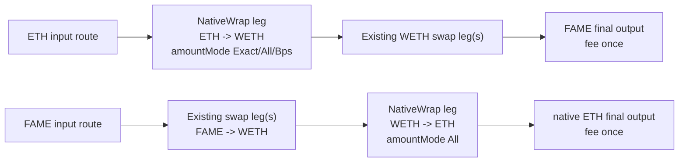

# feat: Add Native WETH Route Legs

## Overview

Add an explicit `NativeWrap` route-leg venue to `FameRouter` so native ETH can be wrapped into WETH and WETH can be unwrapped into native ETH inside larger FAME swap routes. The change keeps schema version `1`, appends a new venue ordinal, preserves route-local custody accounting, and gives generated artifacts a first-class way to prove routes such as `ETH -> WETH -> FAME` and `FAME -> WETH -> ETH`.

The implementation should stay lean. The contract repo should add schema support, safety checks, artifact parity, and fork proof. It should not grow `router-ts` into a general-purpose solver; the app repo now has the stronger solver and should remain the source for richer candidate generation. This repo only needs enough TypeScript support to encode, validate, and prove minimal NativeWrap route artifacts at the contract boundary.

## Problem Frame

Native ETH and WETH are already distinct in the router schema and in generated route artifacts, but the router cannot express pure WETH `deposit()` or `withdraw()` as executable legs. That blocks native ETH trades from safely using WETH connector liquidity. The requirements define the product boundary: NativeWrap is an internal route primitive for FAME-facing swaps, not a public standalone wrapping endpoint (see origin: `docs/brainstorms/2026-05-14-native-weth-wrap-unwrap-route-legs-requirements.md`).

## Requirements Trace

- R1-R5. Add `NativeWrap` as its own route leg operation, appended to schema v1, with only `NATIVE_ETH -> WETH` and `WETH -> NATIVE_ETH` directions, empty payloads, and no generic call surface.
- R6-R10. Support `Exact`, `BalanceBps`, and `All`; use `amount = 0` for `All`; require `minAmountOut = 0`; derive the required output from computed spend; preserve top-level `msg.value` rules.
- R11-R14. Require WETH target allowlisting, skip approvals, fail closed for bad shape, and preserve route-local custody, fee, and leftover behavior.
- R15-R18. Model NativeWrap as a deterministic primitive edge in artifacts, expose a `nativeWrap` capability, include the WETH target in allowlist evidence, and keep app-side restrictions until contract proof exists.

## Scope Boundaries

- No standalone wrapping product through `FameRouter`.
- No fee-free pure wrap special case.
- No generic external-call adapter.
- No raw Universal Router `WRAP_ETH` / `UNWRAP_WETH` passthrough.
- No ETH/WETH normalization or treating both assets as the same graph node.
- No dynamic discovery of wrapper contracts.
- No broad local solver rewrite in `router-ts`; keep it as contract-boundary encoding and artifact proof.

### Deferred to Separate Tasks

- App solver enablement: a separate app-repo change should lift native/WETH restrictions only after this contract repo has contract tests, TypeScript encoding/parity checks, required NativeWrap/WETH target evidence, and pinned Base fork execution for both NativeWrap directions.
- Rich candidate generation: use the app repo's solver as the route source for future route promotion instead of expanding `router-ts` into a competing graph solver.
- Production launch allowlist promotion: `NativeWrap/WETH` is included in the launch-blocking deployment manifest so deploys enable it through the same path as swap venues.

## Context & Research

### Relevant Code and Patterns

- `src/FameRouter.sol` already validates route headers and allowlists before pulling funds, snapshots route assets, computes leg spend through `FameRouterAccounting`, dispatches typed venues, measures output by route-local balance deltas, charges the final fee once, and refunds route-local leftovers.
- `src/router/FameRouterTypes.sol` defines schema version `1`, `VenueFamily`, `AmountMode`, `Leg`, and `Route`. `NativeWrap` should append ordinal `6` after `UniswapV4`.
- `src/router/interfaces/IWETH9.sol` already exposes `deposit()`, `withdraw(uint256)`, and `transfer(address,uint256)`.
- `test/router/FameRouter.t.sol` has the core unit-test style for enum ordinals, pre-pull validation, native value checks, route-local accounting, disabled target failures, and route settlement.
- `router-ts/src/compiler/types.ts`, `router-ts/src/artifacts/schema.ts`, `router-ts/src/artifacts/routeEncoding.ts`, and `router-ts/src/artifacts/writeArtifacts.ts` mirror the Solidity route ABI and produce deterministic JSON plus manifest hashes.
- `test/router/FameRouterGeneratedArtifacts.t.sol` and `test/router/FameRouterForkBase.t.sol` enforce artifact parity and fork execution for generated routes.
- `script/DeployFameRouter.s.sol` and `script/ValidateFameRouterBase.s.sol` configure and validate venue family/target allowlists from `test/router/fixtures/FameRouterFixtureManifest.sol`.
- `config/fame-public.env` already contains `BASE_WETH_ADDRESS=0x4200000000000000000000000000000000000006`.
- `docs/router/fame-router-schema.md` currently states that implicit wrap/unwrap does not exist; this must become the integration reference for explicit NativeWrap behavior.

### Institutional Learnings

- `docs/solutions/workflow-issues/public-config-doppler-foundry-aliases-2026-05-12.md` applies to deployment/config updates: public addresses belong in `config/fame-public.env`, secrets and RPCs stay in Doppler, and Foundry aliases should be used instead of raw RPC URLs.
- `docs/solutions/patterns/critical-patterns.md` was expected by the learning workflow but is not present.

### External References

- None. WETH9 `deposit()` / `withdraw()` behavior and the repo's existing typed adapter patterns are sufficient for this plan.

## Key Technical Decisions

- Append `NativeWrap` as `VenueFamily` ordinal `6`: preserves schema v1 and avoids reordering existing wire values.
- Reject any all-wrap route, not only single-leg wrap routes: prevents no-op multi-leg wrapping paths from turning the router into a fee-taking wrapper.
- Keep the anti-wrapper boundary structural, not economic: require at least one non-NativeWrap swap leg and reject all-wrap routes, but do not add runtime heuristics for route quality such as "dust swap" detection.
- Reject nonzero `NativeWrap.minAmountOut`: keeps the lean convention deterministic and avoids duplicate route data drifting from computed spend.
- Derive NativeWrap effective minimum from computed spend: `Exact`, `BalanceBps`, and `All` all use the existing accounting path, then the wrapper leg must produce at least that spend amount.
- Skip approvals for `NativeWrap`: the target is WETH itself, and the router should call `deposit` / `withdraw` directly without granting allowance.
- Separate evidence from production allowlisting: solver/generated manifests prove artifact executability, while launch/deployment manifests remain the production allowlist authority. `NativeWrap/WETH` is promoted through the launch/deployment manifest, not through an ad hoc post-deploy owner call.
- Pin NativeWrap to canonical chain WETH: Base NativeWrap evidence must use `BASE_WETH_ADDRESS`, verify the expected chain/address/code on fork, and treat WETH targets as canonical wrappers, not arbitrary WETH-like contracts.
- Add `nativeWrap` as a capability or schema feature: reviewers need to distinguish native V4 evidence from native routes that depend on WETH conversion, and downstream consumers must gate on the feature rather than assuming every schema v1 consumer understands venue ordinal `6`.
- Keep local `router-ts` bounded: support NativeWrap encoding and deterministic fixtures, but do not duplicate the app repo's more general solver.

## Open Questions

### Resolved During Planning

- Should all-wrap routes be rejected? Yes. Reject any route whose legs are all `NativeWrap`.
- Should nonzero `minAmountOut` on NativeWrap be ignored or rejected? Reject it.
- Where should Base WETH be sourced? Use the existing `BASE_WETH_ADDRESS` public config for Base evidence. Solver/generated manifests record NativeWrap/WETH evidence; production deployment manifests remain the allowlist authority when this primitive is promoted.
- Should NativeWrap have its own capability flag? Yes, add `nativeWrap`.
- Should `router-ts` become a better solver? No. Use app-repo solver output as the richer source; keep `router-ts` focused on contract-boundary artifacts.
- What exactly gates app-side enablement? Contract tests, TypeScript encoding/parity checks, required NativeWrap/WETH target evidence, and pinned Base fork execution for both `ETH -> WETH -> FAME` and `FAME -> WETH -> ETH`.

### Deferred to Implementation

- Exact helper and error names: choose names that fit the current custom-error style.
- Whether NativeWrap dispatch lives directly in `FameRouter.sol` or a tiny adapter library under `src/router/adapters/`: decide during implementation based on bytecode/readability, while preserving narrow typed behavior.
- Exact route amounts and route IDs for generated NativeWrap fork fixtures: choose minimal deterministic fixtures that execute at the pinned Base block.

## High-Level Technical Design

> *This illustrates the intended approach and is directional guidance for review, not implementation specification. The implementing agent should treat it as context, not code to reproduce.*



NativeWrap validation shape:

```text
NativeWrap leg is valid only when:
  data is empty
  minAmountOut is 0
  target is enabled for NativeWrap
  direction is NATIVE_ETH -> target OR target -> NATIVE_ETH
  at least one route leg is a non-NativeWrap swap leg

NativeWrap execution:
  computedSpend = amountMode.spendAmount(...)
  if wrapping: call WETH.deposit{value: computedSpend}()
  if unwrapping: call WETH.withdraw(computedSpend)
  effectiveMinAmountOut = computedSpend
  require output route-local delta >= effectiveMinAmountOut
```

## Implementation Units

- [x] **Unit 1: Contract Schema And NativeWrap Validation**

**Goal:** Extend schema v1 with a narrow `NativeWrap` venue and fail closed for invalid NativeWrap route shapes before funds move.

**Requirements:** R1-R5, R8, R10-R13

**Dependencies:** None

**Files:**
- Modify: `src/router/FameRouterTypes.sol`
- Modify: `src/FameRouter.sol`
- Test: `test/router/FameRouter.t.sol`
- Modify: `docs/router/fame-router-schema.md`

**Approach:**
- Append `NativeWrap` to `VenueFamily` after `UniswapV4`.
- Update enum ordinal tests so `NativeWrap == 6` and the next invalid ordinal becomes `7`.
- Add header-level validation for NativeWrap structural rules: empty `data`, zero `minAmountOut`, valid direction with `leg.target` as WETH, enabled family/target, and at least one non-NativeWrap swap leg in the route.
- Do not add economic route-quality heuristics such as dust-swap detection in the contract. The router should fail closed on structural NativeWrap misuse; solver/app route selection owns route quality.
- Preserve existing top-level route rules: nonzero `route.amountIn`, native value match, same final asset rejection, final output production, leg count bounds, and payload bounds.
- Ensure validation runs before ERC-20 input transfer so bad NativeWrap routes fail before user funds move.

**Execution note:** Implement behavior test-first because this changes route validation and wire semantics.

**Patterns to follow:**
- Existing pre-pull route validation tests in `test/router/FameRouter.t.sol`.
- Existing enum ordinal tests in `test/router/FameRouter.t.sol`.
- Existing schema documentation table in `docs/router/fame-router-schema.md`.

**Test scenarios:**
- Happy path: a route containing `NativeWrap` plus a non-NativeWrap swap leg passes header validation when family/target are enabled.
- Error path: raw route with venue ordinal `7` fails ABI enum decoding.
- Error path: representative all-wrap route such as `ETH -> WETH -> ETH` fails before any external WETH call.
- Error path: single-leg `ETH -> WETH` and `WETH -> ETH` fail before any funds move.
- Error path: `NativeWrap` with non-empty data fails before any funds move.
- Error path: `NativeWrap` with nonzero `minAmountOut` fails before any funds move.
- Error path: `NativeWrap` with wrong target or disabled target fails before any funds move.
- Error path: `NativeWrap` with `ETH -> non-target`, `non-target -> ETH`, `WETH -> FAME`, or `FAME -> WETH` as the NativeWrap leg fails closed.

**Verification:**
- Solidity enum ordinals, route validation, and docs all agree on schema v1 plus NativeWrap ordinal `6`.
- Invalid NativeWrap shapes fail before user ERC-20 transfer or WETH call.

- [x] **Unit 2: NativeWrap Dispatch And Route-Local Accounting**

**Goal:** Execute `ETH -> WETH` and `WETH -> ETH` legs through WETH9 while preserving route-local accounting, approval, fee, and refund invariants.

**Requirements:** R3, R6-R14

**Dependencies:** Unit 1

**Files:**
- Modify: `src/FameRouter.sol`
- Modify: `src/router/interfaces/IWETH9.sol` if implementation needs a missing interface method
- Test: `test/router/FameRouter.t.sol`
- Modify or create: `test/router/mocks/MockERC20.sol`

**Approach:**
- Add a NativeWrap approval bypass to the same area as `_usesPermit2`, so WETH unwrap does not approve WETH to itself.
- Dispatch wrap by calling `deposit{value: computedSpend}` on the enabled target.
- Dispatch unwrap by calling `withdraw(computedSpend)` on the enabled target.
- Make the shared leg output check use an effective minimum: `computedSpend` for NativeWrap and `leg.minAmountOut` for all other venues. This keeps calldata lean without making `minAmountOut = 0` mean zero-protected execution.
- Keep ordinary leg delta measurement as the source of truth. The NativeWrap branch should integrate with the existing before/after route-local balance checks rather than relying on return values.
- Add a WETH-capable mock that behaves like ERC-20 WETH and supports `deposit` / `withdraw`.
- Threat-model the new external/native call surfaces under the existing router reentrancy posture. If current guards are insufficient for WETH `deposit`, WETH `withdraw`, router `receive`, final native transfer, or native leftover refund callbacks, add the narrowest guard or invariant test needed.

**Execution note:** Start with failing route execution tests for both directions and amount modes.

**Patterns to follow:**
- Existing native input and native output settlement tests in `test/router/FameRouter.t.sol`.
- Existing route-local ambient balance tests in `test/router/FameRouter.t.sol`.
- Existing `IWETH9` usage in `test/router/FameRouterForkBase.t.sol`.

**Test scenarios:**
- Happy path: native input route `ETH -> WETH -> FAME` wraps exact `route.amountIn`, executes the downstream mock swap, charges final FAME fee once, and leaves router ETH/WETH/FAME route-local balances at zero.
- Happy path: ERC-20 input route `FAME -> WETH -> ETH` unwraps route-local WETH via `All`, charges final native ETH fee once, and leaves router ETH/WETH/FAME route-local balances at zero.
- Happy path: `NativeWrap` with `BalanceBps` wraps or unwraps only the computed route-local percentage and refunds the unspent route-local input after success.
- Happy path: `NativeWrap` with `All` and `amount = 0` spends the full route-local input balance.
- Error path: native input route with wrong `msg.value` still reverts with existing native value error.
- Error path: ERC-20 input route with nonzero `msg.value` still reverts with existing unexpected native value error.
- Error path: WETH deposit or withdraw producing less than computed spend fails the effective minimum check.
- Edge case: ambient ETH or WETH already held by the router cannot satisfy spend or output checks.
- Edge case: no ERC-20 approval is left or created for WETH during unwrap.
- Error path: malicious/mock WETH callback or recipient callback cannot reenter into unsafe route state during deposit, withdraw, router receive, final native transfer, or leftover refund.
- Error path: final native recipient rejecting ETH and leftover native refund recipient rejecting ETH both revert atomically without leaving route-local ETH/WETH balances stranded.

**Verification:**
- NativeWrap composes with existing fee, final settlement, and leftover refund behavior.
- Tests show NativeWrap uses computed spend, not encoded `minAmountOut`, as its effective no-slippage output floor.

- [x] **Unit 3: TypeScript Schema, Encoding, And Artifact Compatibility**

**Goal:** Teach `router-ts` the new schema value and minimal primitive leg shape needed for artifact encoding/proof without expanding it into a full app-quality solver.

**Requirements:** R2, R7-R9, R15-R17

**Dependencies:** Unit 1

**Files:**
- Modify: `router-ts/src/compiler/types.ts`
- Modify: `router-ts/src/artifacts/schema.ts`
- Modify: `router-ts/src/artifacts/routeEncoding.ts` if enum coverage requires updates
- Modify: `router-ts/src/artifacts/writeArtifacts.ts`
- Test: `router-ts/test/adapter-encoding.spec.ts`
- Test: `router-ts/test/artifact-schema.spec.ts`
- Test: `router-ts/test/route-hash-parity.spec.ts`
- Test: `router-ts/test/config.spec.ts`

**Approach:**
- Add `NativeWrap: 6` to TypeScript venue ordinals and all schema parsers/serializers that enumerate venue names.
- Add `nativeWrap: boolean` or an equivalent `features: ["nativeWrap"]` marker to generated route artifacts so schema v1 consumers have an explicit feature gate for venue ordinal `6`.
- Document and validate the derived invariant that NativeWrap serializes `minAmountOut = "0"` but has effective output floor equal to computed spend.
- Add a minimal NativeWrap leg fixture path that emits `target = WETH`, `data = "0x"`, `minAmountOut = 0`, and `amount = 0` for `All`.
- Keep primitive legs distinct from pool fixtures. If the existing local route compiler must represent proof routes, use a narrow union such as `PoolLeg | NativeWrapLeg`; primitive legs bypass `poolById`, and route artifact `poolIds` must either omit primitive legs or add a separate `legSources`/`primitiveIds` field. Do not fake NativeWrap as a `base-v1-pools.json` entry.
- Update `writeArtifacts.ts` target extraction so `NativeWrap/WETH` appears in `FameRouterSolverFixtureManifest.requiredVenueTarget`.
- Keep generated routes deterministic and compatible with Solidity `abi.encode(route)` and `FameRouter.hashRoute(route)`.
- Do not expand the local route search/ranking algorithm. Prefer two explicit minimal NativeWrap proof routes in this repo; app-solver imports are deferred until there is a recorded provenance contract.

**Patterns to follow:**
- Existing TypeScript enum mirror in `router-ts/src/compiler/types.ts`.
- Existing artifact JSON conversion in `router-ts/src/artifacts/schema.ts`.
- Existing target allowlist generation in `router-ts/src/artifacts/writeArtifacts.ts`.
- Existing capability derivation tests in `router-ts/test/artifact-schema.spec.ts`.

**Test scenarios:**
- Happy path: NativeWrap leg encoding has venue ordinal `6`, empty data, target Base WETH, and `minAmountOut` string `"0"`.
- Happy path: `All` NativeWrap leg has `amount` string `"0"`.
- Integration: generated route artifact containing NativeWrap ABI-encodes and hashes to the same value as Solidity parity checks.
- Integration: solver manifest required target list includes `NativeWrap` plus Base WETH.
- Integration: route artifacts expose `nativeWrap: true` or an equivalent schema feature and document the effective minimum-from-spend invariant.
- Error path: artifact schema rejects unknown venue names or bad NativeWrap ordinal drift.
- Regression: existing non-NativeWrap artifacts keep previous venue ordinals and route hash parity unless intentionally regenerated because the artifact set changed.

**Verification:**
- `router-ts` can encode and serialize NativeWrap route legs, and generated manifests expose the WETH target allowlist requirement.
- Local TypeScript tests prove NativeWrap is a primitive edge, not a fake pool, and that consumers have an explicit NativeWrap feature signal.

- [x] **Unit 4: Generated Route Evidence And Fork Execution**

**Goal:** Prove NativeWrap works end to end through generated artifacts and pinned Base fork execution for both important directions.

**Requirements:** R15-R18 and all success criteria

**Dependencies:** Units 1-3

**Files:**
- Modify: `test/router/fixtures/base-v1-solver-routes.json`
- Modify: `test/router/fixtures/base-v1-route-parity-vectors.json`
- Modify: `test/router/fixtures/FameRouterSolverFixtureManifest.sol`
- Modify: `test/router/FameRouterGeneratedArtifacts.t.sol`
- Modify: `test/router/FameRouterForkBase.t.sol`
- Test: `test/router/FameRouterGeneratedArtifacts.t.sol`
- Test: `test/router/FameRouterForkBase.t.sol`

**Approach:**
- Add the smallest deterministic NativeWrap route artifacts needed for proof: one `ETH -> WETH -> FAME` route and one `FAME -> WETH -> ETH` route.
- Use local deterministic proof fixtures for this plan. App-solver artifacts from the stronger app repo are the preferred source for future route promotion, but importing them is deferred until the import contract records app commit/version, source block, raw artifact hash, normalization step, and checked output.
- Keep `router-ts` artifact generation deterministic and avoid broad fixture regeneration beyond the minimal proof routes and derived parity/manifest files.
- Extend generated route target allowlisting to include `NativeWrap/WETH`.
- Ensure fork helper enables NativeWrap family/target and asserts every leg target appears in the solver manifest before execution.
- Extend post-execution asset-zero assertions to cover native ETH and WETH for all NativeWrap route assets.
- On the pinned Base fork, assert NativeWrap uses canonical Base WETH for the active chain: exact `BASE_WETH_ADDRESS`, nonzero code, and fork-proven deposit/withdraw behavior. A code-hash assertion may be added if the repo already has a stable pattern for chain-specific code hashes.

**Patterns to follow:**
- Existing generated artifact parity flow in `test/router/FameRouterGeneratedArtifacts.t.sol`.
- Existing fork route execution flow in `test/router/FameRouterForkBase.t.sol`.
- Existing solver manifest generation in `router-ts/src/artifacts/writeArtifacts.ts`.

**Test scenarios:**
- Integration: generated `ETH -> WETH -> FAME` route hash matches ABI-encoded route and executes on the pinned Base fork.
- Integration: generated `FAME -> WETH -> ETH` route hash matches ABI-encoded route and executes on the pinned Base fork.
- Integration: generated NativeWrap routes fail the allowlist assertion if the solver manifest omits the WETH target.
- Integration: after each NativeWrap route executes, router route-local balances for ETH, WETH, FAME, and every intermediate token are zero.
- Integration: fork setup rejects or fails clearly if NativeWrap points at a noncanonical or no-code WETH target for the chain under test.
- Regression: generated route artifact count, route IDs, JSON hashes, and parity vectors remain internally consistent after regeneration.

**Verification:**
- Generated NativeWrap artifacts are parity-checked and fork-executable.
- The evidence gate needed before app-side solver restriction lifting is visible in committed artifacts and tests.

- [x] **Unit 5: Documentation And Production Promotion Gate**

**Goal:** Document the schema contract and the separate production promotion gate without turning this low-lift primitive into deployment promotion work.

**Requirements:** R2, R11, R16-R18

**Dependencies:** Units 1-4

**Files:**
- Modify: `docs/router/fame-router-schema.md`
- Modify: `docs/router/fame-router-validation.md`

**Approach:**
- State the authority split clearly: solver/generated manifests prove artifact executability; launch/deployment manifests are authoritative for production router allowlists.
- State that production promotion goes through the deployment manifest: before NativeWrap routes can be enabled in the app, live validation must confirm `NativeWrap/WETH` is enabled against canonical chain WETH.
- Use existing `BASE_WETH_ADDRESS` in `config/fame-public.env` as the public Base address source; do not introduce a secret or raw RPC dependency.
- Update schema docs with `NativeWrap` ordinal `6`, allowed directions, empty payload, `minAmountOut = 0`, effective minimum-from-spend behavior, feature/capability marker, approval policy, standalone/all-wrap rejection, and the solver-owned route-quality boundary.
- Update validation docs with the app-side enablement gate: contract tests, TypeScript encoding/parity checks, required NativeWrap/WETH target evidence, and pinned Base fork execution of both NativeWrap directions.

**Patterns to follow:**
- Existing schema and validation docs under `docs/router/`.

**Test scenarios:**
- Test expectation: deployment validation covers the launch manifest target list, including canonical Base WETH for `NativeWrap`.

**Verification:**
- Docs provide enough contract for app route builders to encode NativeWrap safely.
- The plan no longer leaves implementers to decide whether solver manifests or launch manifests are authoritative for production allowlisting.

## System-Wide Impact

- **Interaction graph:** `FameRouter.executeRoute` gains a new typed branch that sits beside existing venue families. The route builder/artifact path gains one primitive edge type and one explicit NativeWrap feature/capability marker.
- **Error propagation:** Invalid NativeWrap shapes should fail as custom router errors before user funds move. WETH call failures and recipient/refund native transfer failures should revert the whole route atomically like other venue failures.
- **State lifecycle risks:** Native ETH balance accounting is already route-local but must be protected from ambient ETH and callback/reentrancy paths. WETH unwrap must not leave approvals or residual WETH. Final native output settlement remains subject to recipient native transfer behavior.
- **API surface parity:** Solidity enum ordinals, TypeScript enum mirrors, JSON artifact schemas, app route encoders, and docs must all agree on `NativeWrap = 6` plus the explicit NativeWrap feature signal.
- **Integration coverage:** Unit tests prove local semantics; generated artifact tests prove ABI/hash parity; pinned fork tests prove composition with real WETH liquidity and final settlement.
- **Unchanged invariants:** Schema version remains `1`; native ETH remains `address(0)`; WETH remains an ERC-20 address; fees are charged once on final output; route discovery and ranking remain offchain.

## Risks & Dependencies

| Risk | Mitigation |
|------|------------|
| NativeWrap accidentally becomes a public wrapping product | Reject any route whose legs are all NativeWrap; keep pure wrapping out of app scope. |
| NativeWrap is used with poor route quality, such as dust swap activity | Accept this as solver/app responsibility rather than contract policy; keep the contract boundary structural to avoid runtime overhead and false positives. |
| Approval path grants WETH allowance during unwrap | Add an explicit NativeWrap approval bypass and test for no WETH allowance. |
| `minAmountOut = 0` weakens safety or confuses artifact consumers | Reject nonzero min, derive effective required output from computed spend, and expose/document that derived invariant in artifacts. |
| Native ETH/WETH evidence becomes ambiguous | Add `nativeWrap` capability and require gap/artifact distinction from native V4 routes. |
| Local `router-ts` duplicates the app solver | Keep local TS changes to encoding, deterministic fixtures, and parity; use app solver output for richer routes. |
| Wrong WETH target is allowlisted | Pin Base evidence to `BASE_WETH_ADDRESS`, assert chain/address/code and fork-proven deposit/withdraw behavior, and document that NativeWrap targets are canonical chain WETH only. |
| Production deployment misses WETH target | Keep production launch/deployment manifests authoritative and validate that `NativeWrap/WETH` is included before app enablement. |
| WETH/native callbacks expose reentrancy assumptions | Add malicious WETH and native recipient/refund callback tests, then use the existing router guard or the narrowest added guard if current invariants are insufficient. |
| Fork evidence depends on stale liquidity | Use pinned Base block evidence; if selected proof routes do not execute at the pinned block, choose deterministic executable amounts or classify the route as blocked until a new pinned snapshot is justified. |

## Documentation / Operational Notes

- `docs/router/fame-router-schema.md` becomes the schema contract for NativeWrap route builders.
- `docs/router/fame-router-validation.md` should name the exact proof needed before the app solver lifts native/WETH restrictions: contract tests, TypeScript encoding/parity checks, required NativeWrap/WETH target evidence, and pinned Base fork execution in both directions.
- Public Base WETH config already exists in `config/fame-public.env`; do not move it to Doppler.
- RPC-backed fork validation should continue to run through Doppler and Foundry aliases, without echoing RPC URLs.

## Sources & References

- **Origin document:** `docs/brainstorms/2026-05-14-native-weth-wrap-unwrap-route-legs-requirements.md`
- Ideation source: `docs/ideation/2026-05-14-native-weth-wrap-unwrap-route-legs-ideation.md`
- Contract router: `src/FameRouter.sol`
- Router types: `src/router/FameRouterTypes.sol`
- WETH interface: `src/router/interfaces/IWETH9.sol`
- TypeScript route schema: `router-ts/src/compiler/types.ts`
- Generated artifact writer: `router-ts/src/artifacts/writeArtifacts.ts`
- Schema docs: `docs/router/fame-router-schema.md`
- Validation docs: `docs/router/fame-router-validation.md`
- Public config learning: `docs/solutions/workflow-issues/public-config-doppler-foundry-aliases-2026-05-12.md`
