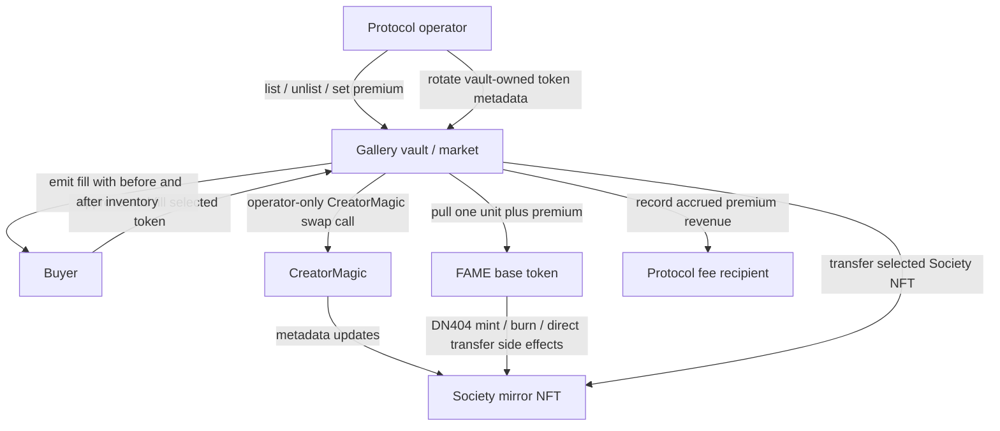
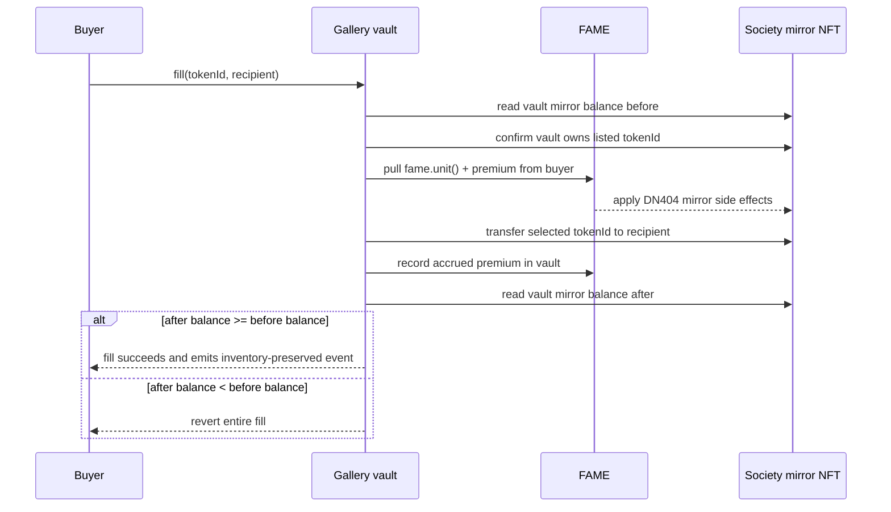

# feat: Build closed-loop gallery swap

> **Superseded (2026-08-06).** `ClosedLoopGallerySwap` was removed from the codebase. Do not implement this plan. Successor: universal pool art marketplace + atomic checkout. See `docs/gallery/marketplace-checkout-review-decisions.md` (D1).

## Summary

Build a protocol-controlled gallery vault that lets buyers fill curated Society NFT listings for one FAME unit plus a FAME premium, while enforcing that completed fills do not reduce protocol Society NFT inventory. CreatorMagic is part of the operator-side rotation mechanism for vault-owned token metadata, but buyer settlement stays on a separate fill path with no buyer-directed metadata authority.

---

## Problem Frame

The product goal is a curated, rotating gallery rather than a general NFT marketplace. Users should be able to choose an already-curated Society NFT, pay more than one full FAME unit, and receive that token only if the protocol's Society NFT inventory remains closed-loop.

The technical risk is that FAME is DN404-style. A mirror NFT transfer debits one FAME unit from the NFT sender and credits it to the recipient, while ERC20 FAME transfers can burn, mint, or directly transfer mirror NFTs depending on balances and `skipNFT` state. The plan therefore treats "inventory non-decrease" as a measured mirror NFT invariant, not as ordinary ERC20 accounting.

---

## Requirements

**Gallery scope**

- R1. The V1 gallery lists only Society NFTs owned by the protocol-controlled gallery vault.
- R2. V1 does not support holder-owned listings, consignment, peer-to-peer sales, or buyer-selected metadata pool entries.
- R3. Each listed gallery piece has an operator-set positive FAME premium, making total price greater than one full FAME unit.

**Fill semantics**

- R4. A fill requires the buyer to provide one FAME unit plus the listed FAME premium.
- R5. A fill transfers the selected protocol-owned Society NFT to the buyer only when protocol Society NFT inventory after settlement is greater than or equal to inventory before settlement.
- R6. A fill fails rather than completing as a stock-draining sale when the non-decrease invariant cannot be satisfied.
- R7. A fill leaves the premium attributable to the protocol as fee revenue.

**DN404 and metadata safety**

- R8. Settlement accounts for DN404 side effects from FAME transfers, including sender NFT burns, recipient NFT mints, direct NFT transfers, and `skipNFT` state.
- R9. The buyer experience does not imply that Society NFTs behave like ordinary standalone ERC721s.
- R10. The vault behavior is designed so received FAME and transferred Society NFTs preserve the gallery inventory invariant.

**Curation and observability**

- R11. The gallery exposes a rotating curated set of protocol-owned Society NFTs, not the full unminted pool, burn pool, or art pool.
- R12. CreatorMagic metadata operations are not exposed as public purchase settlement in V1.
- R13. CreatorMagic preparation and rotation stay operator-controlled and do not grant buyers broad metadata write authority.
- R14. Fills make it observable whether protocol Society NFT inventory was preserved.
- R15. Unavailable, transferred, or invariant-breaking gallery pieces fail cleanly rather than partially settling.
- R16. Premium, unit amount, selected token, and recipient are unambiguous for offchain UIs and reviewers.
- R17. Direct CreatorMagic `updateMetadata` is not part of the gallery rotation interface unless a later governance decision explicitly accepts that broader trust surface.

---

## Key Technical Decisions

- KTD1. **Use a dedicated CreatorMagic-aware gallery vault contract:** The gallery needs a contract that can own Society NFTs, call CreatorMagic as the token owner for operator rotation, and settle buyer fills. Extending CreatorMagic would mix metadata management with payment settlement; using the router would overload a swap route executor with NFT custody.
- KTD2. **Keep buyer fills separate from CreatorMagic:** Buyer fills should transfer an already-curated token and enforce payment/inventory invariants. Buyers should never choose mint, burn, end-of-mint, or art-pool metadata legs through the marketplace action.
- KTD3. **Measure inventory with mirror balance before and after settlement:** The authoritative V1 invariant is the gallery vault's Society NFT balance from the mirror contract around the fill. This matches the product promise better than checking that `fame.unit() + premium` was received.
- KTD4. **Settle payment before the selected NFT leaves, then check the invariant after all DN404 effects:** The payment can create or move replacement mirror NFTs into the vault. V1 keeps the premium in the vault during fill, emits or records accrued protocol fee revenue, and leaves any later fee sweep to a separate inventory-preserving path.
- KTD5. **Use per-token positive operator premiums with optional higher guardrails:** V1 pricing should be a curated gallery decision per listed token. A global minimum can prevent accidental low premiums, but it should not be the pricing model.
- KTD6. **Initialize and validate vault `skipNFT` posture:** Contract addresses can default into a skip-NFT posture, and the gallery depends on incoming FAME being able to mint or direct-transfer replacement mirror NFTs to the vault. Deployment must actively initialize the vault to the intended non-skip state, then validate it before launch.
- KTD7. **Do not use operational rebalancing as correctness:** Post-fill curation and metadata rotation are allowed, but a fill must stand on its own as inventory non-decreasing.
- KTD8. **Split owner and operator powers:** Owner or multisig authority controls role grants, fee recipient changes, rescue, and deployment-critical config. Operators control curation actions only: listing, unlisting, premium updates, and CreatorMagic swap rotation.

---

## High-Level Technical Design

---

## Implementation Units

### U1. Characterize CreatorMagic rotation and DN404 inventory mechanics

- **Goal:** Lock down the behavior the gallery vault will depend on before adding new settlement code.
- **Requirements:** R8, R10, R12, R13, R17.
- **Dependencies:** None.
- **Files:**
  - `test/ClosedLoopGallerySwap.t.sol`
  - `test/CreatorArtistMagic.t.sol`
  - `src/CreatorArtistMagic.sol`
  - `src/DN404.sol`
  - `src/DN404Mirror.sol`
  - `src/Fame.sol`
- **Approach:** Add characterization coverage in the new gallery test file or extend CreatorMagic tests where the assertion belongs. Prove that CreatorMagic swap-style rotation requires ownership of the updated token, that mint/burn pool legs are constrained as expected, and that direct `updateMetadata` is a separate privileged path.
- **Execution note:** Start characterization-first. Do not change CreatorMagic behavior unless the tests reveal a mismatch with the intended GTM path.
- **Patterns to follow:** Existing ownership and pool-boundary tests in `test/CreatorArtistMagic.t.sol`; DN404 transfer behavior tests in `test/Fame.t.sol`.
- **Test scenarios:**
  - A vault-owned token can be rotated through the intended CreatorMagic swap function when the caller is the token owner and has the required CreatorMagic role.
  - A non-vault-owned token cannot be rotated through the vault/operator path.
  - A mint-pool leg must be unowned, above total NFT supply, below `nextTokenId`, and outside the art-pool range.
  - A burn-pool leg must be unowned by `ownerOf` revert, within minted supply, and outside the art-pool range.
  - A still-owned token is rejected as a burn-pool leg.
  - Direct `updateMetadata` remains role-gated but is not used by the gallery rotation path.
  - DN404 ERC20 payment into a non-skip vault can mint or directly transfer a mirror NFT to the vault when balances support it.
  - DN404 ERC20 payment into a skip vault does not mint replacement mirror NFTs and can make a later fill fail the invariant.
- **Verification:** The implementer can explain, from tests, which CreatorMagic functions are safe for gallery rotation and which DN404 side effects preserve or break vault inventory.

### U2. Add gallery vault ownership, roles, and listing state

- **Goal:** Create the protocol-owned inventory and listing surface for curated Society NFTs.
- **Requirements:** R1, R2, R3, R11, R15, R16.
- **Dependencies:** U1.
- **Files:**
  - `src/ClosedLoopGallerySwap.sol`
  - `test/ClosedLoopGallerySwap.t.sol`
- **Approach:** Implement a dedicated contract that owns gallery NFTs, references FAME, the mirror NFT, CreatorMagic, and the protocol fee recipient, and exposes listing controls. Owner or multisig authority should control role grants, fee-recipient changes, rescue, and deployment config; operator authority should control listing, unlisting, premium updates, and rotation only. The vault should implement ERC721 receiver behavior for Society NFT custody, reject or clearly account for unsupported NFT deposits, and avoid arbitrary mirror approvals. Listings should validate that the vault owns the token at the time of listing or fill, store the premium, and expose enough read state for offchain gallery UIs.
- **Patterns to follow:** `src/FameRouter.sol` for `Ownable`, custom errors, events, `ReentrancyGuard`, and fee-recipient configuration patterns; `src/CreatorArtistMagic.sol` for role-gated operator behavior.
- **Test scenarios:**
  - An owner/operator can list a vault-owned Society NFT with a positive premium.
  - Listing a token not owned by the vault reverts.
  - Listing with a zero premium reverts.
  - Updating a listed token's premium changes future fills without changing past fill events.
  - Unlisting removes the token from the fillable set.
  - Non-operators cannot list, unlist, or update premiums.
  - Operators cannot change fee recipient, grant roles, rescue assets, or change deployment-critical config.
  - Rescue rejects listed Society token IDs and any FAME amount reserved for invariant-preserving operation.
  - The vault does not expose arbitrary mirror `approve` or `setApprovalForAll` paths.
  - Safe transfer of the Society mirror NFT into the vault succeeds through the intended receiver hook.
  - Safe transfer of unrelated ERC721 tokens into the vault is rejected or recorded for owner-only rescue without affecting gallery inventory.
  - Read methods expose token availability, premium, and configured recipient without requiring offchain ownership guesses.
- **Verification:** The gallery can represent a curated protocol-owned set, and no test path accepts holder inventory or buyer-selected metadata pool entries.

### U3. Implement operator-side CreatorMagic rotation through the vault

- **Goal:** Let the protocol rotate art on vault-owned gallery tokens while keeping buyers away from CreatorMagic authority.
- **Requirements:** R12, R13, R17.
- **Dependencies:** U1, U2.
- **Files:**
  - `src/ClosedLoopGallerySwap.sol`
  - `test/ClosedLoopGallerySwap.t.sol`
  - `test/CreatorArtistMagic.t.sol`
- **Approach:** Add operator-only vault functions that call the approved CreatorMagic swap-style paths for tokens the vault owns. The vault contract, not the operator EOA, is the CreatorMagic caller because CreatorMagic checks `msg.sender` ownership. Grant the vault the narrow CreatorMagic role set needed for swap rotation, expected to be `ART_POOL_MANAGER` plus `BANISHER` and not `CREATOR` if characterization confirms those roles cover the intended art, mint, burn, and end-of-mint paths. Do not expose a buyer-callable rotation method, and do not wrap direct `updateMetadata` in V1.
- **Patterns to follow:** CreatorMagic `banishToArtPool`, `banishToMintPool`, `banishToBurnPool`, and `banishToEndOfMintPool` ownership and pool checks.
- **Test scenarios:**
  - An operator can rotate a listed vault-owned token through an approved swap-style art-pool path when the vault has the needed CreatorMagic role.
  - An operator can rotate through a valid mint-pool leg and the token URI changes to the selected pool metadata.
  - An operator can rotate through a valid burn-pool leg when a burned token exists.
  - Rotation fails for a token no longer owned by the vault.
  - Rotation fails for invalid mint or burn pool legs.
  - A buyer cannot call any rotation method.
  - Non-operators cannot call any rotation method.
  - A fill does not call CreatorMagic and cannot change metadata as part of purchase settlement.
  - The vault does not expose direct `updateMetadata` in V1.
  - The vault can rotate with `ART_POOL_MANAGER` and `BANISHER` roles but without `CREATOR`, if characterization confirms that role set covers the intended paths.
- **Verification:** The static gallery inventory can be refreshed through metadata swaps, and the public marketplace action remains a buy/fill action rather than a metadata-authoring action.

### U4. Implement atomic fill settlement and inventory invariant

- **Goal:** Sell the selected gallery token for one FAME unit plus premium without decreasing protocol Society NFT inventory.
- **Requirements:** R3, R4, R5, R6, R7, R8, R10, R14, R15, R16.
- **Dependencies:** U1, U2.
- **Files:**
  - `src/ClosedLoopGallerySwap.sol`
  - `test/ClosedLoopGallerySwap.t.sol`
  - `test/mocks/ReentrantGalleryFillToken.sol`
  - `test/mocks/ReentrantGalleryRecipient.sol`
- **Approach:** The fill should snapshot vault mirror balance, validate listing and ownership, pull `fame.unit() + premium`, transfer the selected mirror token to the recipient, record accrued premium revenue in the vault, then require final vault mirror balance to be at least the initial balance. Use non-reentrancy and safe transfer patterns consistent with the router. Prefer `safeTransferFrom` for selected NFT delivery unless characterization shows DN404 mirror constraints make `transferFrom` the safer explicit choice; the chosen transfer mode must be tested with contract recipients. Emit an event carrying buyer, recipient, token ID, unit amount, premium, before inventory, and after inventory.
- **Patterns to follow:** `src/FameRouter.sol` for value-moving non-reentrant settlement, fee recipient validation, rescue safeguards, and event style; DN404 mirror transfer path for unit-backed NFT transfer semantics.
- **Test scenarios:**
  - Covers AE1. Given the vault can preserve inventory, a buyer fills with one unit plus premium, receives the selected token, and the protocol retains non-decreased mirror balance.
  - Covers AE2. Given the vault would end with fewer mirror NFTs, fill reverts and buyer/vault balances remain unchanged.
  - Filling an unlisted token reverts.
  - Filling a listed token that was transferred out of the vault reverts.
  - Filling with insufficient allowance or balance reverts.
  - Filling to the zero address reverts.
  - Filling to a contract recipient succeeds only when the chosen mirror transfer path supports it for that recipient.
  - A buyer whose payment burns their own mirror NFTs still either preserves vault inventory or reverts.
  - A vault configured with `skipNFT` in the wrong state causes the invariant-breaking fill scenario to revert.
  - Reentrant token or recipient callback attempts cannot complete a nested fill, rescue, list, unlist, premium update, rotation, fee-recipient change, or role change during settlement.
  - Premium is recorded as accrued protocol revenue in the vault exactly once during fill.
  - Fee sweeping, if implemented in this slice, has its own mirror-balance invariant check and cannot reduce protocol Society NFT inventory.
  - The fill event reports before and after inventory values that match mirror balances.
- **Verification:** Every successful fill preserves the inventory invariant under DN404 side effects, and every invariant-breaking path reverts atomically.

### U5. Add deployment and Base validation support

- **Goal:** Make the gallery deployable and auditable without leaking secrets or relying on generated broadcast artifacts.
- **Requirements:** R1, R7, R8, R10, R13, R14.
- **Dependencies:** U2, U3, U4.
- **Files:**
  - `script/DeployClosedLoopGallerySwap.s.sol`
  - `script/ValidateClosedLoopGallerySwapBase.s.sol`
  - `test/ClosedLoopGallerySwapDeploymentValidation.t.sol`
  - `config/fame-public.env`
  - `docs/gallery/closed-loop-gallery-swap.md`
- **Approach:** Follow the router deployment shape: read public addresses from `config/fame-public.env`, read deployer secrets through Doppler at execution time, validate chain ID before broadcast, actively initialize the vault to the intended non-skip NFT posture, and validate configured FAME, mirror, CreatorMagic, owner, operator, fee recipient, CreatorMagic role holders, and vault `skipNFT` posture after deployment. The skip setup can be either a vault initialization call to `fame.setSkipNFT(false)` or a `SKIP_MANAGER` deployment step calling `Fame.setSkipNftForAccount(vault, false)`. Public deployment addresses should land in curated config; `broadcast/` artifacts stay uncommitted.
- **Patterns to follow:** `script/DeployFameRouter.s.sol`, `script/ValidateFameRouterBase.s.sol`, `test/router/FameRouterDeploymentValidation.t.sol`, and workflow guidance in `docs/solutions/workflow-issues/`.
- **Test scenarios:**
  - Deployment configuration rejects the wrong chain before broadcast.
  - Deployment rejects zero FAME, mirror, CreatorMagic, owner, or fee recipient addresses.
  - Validation passes when the deployed gallery references expected Base public addresses.
  - Deployment or initialization sets `getSkipNFT(address(vault)) == false` before launch validation passes.
  - Validation fails when the vault `skipNFT` state differs from the intended inventory-preserving posture.
  - Validation fails when the vault lacks the CreatorMagic roles required for operator rotation.
  - Validation fails when the vault has broader CreatorMagic authority than intended, including `CREATOR`, unless the plan is updated to accept that trust surface.
  - Validation checks configured expected CreatorMagic owner and role-holder allowlists for `CREATOR`, `BANISHER`, and `ART_POOL_MANAGER`; if roles are not enumerable onchain, launch requires an explicit admin or event-history attestation for unexpected role holders.
  - Validation fails when configured owner or operator addresses differ from public config.
  - Validation fails when the configured fee recipient differs from public config.
- **Verification:** A reviewer can validate deployment configuration from tests and curated config without reading generated Foundry broadcast logs.

### U6. Document UI contract and operational rotation rules

- **Goal:** Make the marketplace legible to offchain consumers without implying ordinary standalone ERC721 semantics.
- **Requirements:** R2, R9, R11, R12, R13, R14, R16.
- **Dependencies:** U2, U3, U4, U5.
- **Files:**
  - `docs/gallery/closed-loop-gallery-swap.md`
  - `docs/fame-release-plan.md`
  - `config/fame-public.env`
- **Approach:** Document the read model UIs should use, the event fields that prove inventory preservation, and the distinction between operator-side metadata rotation and buyer settlement. The docs should state that gallery tokens are DN404 mirror NFTs backed by FAME unit accounting, not standalone NFTs.
- **Patterns to follow:** Existing release and router validation docs for public config, Doppler, Foundry aliases, and launch gating.
- **Test scenarios:** Test expectation: none -- this unit is documentation and public config wiring. Behavioral coverage belongs to U2-U5.
- **Verification:** A UI or reviewer can explain available listings, total price, premium, recipient, selected token, and inventory preservation from documented reads/events.

---

## Acceptance Examples

- AE1. A buyer fills an available vault-owned gallery token with `fame.unit() + premium`; the buyer receives the selected token, accrued protocol premium is recorded, and the vault's mirror NFT balance is not lower after settlement.
- AE2. A buyer attempts to fill a token when DN404 side effects would leave the vault with fewer mirror NFTs; the transaction reverts without partially settling.
- AE3. An offchain candidate token is not owned by the vault; it cannot be listed or filled in V1.
- AE4. The vault is in a `skipNFT` state that prevents incoming FAME from minting replacement mirror NFTs; tests prove the affected fill path fails the invariant rather than draining stock.
- AE5. The operator rotates metadata on a vault-owned gallery token through CreatorMagic before sale; the later buyer fill does not grant metadata authority or call CreatorMagic.

---

## Scope Boundaries

### In Scope

- Protocol-owned Society NFT gallery inventory.
- Operator-controlled listing, premium updates, and unlisting.
- Operator-side CreatorMagic swap rotation for vault-owned tokens.
- Buyer fill settlement with atomic DN404 inventory non-decrease.
- Deployment validation for public Base addresses, fee recipient, CreatorMagic roles, and vault `skipNFT` posture.

### Deferred for Later

- Holder listings, consignment, peer seller flows, order books, and seller cancellation.
- Buyer-selected unminted, burned, end-of-mint, or art-pool metadata.
- Public metadata purchase flows or arbitrary buyer-directed CreatorMagic writes.
- Wrapped `gSOCIETY` trading or governance-lock behavior.
- Seaport, OpenSea, or other third-party marketplace integrations.

### Deferred to Follow-Up Work

- UI implementation for browsing and filling gallery listings.
- Automated offchain gallery rotation scheduling.
- Analytics dashboards for premium revenue and inventory churn.
- Any migration or governance cleanup of existing CreatorMagic role holders beyond the launch allowlist or attestation required for safe gallery operation.

---

## Risks & Dependencies

- **CreatorMagic role configuration:** The vault must have the narrow roles needed to call swap functions, while unexpected `CREATOR` role holders remain production metadata authorities because `updateMetadata` is not owner-gated.
- **DN404 inventory surprises:** Exact token IDs held by the vault may change because incoming FAME can mint or directly transfer mirror NFTs. The invariant should be count-based for V1, with token-ID-level curation handled by listing state and operator rotation.
- **`skipNFT` posture:** A misconfigured vault can make fills fail or behave unlike staging assumptions. Deployment must initialize the vault to the intended non-skip state and validation must make it a launch gate.
- **Reentrancy and external calls:** Settlement moves ERC20 and mirror NFT assets. The fill path should follow existing non-reentrant value-moving patterns.
- **Recipient semantics:** Contract recipients may interact differently with mirror `transferFrom` and `safeTransferFrom`. The implementation should choose and test the transfer mode rather than assuming ordinary ERC721 UX.

---

## Documentation / Operational Notes

- Public deployment constants belong in `config/fame-public.env`; private keys, RPC URLs, explorer keys, and signer secrets stay in Doppler.
- Foundry scripts should use configured chain aliases such as `base` and `base_sepolia`.
- Do not commit Foundry `broadcast/` logs. Record durable deployment facts in curated config/docs.
- The operator runbook should separate two actions: rotate metadata on vault-owned inventory, then list or update price for fillable gallery pieces.
- If an operator transfers a listed token out of the vault, the listing should become unfillable until repaired or removed.
- The operator runbook should state that direct CreatorMagic `CREATOR` grants are production metadata authority even though the gallery contract does not expose `updateMetadata`.
- Any fee sweep after fill should preserve the vault's Society NFT inventory or be delayed until enough unreserved FAME remains to avoid burning protocol inventory.

---

## Sources / Research

- `docs/brainstorms/2026-06-21-closed-loop-gallery-swap-requirements.md` -- origin requirements and acceptance examples.
- `src/CreatorArtistMagic.sol` -- CreatorMagic swap functions, pool definitions, ownership checks, and direct `updateMetadata` path.
- `test/CreatorArtistMagic.t.sol` -- existing coverage for CreatorMagic ownership checks, mint-pool boundaries, burn-pool rejection, and direct metadata update.
- `src/Fame.sol` -- FAME unit size, mirror access, and role-gated `skipNFT` management.
- `src/DN404.sol` -- ERC20 transfer side effects and mirror NFT transfer accounting.
- `src/DN404Mirror.sol` -- mirror transfer path into DN404 base transfer.
- `src/FameRouter.sol` -- local pattern for non-reentrant value movement, owner configuration, fee recipient updates, and events.
- `script/DeployFameRouter.s.sol` and `script/ValidateFameRouterBase.s.sol` -- deployment and validation patterns.
- `docs/solutions/workflow-issues/public-config-doppler-foundry-aliases-2026-05-12.md` -- repo guidance for public config, Doppler secrets, and Foundry aliases.
- `docs/solutions/workflow-issues/keep-generated-deployment-artifacts-out-of-repo-2026-05-15.md` -- repo guidance for keeping broadcast artifacts out of version control.
