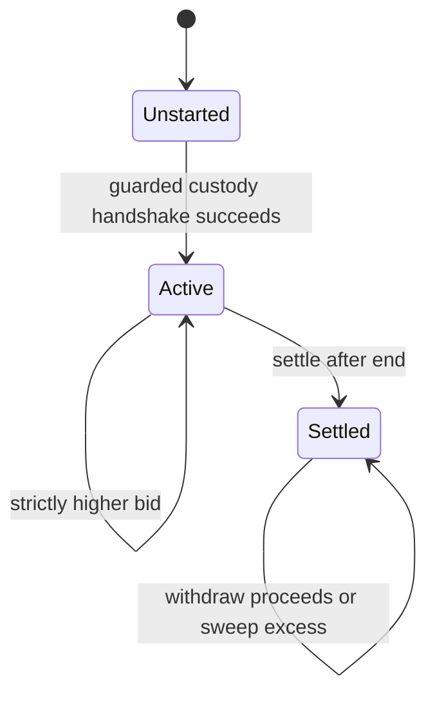
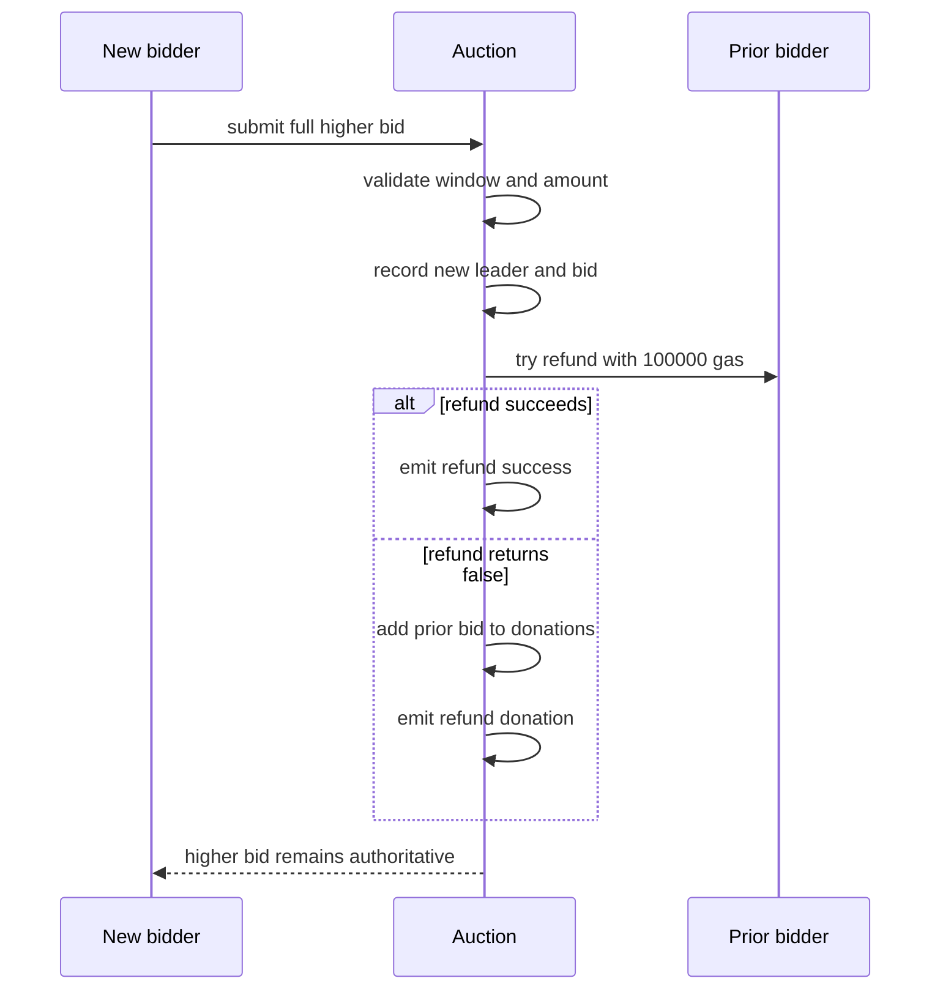
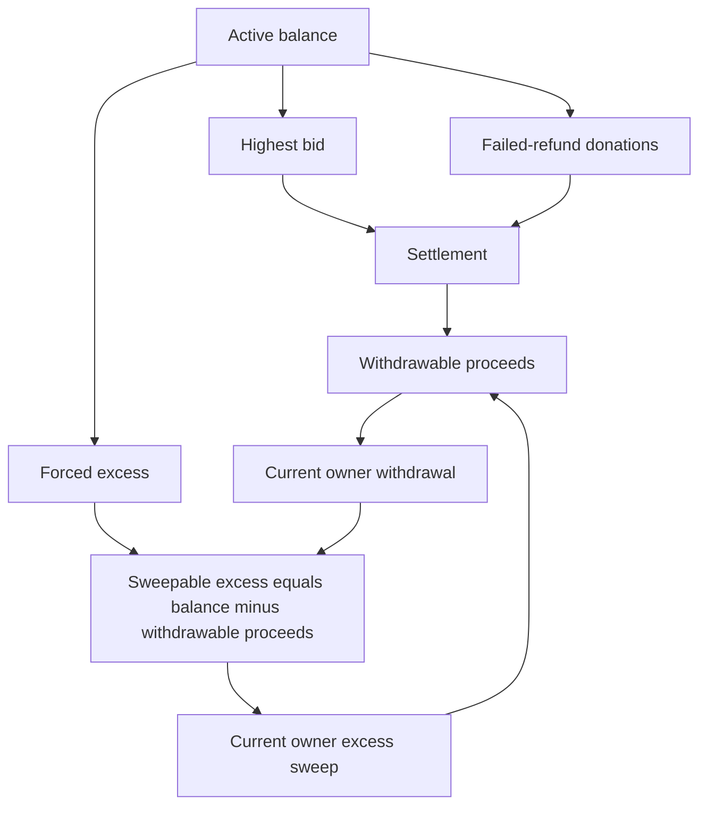

# Society NFT One-Off Auction - Plan

## Goal Capsule

- **Objective:** Provide a one-off, native-ETH auction for one Society NFT on Base that cannot be cancelled or blocked after custody succeeds.
- **Product authority:** This Product Contract is the authority for auction behavior and scope; `docs/ideation/2026-07-12-society-nft-one-off-auction-ideation.html` is supporting rationale.
- **Product Contract preservation:** Requirements R1-R36, actors, flows, acceptance examples, success criteria, and scope are unchanged; the resolved technical questions move into the Planning Contract and the lifecycle diagram moves to High-Level Technical Design.
- **Execution profile:** Implement the contract test-first, validate adversarial callbacks and accounting locally, then dry-run and validate the one-off Base deployment before any broadcast.
- **Stop conditions:** Stop for any change to the refund-as-donation policy, transferable-owner economics, three-day irreversible lifecycle, callback-free winner delivery, fixed collection, or NFT-only DN404 boundary.
- **Tail ownership:** The current owner controls the deployed auction and its economics; curated public deployment facts land in repo config/docs, while signing material and RPC credentials remain in Doppler.
- **Open blockers:** None.

---

## Product Contract

### Summary

Build a single-lot auction for the Society NFT mirror on Base.
The owner escrows one approved NFT to start a fixed three-day auction, bidders compete with strictly higher native-ETH bids, anyone can settle after the deadline, and the current owner withdraws the proceeds afterward.

### Problem Frame

The auction needs to preserve trust without importing marketplace machinery.
Once bidding opens, the prize and deadline must be fixed, a hostile bidder must not block a replacement bid by rejecting a refund, and neither the winner nor owner may block permissionless settlement through a receiving callback.

### Key Decisions

- **One contract, one lot:** The contract auctions one token once and does not become a reusable marketplace.
- **Custody is activation:** The auction becomes active only after the advertised NFT has entered contract custody and that custody has been verified.
- **Refund rejection is donation:** A failed bounded refund does not create a bidder claim; it becomes proceeds belonging to the current owner after settlement.
- **Liveness beats recipient acknowledgement:** Winner delivery cannot depend on a successful ERC-721 receiver callback, and owner payment is separate from settlement.
- **Ownership carries all economics:** Ownership remains transferable to nonzero addresses at every lifecycle stage, cannot be renounced, and gives the current owner every seller-side asset or payout right.
- **Business state is not contract balance:** Bid, donation, and proceeds accounting remain explicit so forced ETH cannot influence bidding or settlement decisions.

### Actors

- A1. **Current owner:** May start the auction, transfer ownership to another nonzero address at any time, receive the NFT when no bid exists, withdraw settled proceeds, and sweep forced ETH after settlement.
- A2. **Bidder:** Submits a strictly higher native-ETH bid and receives an immediate refund attempt after being outbid.
- A3. **Resolver:** Any address that calls settlement after the auction end time.
- A4. **Society NFT mirror:** The fixed Base ERC-721 surface that owns and transfers the auctioned token.

### Requirements

**Collection and activation**

- R1. The auction accepts NFTs only from the Society NFT mirror at `0xbb5ed04dd7b207592429eb8d599d103ccad646c4` on Base, and it does not interact with the DN404 ERC-20 side.
- R2. Only the current owner may start the auction, and start may succeed only once.
- R3. Start selects one token ID and verifies that the token exists, the current owner owns it, and the contract is authorized to transfer it.
- R4. Start transfers the selected NFT into contract custody and verifies custody before the auction becomes active.
- R5. Successful start records `startTime` from the activation block and sets `endTime` to exactly three days later.
- R6. A failed start flight check leaves the auction unstarted and does not retain the selected NFT.
- R7. After successful start, no actor may pause, cancel, extend, restart, settle early, or rescue the auctioned NFT before terminal settlement.

**Bidding and refunds**

- R8. Bidding is open while `startTime <= block.timestamp < endTime` and closed at every other time.
- R9. Each bid consists only of native ETH, must be greater than zero, and must strictly exceed the current highest bid.
- R10. The auction has no reserve price and no minimum increment beyond the strict-higher requirement.
- R11. A valid replacement bid becomes the authoritative highest bid before the prior bidder's refund is attempted.
- R12. The prior highest bid receives one immediate refund attempt with a bounded gas allowance.
- R13. A successful refund returns the complete prior bid and removes it from auction custody.
- R14. A failed refund does not revert or otherwise invalidate the replacement bid.
- R15. A failed refund becomes an irrevocable donation owed to the current owner after settlement, with no later bidder claim or retry path.
- R16. A refund recipient callback cannot reenter auction operations or corrupt bid, donation, lifecycle, or proceeds state.
- R17. Refund success and refund donation are distinguishable in emitted auction history.

**Custodied ETH**

- R18. During the active auction, explicit accounting distinguishes the live highest bid from accumulated failed-refund donations.
- R19. Normal direct ETH transfers outside the bid path are rejected.
- R20. Unavoidable forced ETH does not change the highest bid, donation total, settlement result, or tracked auction proceeds.
- R21. No owner withdrawal or forced-ETH sweep is available before terminal settlement.

**Settlement and NFT delivery**

- R22. Settlement is callable by anyone at `block.timestamp >= endTime` and may complete only once.
- R23. Settlement records terminal state before attempting NFT delivery.
- R24. When at least one valid bid exists, settlement transfers the auctioned NFT to the highest bidder without requiring a successful receiver callback.
- R25. When no valid bid exists, settlement returns the auctioned NFT to the current owner without requiring a successful receiver callback.
- R26. Settlement never sends ETH to the owner or otherwise depends on the owner's ability to receive ETH.
- R27. Successful settlement converts the final highest bid and all failed-refund donations into withdrawable owner proceeds.

**Ownership and proceeds**

- R28. Ownership remains transferable before start, during the active auction, and after settlement, but it cannot be renounced or transferred to the zero address.
- R29. Transferring ownership transfers every seller-side economic right, including future settlement proceeds, accumulated failed-refund donations, forced-ETH excess, and the no-bid NFT return.
- R30. Only the current owner may withdraw, and withdrawal is unavailable until settlement completes.
- R31. Withdrawal sends the complete tracked owner proceeds only to the current owner and cannot select a different recipient.
- R32. If the current owner rejects withdrawal, the withdrawal reverts without losing the proceeds, ownership may be transferred, and the new owner may retry.
- R33. Successful withdrawal clears the tracked owner proceeds and prevents double withdrawal.
- R34. Only the current owner may sweep forced-ETH excess, and only after settlement.

**Readability and history**

- R35. Public read state exposes the lifecycle, selected token ID, start and end times, highest bidder, highest bid, failed-refund donation total, current owner, settlement result, and withdrawable proceeds.
- R36. Auction history distinguishes ownership transfers, activation, accepted bids, successful refunds, refund donations, settlement, proceeds withdrawal, and forced-ETH sweep.

### Key Flows

- F1. **Custody-first start**
  - **Trigger:** A1 starts with an approved Society NFT token ID.
  - **Actors:** A1, A4
  - **Steps:** Validate the lot and authority; transfer the NFT; verify custody; record the three-day window; activate once.
  - **Outcome:** The auction is active only when the advertised prize is already escrowed.
  - **Covered by:** R1-R7

- F2. **Top-bid replacement**
  - **Trigger:** A2 submits a valid higher bid during the active window.
  - **Actors:** A2 and the prior A2, when one exists
  - **Steps:** Record the new leader; attempt the complete prior refund with bounded gas; record either refund success or seller donation.
  - **Outcome:** The new bid remains authoritative regardless of prior-recipient behavior.
  - **Covered by:** R8-R21

- F3. **Permissionless settlement**
  - **Trigger:** A3 calls settlement at or after `endTime`.
  - **Actors:** A3, A1, A2, A4
  - **Steps:** Record terminal state; deliver the NFT to the winner or, with no bids, the current owner; expose proceeds for later withdrawal.
  - **Outcome:** Auction finality never depends on owner payment or recipient acknowledgement.
  - **Covered by:** R22-R29

- F4. **Owner exit**
  - **Trigger:** A1 withdraws after settlement.
  - **Actors:** A1
  - **Steps:** Send tracked proceeds to the current owner; if receipt fails, preserve the claim for retry; allow post-settlement forced-ETH sweep separately.
  - **Outcome:** The current owner receives all seller-side value without coupling payment to settlement.
  - **Covered by:** R30-R36

### Acceptance Examples

- AE1. **Covers R3, R4, R6.** Given an unapproved, nonexistent, or incorrectly owned token, when the owner attempts start, then start fails atomically and the auction remains unstarted.
- AE2. **Covers R1, R4, R5, R7.** Given a valid approved Society NFT, when the owner starts, then the contract holds that token, `startTime` is recorded, `endTime` is exactly three days later, and no cancellation path exists.
- AE3. **Covers R9, R10.** Given an active highest bid, when a bidder submits zero ETH, an equal bid, or a lower bid, then the bid is rejected without changing auction state.
- AE4. **Covers R11-R13, R17, R18.** Given a refundable prior leader, when a higher bid arrives, then the prior bid is returned immediately and only the new highest bid plus any earlier donations remain tracked in custody.
- AE5. **Covers R11, R12, R14, R15, R17, R18.** Given a prior leader that rejects the bounded refund call, when a higher bid arrives, then the higher bid succeeds and the rejected amount becomes a recorded seller donation.
- AE6. **Covers R22, R23, R25, R26.** Given no bids and ownership transferred during the active window, when anyone settles at `endTime`, then the NFT returns to the current owner rather than the address that started the auction.
- AE7. **Covers R22-R24, R26, R27.** Given a winning contract that rejects ERC-721 receiver callbacks, when anyone settles, then settlement still completes and ownership of the NFT is registered to that winner.
- AE8. **Covers R29-R31.** Given ownership transferred after bids or donations accrue, when settlement and withdrawal complete, then only the current owner receives those proceeds.
- AE9. **Covers R30-R32.** Given a current owner that rejects ETH, when withdrawal is attempted, then it reverts without losing proceeds; after ownership transfers to a payable address, the new owner can withdraw successfully.
- AE10. **Covers R19-R21, R34.** Given a normal direct ETH send, then the transfer is rejected; given unavoidable forced ETH, then it cannot alter auction behavior and only the current owner can sweep it after settlement.
- AE11. **Covers R22, R33.** Given a settled auction, when any actor tries to settle again or the owner tries to withdraw the same proceeds again, then the repeated action is rejected.
- AE12. **Covers R2.** Given a non-owner or an auction that has already started, when start is attempted, then the action is rejected without changing custody or lifecycle.
- AE13. **Covers R7, R28.** Given an active auction, when any actor attempts a forbidden lifecycle control or the owner tries to renounce ownership, then the action is rejected without changing custody, lifecycle, or economic rights.
- AE14. **Covers R8, R22.** Given the exact `endTime`, when a bid and settlement are attempted, then the bid is rejected and settlement is available.
- AE15. **Covers R16.** Given a prior bidder whose refund callback attempts to reenter bidding, settlement, withdrawal, or ownership-sensitive auction operations, when a higher bid triggers that callback, then no reentrant operation succeeds and the outer bid resolves to a single consistent refund-or-donation outcome.

### Success Criteria

- Every valid active-state bid either refunds the prior leader or converts that refund into an observable donation without losing the new highest bid.
- After activation, no privileged operation can change the lot, deadline, or path to settlement.
- Any address can complete settlement after the deadline even when the winner and owner are hostile receiving contracts.
- All seller-side economic rights consistently follow the current owner across ownership transfers.
- A reader can reconstruct the auction's lot, bids, donations, settlement, and payouts from public state and emitted history.

### Scope Boundaries

- No DN404 ERC-20 operations, ERC-20 approvals, WETH fallback, or token conversion.
- No reserve price, configured bid increment, Dutch pricing, sealed bids, time extension, or anti-sniping behavior.
- No platform fee, royalty engine, proceeds split, alternate beneficiary, or owner-selected withdrawal recipient.
- No pause, cancellation, early settlement, deadline edit, active-auction auction-lot rescue, or emergency owner override.
- No proxy, upgrade path, reusable auction factory, multiple lots, repeated auctions, or marketplace surface.
- No bidder refund claim ledger: a rejected immediate refund is final and becomes a seller donation.

### Dependencies and Assumptions

- The fixed Society NFT mirror continues to expose the expected ERC-721 ownership, approval, and transfer behavior on Base.
- The auction owner understands that transferring ownership transfers all economic rights and any no-bid NFT return.
- Contract bidders understand the bounded refund policy and can accept native ETH within the published allowance if they want refunds.
- Bidders are responsible for choosing a winning address capable of later managing the NFT; settlement prioritizes liveness over receiver acknowledgement.

### Sources and Research

- `docs/ideation/2026-07-12-society-nft-one-off-auction-ideation.html` — ranked design directions and adversarial filtering.
- `config/fame-public.env` — canonical Base Society NFT mirror address.
- `src/DN404Mirror.sol` — mirror ownership, approval, transfer, and receiver-callback behavior.
- `src/FameRouter.sol` — local guarded native-ETH and reentrancy precedent.
- `lib/solady/src/auth/Ownable.sol` — existing transferable-ownership behavior.
- `lib/solady/src/utils/ReentrancyGuard.sol` — existing mutation guard.
- `lib/solady/src/utils/SafeTransferLib.sol` — `trySafeTransferETH` and the 100,000-gas no-grief allowance.
- `docs/solutions/workflow-issues/public-config-doppler-foundry-aliases-2026-05-12.md` — public config and secret-handling convention.
- `docs/solutions/workflow-issues/keep-generated-deployment-artifacts-out-of-repo-2026-05-15.md` — deployment artifact policy.
- [Solidity security considerations](https://docs.soliditylang.org/en/v0.8.35/security-considerations.html) — checks-effects-interactions, reentrancy, and forced-ETH constraints.
- [ERC-721](https://eips.ethereum.org/EIPS/eip-721) — safe and callback-free transfer semantics.
- [EIP-6780](https://eips.ethereum.org/EIPS/eip-6780) — current `SELFDESTRUCT` balance-transfer behavior.

---

## Planning Contract

### Key Technical Decisions

- KTD1. **Use one non-upgradeable auction contract.** Create one Solidity contract with the Society mirror and three-day duration embedded as constants; use a monotonic `Unstarted -> Active -> Settled` lifecycle and no factory, proxy, fee module, or generalized auction abstraction.
- KTD2. **Use Solady ownership with both transfer paths.** Inherit the repo's Solady `Ownable`, initialize a nonzero owner at deployment, retain direct transfer and two-step handover, override renunciation to always revert, and guard ownership completion paths against refund-callback reentrancy.
- KTD3. **Make safe custody a validated handshake.** Guard start, record temporary expected receipt context, invoke the mirror's safe transfer, validate mirror/operator/from/token in the receiver callback, verify post-transfer ownership, clear receipt context, then record timestamps and activate. The receiver callback remains validation-only and is not separately reentrancy-guarded because it executes inside guarded start.
- KTD4. **Use Solady's 100,000-gas try-transfer for refunds.** Attempt prior-bid refunds with `trySafeTransferETH` and `GAS_STIPEND_NO_GRIEF`; false is the only donation trigger. Never use safe-transfer reversion, WETH fallback, or force-send for an outbid refund.
- KTD5. **Prevent caller-manufactured refund failure.** Check immediately before the refund call that `gasleft()` meets a named minimum covering EIP-150 call forwarding, the complete 100,000-gas recipient allowance, and post-call accounting. Start with a 175,000-gas minimum, prove below/at/above-boundary behavior with a recipient that consumes its full allowance, and raise the minimum if measurement shows the finishing reserve is insufficient.
- KTD6. **Guard every callback-reachable mutation.** Apply one reentrancy guard to start, bid, settle, withdraw, excess sweep, direct ownership transfer, and two-step handover completion. Request/cancel handover bookkeeping may remain unguarded because it does not move ownership or auction economics.
- KTD7. **Use callback-free winner delivery.** Settlement records terminal effects before calling the fixed mirror and delivers through plain ERC-721 transfer; any mirror failure reverts the whole settlement, restoring pre-settlement state.
- KTD8. **Keep historical and obligated ETH separate.** Highest bid and failed-refund donation totals remain readable history. After settlement, `withdrawableProceeds` is the only tracked ETH obligation; sweepable excess is current balance minus that obligation, so withdrawal and excess sweep work safely in either order.
- KTD9. **Use retryable full-gas owner payouts.** Withdrawal and excess sweep clear their payable amount before a guarded full-gas transfer to the current owner. A failed receipt reverts atomically, preserving the amount so ownership can transfer and the new owner can retry.
- KTD10. **Treat public deployment facts as curated config.** Deployment and validation use the Base chain alias, public owner/deployed addresses live in `config/fame-public.env`, secrets remain in Doppler, and generated `broadcast/` output stays untracked.

### High-Level Technical Design

#### Lifecycle

The end timestamp closes bidding but does not mutate state; the first valid settlement call after the deadline performs the terminal transition. Winner/no-bid outcome, withdrawal, and excess sweep are terminal-state data and actions, not additional lifecycle states.

#### Higher-bid refund sequence

The pre-call gas floor ensures the new bidder cannot starve the prior bidder's bounded refund attempt by submitting an under-gassed transaction.

#### ETH accounting after settlement

Historical bid and donation totals remain observable after settlement, but only `withdrawableProceeds` participates in the post-settlement obligation calculation.

### Implementation Constraints

- Use the fixed mirror's ERC-721 surface only; do not call DN404 ERC-20 functions or copy router-specific skip-NFT setup.
- Reject normal direct ETH receipt and use explicit bid, withdrawal, and excess-sweep entrypoints for every intentional balance change.
- Do not use Solady force-send helpers for bidder refunds because forced delivery contradicts the confirmed donation policy.
- Do not add an auction-lot rescue, unrelated-NFT recovery surface, upgrade hook, pausing authority, time extension, or emergency settlement path.
- Preserve custom errors, explicit events, checks-effects-interactions, and repo formatting conventions.
- Keep tests deterministic by installing a mirror-compatible mock at the fixed Base address for local unit tests; reserve live Base access for compatibility and deployment validation.

### Sequencing

1. Establish the contract shell, custody handshake, lifecycle, and ownership restrictions before any ETH path exists.
2. Add top-bid replacement and refund-or-donation accounting with hostile callback coverage.
3. Add permissionless settlement, proceeds withdrawal, and forced-excess handling.
4. Add stateful invariants and live-mirror compatibility coverage across the complete contract.
5. Add Base deployment, validation, public config, and operational documentation only after contract behavior is green.

### Risks and Mitigations

| Risk | Consequence | Mitigation |
|---|---|---|
| Under-gassed replacement bid | Honest prior refund is misclassified as donation | Enforce the pre-refund gas floor and test immediately below/at/above it. |
| Refund callback reentrancy | Bid, ownership, or proceeds state changes mid-replacement | Guard all callback-reachable mutations and test each attempted reentry surface. |
| Accounting treats historical values as obligations | Owner over-withdraws or excess sweep consumes proceeds | Make `withdrawableProceeds` the sole post-settlement obligation and assert the balance equation with invariants. |
| Ownership becomes zero or changes during callback | No-bid NFT and seller economics become unreachable or redirected | Disable renunciation, preserve nonzero transfer checks, and guard ownership completion. |
| Safe winner delivery calls hostile code | Winner blocks permissionless settlement | Use plain mirror transfer for terminal delivery and document bidder responsibility. |
| Mirror behavior differs from the local mock | Base deployment fails despite unit tests | Add live-mirror interface/fork compatibility and post-deploy validation before broadcast. |
| Irreversible start uses wrong owner, token, or chain | Auction cannot be repaired after activation | Validate chain, owner, fixed mirror, token custody, and pristine state before any live start. |

### System-Wide Impact and Operational Boundaries

- **On-chain state:** One new non-upgradeable contract owns the lot during Active and ETH until the applicable refund, withdrawal, or excess sweep. No existing contract storage or behavior changes.
- **Society DN404 boundary:** The auction addresses only the deployed mirror's ERC-721 ownership and transfer surface. No DN404 base-token call, approval, balance, or skip-NFT behavior enters the dependency graph.
- **Indexer and operator surface:** Events and public getters are the source of truth for lot, leader, refund outcome, donations, settlement, proceeds, and excess sweep. Operator documentation must map each live action to its expected event and post-call getter state.
- **Irreversibility boundary:** Deployment is replaceable while pristine; a failed start reverts atomically; a successful start has no rollback, rescue, pause, or deadline edit. Any mismatch in chain, owner, token ID, approval, code hash/interface assumptions, or pristine state is a no-go before start.
- **Failure containment:** A failed bid, start, settlement, withdrawal, or sweep reverts that call without creating an alternate claim path. A failed prior-bid refund is the sole intentional exception and resolves as a donation under R15.

### Deferred Implementation Notes

- Final custom error names, event names, storage packing, and getter layout may adjust during implementation while preserving R34-R36.
- The 175,000-gas pre-refund floor is the planned starting value; implementation may raise it if boundary tests prove the post-call buffer insufficient, but may not reduce the 100,000-gas recipient allowance.
- Generic recovery for unrelated NFTs forced in through unsafe transfer remains outside scope.

---

## Implementation Units

### U1. Contract shell, ownership, custody, and lifecycle

- **Goal:** Create the one-shot contract and prove that only a validated Society NFT custody handshake can cross into the irreversible active state.
- **Requirements:** R1-R7, R28-R29, R35-R36; A1, A4; F1; AE1-AE2, AE12-AE13; KTD1-KTD3, KTD6.
- **Dependencies:** None.
- **Files:** `src/SocietyNftAuction.sol`, `test/SocietyNftAuction.t.sol`, `test/mocks/SocietyNftAuctionActors.sol`.
- **Approach:** Add the fixed mirror and duration constants, lifecycle/read state, Solady ownership initialization, nonzero transferable ownership, disabled renunciation, guarded ownership completion, temporary receipt context, strict receiver validation, post-transfer ownership verification, and atomic activation.
- **Execution note:** Start with failing custody and ownership boundary tests before adding the contract state transitions.
- **Patterns to follow:** `src/FameRouter.sol` for Solady ownership/reentrancy composition; `src/FameLaunch.sol` for receiver shape; `src/DN404Mirror.sol` for mirror transfer semantics; fixed-address `vm.etch` setup in `test/router/FameRouter.t.sol`.
- **Test scenarios:**
  - Covers AE1. Nonexistent token, wrong owner, missing token approval, and missing operator approval each leave the auction unstarted and without custody.
  - Covers AE2. A valid safe transfer verifies custody, records the activation timestamp, derives the exact three-day end, and activates once.
  - Receiver rejects the wrong collection sender, operator, prior owner, token ID, or transfer outside the temporary receipt window.
  - A receiver mismatch rolls the whole start back, including expected-receipt context and any partial state.
  - Covers AE12. Non-owner start and repeated start revert without changing custody or timestamps.
  - Covers AE13. Pause, cancel, early settlement, lot rescue, renunciation, and zero-address ownership transfer are unavailable or rejected.
  - Direct ownership transfer works in unstarted and active states; two-step request/cancel/complete works within its validity window and rejects expired or missing handovers.
  - Callback-time attempts to transfer or complete ownership are rejected by the shared guard.
- **Verification:** The contract can enter Active exactly once, only while holding the selected fixed-mirror token, and owner is nonzero through every tested transition.

### U2. Top-bid replacement and refund-or-donation accounting

- **Goal:** Implement strictly increasing native-ETH bids whose prior refund cannot block or reenter the auction.
- **Requirements:** R8-R18; A2; F2; AE3-AE5, AE14-AE15; KTD4-KTD6.
- **Dependencies:** U1.
- **Files:** `src/SocietyNftAuction.sol`, `test/SocietyNftAuction.t.sol`, `test/mocks/SocietyNftAuctionActors.sol`.
- **Approach:** Treat each `msg.value` as the full proposed bid, validate the half-open window and strict increase, record the new leader before interaction, enforce the pre-call gas floor, then use Solady's 100,000-gas try-transfer to resolve the complete prior bid as either refund success or donation.
- **Execution note:** Implement the refund path test-first with accepting, reverting, gas-burning, and reentrant prior bidders before optimizing storage or event shape.
- **Patterns to follow:** `lib/solady/src/utils/SafeTransferLib.sol` for try-transfer semantics and stipend; `test/router/mocks/ReentrantToken.sol` and callback tests in `test/router/FameRouter.t.sol` for hostile actors.
- **Test scenarios:**
  - The first positive bid becomes highest without any refund attempt.
  - Covers AE3. Zero, equal, and lower bids revert without changing leader, amount, donations, or balance obligations.
  - A bid at `endTime - 1` succeeds; Covers AE14, a bid at `endTime` fails and settlement becomes available.
  - Covers AE4. An accepting prior bidder receives the complete prior bid within the 100,000-gas allowance and no donation is added.
  - Covers AE5. A reverting prior bidder leaves the higher bid authoritative and converts the complete prior amount into one donation.
  - A gas-burning prior bidder exhausts only its allowance; the outer bid completes with a donation.
  - A call immediately below the pre-refund gas floor reverts before replacing the leader; calls at and above the floor provide the full allowance and finish accounting.
  - Covers AE15. Refund callbacks cannot reenter start, bid, settle, withdraw, excess sweep, direct ownership transfer, or handover completion.
  - A current leader may submit a full higher bid; its prior amount follows the same refund-or-donation policy as any other leader.
  - Fuzzed valid bids keep the highest amount strictly increasing and preserve exact refund-or-donation conservation.
- **Verification:** Every accepted replacement produces one new leader and exactly one prior-bid outcome while preserving the gas and reentrancy invariants.

### U3. Permissionless settlement, proceeds, and forced excess

- **Goal:** Complete either terminal settlement path and pay only the current owner without coupling finality to ETH receipt.
- **Requirements:** R19-R34; A1-A3; F3-F4; AE6-AE11; KTD7-KTD9.
- **Dependencies:** U1, U2.
- **Files:** `src/SocietyNftAuction.sol`, `test/SocietyNftAuction.t.sol`, `test/mocks/SocietyNftAuctionActors.sol`.
- **Approach:** Reject ordinary direct ETH, settle once at or after the deadline, record terminal effects before mirror transfer, deliver with callback-free transfer, derive `withdrawableProceeds` from the winning bid plus donations, and compute sweepable forced excess as balance minus that sole obligation.
- **Execution note:** Prove both settlement branches and both payout orderings before refactoring shared accounting helpers.
- **Patterns to follow:** `src/DN404Mirror.sol` for callback-free transfer; `src/FameRouter.sol` and Solidity checks-effects-interactions guidance for guarded native payout.
- **Test scenarios:**
  - Settlement before `endTime` fails; Covers AE14, settlement exactly at `endTime` succeeds.
  - Covers AE6. With no bids and ownership transferred during Active, anyone settles and the NFT returns to the current owner.
  - Covers AE7. With a winning contract that rejects receiver callbacks, callback-free delivery and terminal settlement still succeed.
  - A mirror transfer failure reverts settlement and restores the pre-settlement lifecycle and proceeds state.
  - Covers AE8. Direct and two-step ownership transfers before or after settlement move every seller-side right to the new current owner.
  - Covers AE9. A rejecting owner cannot consume proceeds; ownership transfer to a payable owner enables a successful retry.
  - Covers AE10. Normal direct ETH rejects; forced ETH before settlement cannot be swept or affect bidding; after settlement it is exact excess.
  - Sweep-before-withdraw and withdraw-before-sweep produce identical final owner receipts and zero tracked obligations.
  - A failed excess sweep reverts and remains retryable after ownership transfer.
  - Covers AE11. Repeated settlement and repeated proceeds withdrawal revert; zero-excess sweep reverts without changing state.
- **Verification:** Settlement remains permissionless, proceeds remain retryable, and no operation can consume the other ETH bucket in either payout order.

### U4. Stateful invariants and Base mirror compatibility

- **Goal:** Prove conservation, monotonic lifecycle, callback containment, and compatibility beyond example-based unit tests.
- **Requirements:** R1-R36; F1-F4; AE1-AE15; KTD1-KTD9.
- **Dependencies:** U1-U3.
- **Files:** `test/SocietyNftAuctionInvariant.t.sol`, `test/SocietyNftAuctionBaseFork.t.sol`, `test/mocks/SocietyNftAuctionActors.sol`.
- **Approach:** Add a stateful handler that varies bids, ownership transfer, time, settlement, withdrawal, forced ETH, and hostile recipients; keep a separate Base-fork compatibility suite focused on the fixed mirror's deployed interface and transfer assumptions.
- **Execution note:** Treat any invariant failure as an accounting or lifecycle defect, not as a test-harness inconvenience to be papered over.
- **Patterns to follow:** Foundry fuzz/invariant conventions already available through `forge-std`; public Base alias and Doppler workflow from repo guidance.
- **Test scenarios:**
  - Lifecycle never moves backward or activates/settles more than once.
  - Owner is never zero, including direct and completed two-step handovers.
  - During Active, contract balance is at least highest bid plus failed-refund donations; any remainder is forced excess.
  - After settlement, contract balance is at least `withdrawableProceeds`; historical highest bid and donations are never counted twice.
  - Every accepted bid strictly increases highest bid and resolves the prior bid once.
  - Refund callbacks cannot complete any guarded mutation.
  - The auction holds the selected NFT throughout Active and no longer holds it after successful settlement.
  - Base fork confirms the configured mirror has code and exposes the ownership, approval, safe-transfer, callback, and callback-free transfer behavior the contract depends on.
- **Verification:** Long stateful runs preserve every balance, ownership, custody, and lifecycle invariant, and the live Base mirror satisfies the assumed ERC-721 surface.

### U5. Base deployment, validation, public config, and operator notes

- **Goal:** Make the one-off deployment reproducible, secret-safe, and independently verifiable before the irreversible live start.
- **Requirements:** R1-R7, R27-R28, R34-R36; KTD10.
- **Dependencies:** U1-U4.
- **Files:** `script/DeploySocietyNftAuction.s.sol`, `script/ValidateSocietyNftAuctionBase.s.sol`, `test/SocietyNftAuctionDeploymentValidation.t.sol`, `config/fame-public.env`, `docs/society-nft-auction.md`.
- **Approach:** Add a Base-chain deployment script with explicit owner initialization, a read-only validator for code/owner/mirror/pristine lifecycle, fixed-address deployment validation tests, curated public address fields, and operator documentation for approval, dry-run, broadcast, validation, start, settlement, and withdrawal.
- **Execution note:** Dry-run and validate the configured owner and pristine auction state before any broadcast; never start the live auction as part of deployment automation.
- **Patterns to follow:** `script/DeployFameRouter.s.sol`, `script/ValidateFameRouterBase.s.sol`, `test/router/FameRouterDeploymentValidation.t.sol`, `config/fame-public.env`, and the deployment workflow learnings in `docs/solutions/workflow-issues/`.
- **Test scenarios:**
  - Deployment rejects a zero owner and initializes the supplied nonzero owner.
  - Deployment on a non-Base chain ID rejects before broadcast logic.
  - Deployed contract reports the fixed mirror, Unstarted lifecycle, zero timestamps, zero bids/donations/proceeds, and disabled renunciation.
  - Validator rejects missing code, wrong owner, wrong mirror, non-pristine lifecycle, or unexpected economic state.
  - Validator accepts the intended deployed contract without moving NFT or ETH.
  - Public config parsing requires a valid confirmed owner and deployed address while private key/RPC values remain absent from tracked files.
- **Verification:** A dry-run produces the expected contract state, read-only validation passes on Base, and no generated broadcast artifact is part of the reviewed change.

#### Live deployment and start go/no-go

1. **Pre-deploy:** Record the intended nonzero owner and confirm Base chain ID, fixed mirror code, and the absence of secrets from tracked config. Stop on any mismatch.
2. **Dry-run:** Execute `DeploySocietyNftAuction.s.sol` without broadcast through Doppler and the `base` alias. Require the predicted contract to report the intended owner, fixed mirror, Unstarted lifecycle, zero timestamps, and zero economic state.
3. **Broadcast and record:** Broadcast only the deployment, add the resulting public auction address to `config/fame-public.env`, and keep generated `broadcast/` output untracked.
4. **Independent validation:** Execute `ValidateSocietyNftAuctionBase.s.sol` read-only against the curated address. Stop unless deployed code, owner, fixed mirror, disabled renunciation, pristine lifecycle, and zero economic state all match.
5. **Pre-start lot check:** Immediately before start, independently read `ownerOf(tokenId)` and approval state from the fixed mirror, confirm the selected token ID and current auction owner, and simulate the exact start call. Stop on a revert, unexpected state delta, or stale approval.
6. **Start:** Submit start as a separate owner action. Success requires the activation event, auction ownership of the exact token, `startTime` equal to the mined block timestamp, and `endTime == startTime + 3 days`.
7. **Post-start posture:** Treat the auction as irreversible. Monitor accepted-bid/refund/donation events, publish the exact end timestamp, and retain the permissionless settlement plus owner-withdrawal commands in the operator runbook; there is no rollback transaction to prepare.

---

## Verification Contract

| Gate | Command or check | Applies to | Required outcome |
|---|---|---|---|
| Formatting | `forge fmt --check` | U1-U5 | All Solidity and script files are formatted. |
| Compile and size | `forge build --sizes` | U1-U5 | Build succeeds without a contract-size regression that threatens deployment. |
| Focused behavior | `forge test --match-path test/SocietyNftAuction.t.sol -vvv` | U1-U3 | Lifecycle, bidding, callbacks, settlement, ownership, and payout scenarios pass. |
| Stateful invariants | `forge test --match-path test/SocietyNftAuctionInvariant.t.sol -vvv` | U4 | Conservation, monotonicity, custody, and nonzero-owner invariants hold. |
| Base mirror compatibility | Load `config/fame-public.env`, then run `doppler run -- forge test --match-path test/SocietyNftAuctionBaseFork.t.sol --fork-url base -vvv` | U4 | Fixed deployed mirror satisfies the NFT-side assumptions without ERC-20 interaction. |
| Deployment validation tests | `forge test --match-path test/SocietyNftAuctionDeploymentValidation.t.sol -vvv` | U5 | Wrong-chain/config/state cases reject and pristine deployments validate. |
| Full regression | `forge test` | U1-U5 | Existing repository tests remain green. |
| Base dry-run | Load `config/fame-public.env`, then run `doppler run -- forge script script/DeploySocietyNftAuction.s.sol --chain base --rpc-url base -vvv` without `--broadcast` | U5 | Predicted deployment succeeds with the confirmed owner and fixed mirror. |
| Live validation | Load `config/fame-public.env`, then run `doppler run -- forge script script/ValidateSocietyNftAuctionBase.s.sol --chain base --rpc-url base -vvv` | U5 | Deployed code, owner, fixed mirror, disabled renunciation, and pristine state match curated public config. |
| Pre-start simulation | Simulate the exact owner `start(tokenId)` call against Base after confirming `ownerOf` and approval state | U5 | Simulation succeeds and shows only exact-lot custody plus the expected three-day activation state; otherwise stop. |
| Artifact hygiene | Inspect the reviewed change before staging | U5 | No `broadcast/` logs, RPC URLs, private keys, mnemonics, or explorer keys are tracked. |

---

## Definition of Done

### Global

- The artifact remains faithful to R1-R36, F1-F4, and AE1-AE15 without adding marketplace, WETH, ERC-20, rescue, pause, or upgrade behavior.
- Every external callback surface has explicit reentrancy, failure, and gas-boundary coverage.
- Highest bid, donations, withdrawable proceeds, and forced excess reconcile under unit and stateful invariant tests.
- Base mirror compatibility, deployment validation, focused tests, full regression, formatting, and build-size gates pass.
- Public deployment facts are curated in config/docs, secrets remain in Doppler, and generated broadcast output is absent from the reviewed diff.
- Dead-end helpers, unused mocks, temporary debug logging, and abandoned experimental code are removed.

### Per Unit

- U1 is done when custody-first activation and nonzero transferable ownership are proven across direct, handover, and hostile callback cases.
- U2 is done when every prior bid resolves once through a full 100,000-gas refund attempt or donation and low-gas/reentrant callers cannot corrupt the result.
- U3 is done when both settlement branches, both payout orders, failed owner receipt, and forced excess preserve finality and exact obligations.
- U4 is done when stateful invariants hold and the live Base mirror satisfies the NFT-side transfer contract.
- U5 is done when deployment can be dry-run, the deployed state can be validated read-only, operator documentation is complete, and tracked artifacts are secret-safe.
