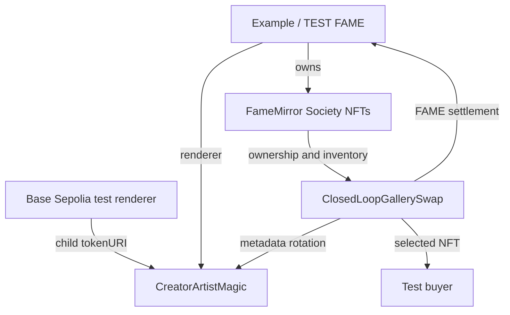
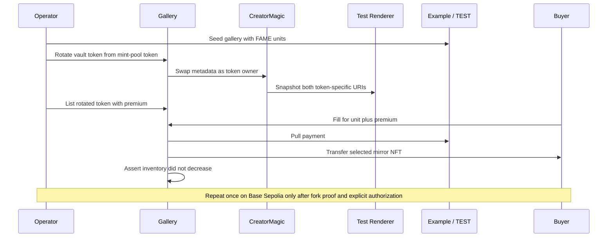

# Base Sepolia Marketplace Test Renderer - Plan

> **Superseded (2026-08-06).** ClosedLoop gallery test stack and `BaseSepoliaTestRenderer` were removed with `ClosedLoopGallerySwap`. See `docs/gallery/marketplace-checkout-review-decisions.md` (D1).

## Goal Capsule

- **Objective:** Prove that the Base Sepolia `Example / TEST` DN404 deployment can expose unique on-chain Society NFT art, rotate that metadata through CreatorArtistMagic, and settle a selected token through `ClosedLoopGallerySwap` without reducing vault inventory.
- **Authority:** The live `Example / TEST` contract at `0x2cf0408ee86b337216dd0073ab257f84497067ca` is the target test asset. Existing CreatorArtistMagic ownership rules and gallery inventory invariants remain authoritative.
- **Execution profile:** Add deterministic renderer code and local tests first, then deployment/validation support, execute the Base Sepolia fork gate, and finish with one authorized live smoke run.
- **Stop conditions:** Stop before broadcast if the chain, FAME identity, mirror, deployer authority, or existing public configuration differs from the expected Base Sepolia test stack.
- **Tail ownership:** Record public addresses and validation instructions in the repo. Keep RPC URLs and deployer credentials in Doppler and keep generated broadcast output uncommitted.

---

## Product Contract

### Summary

Add a stateless on-chain renderer that produces visibly distinct SVG artwork and ERC-721 metadata for every token ID. Deploy it as the child renderer for a Base Sepolia CreatorArtistMagic instance, wire that instance into `Example / TEST` and the gallery, prove the flow on a deployed-address fork, then confirm it with one authorized live smoke run.

### Problem Frame

The existing Base Sepolia renderer returns one constant URI, so it cannot prove that CreatorArtistMagic moved one token's metadata to another token or that a buyer selected the intended art. A hosted metadata endpoint would add web deployment, cache, and availability variables to a contract integration test. The test stack needs unique metadata whose complete source is inspectable onchain.

### Actors

- A1. **Test-stack administrator:** Deploys and wires the renderer, CreatorArtistMagic, and gallery using the existing FAME admin authority.
- A2. **Gallery operator:** Seeds inventory, rotates a vault-owned token to a distinct pool token's metadata, and lists the result.
- A3. **Test buyer:** Pays one FAME unit plus premium and receives the selected Society NFT.
- A4. **Reviewer:** Re-runs local, Base Sepolia fork, and live-state validation gates without relying on generated broadcast logs.

### Requirements

**Renderer behavior**

- R1. The renderer implements `ITokenURIGenerator` and returns a valid `data:application/json;base64` URI for every `uint256` token ID.
- R2. Decoded metadata contains token-specific `name`, `description`, `image`, and attributes, with `image` holding a valid `data:image/svg+xml;base64` URI.
- R3. The SVG visibly contains the decimal token ID and deterministic token-derived styling so two different IDs produce different metadata and image bytes.
- R4. Rendering is pure and stateless, with no owner, mutable configuration, external URL, or supported-token range that could obstruct unminted pool lookups.

**Base Sepolia wiring**

- R5. Deployment targets only chain ID `84532` and verifies the target FAME contract is `Example / TEST` with the expected mirror before changing renderer authority.
- R6. CreatorArtistMagic uses the on-chain renderer as its child renderer, uses the verified `Example / TEST` address, and starts with `nextTokenId = 500` to preserve the established mint-pool test boundary.
- R7. `Example / TEST` delegates tokenURI rendering to CreatorArtistMagic, while the gallery receives only CreatorMagic `BANISHER` and `ART_POOL_MANAGER` roles and remains non-skip for DN404 inventory.
- R8. Public Base Sepolia addresses are recorded in `config/fame-public.env`; RPC URLs and the deployer private key remain in Doppler.

**Marketplace proof**

- R9. An executed Base Sepolia fork test uses the deployed test stack to seed gallery inventory, select two distinct metadata legs, rotate a vault-owned token, list it, fill it for one unit plus premium, and assert the recipient receives the selected metadata.
- R10. The fork proof asserts the gallery's mirror balance does not decrease across fill and that the recorded premium equals the configured protocol fee.
- R11. Missing RPC or deployment inputs may skip the test in ordinary local runs, but a skipped test does not satisfy the Base Sepolia verification gate.
- R12. After fork proof passes, an explicitly authorized live Base Sepolia smoke run performs one rotation and fill, then verifies the resulting ownership, metadata, premium, and inventory state from chain reads.

### Key Flows

- F1. **Deploy and wire test stack**
  - **Trigger:** A1 runs the Base Sepolia deployment after loading public config and Doppler `dev` secrets.
  - **Steps:** Verify chain and FAME identity, deploy the renderer and CreatorArtistMagic, grant required FAME metadata authority, set CreatorArtistMagic as the FAME renderer, deploy the gallery, and grant the gallery narrow CreatorMagic roles.
  - **Outcome:** All contracts are connected to the existing `Example / TEST` deployment and their public addresses can be validated independently.
- F2. **Rotate distinct on-chain art**
  - **Trigger:** A2 identifies a vault-owned token and an eligible unminted mint-pool token below ID 500.
  - **Steps:** Read both token URIs, rotate through the gallery, and compare the purchased token's new URI with the pool token's pre-rotation URI.
  - **Outcome:** The vault-owned token carries the selected pool artwork and the source leg carries the displaced metadata.
- F3. **Fill a listed token**
  - **Trigger:** A2 lists the rotated token and A3 approves one unit plus premium.
  - **Steps:** Fill to the recipient, inspect ownership and metadata, and compare vault mirror balances before and after.
  - **Outcome:** The recipient owns the selected art, premium accrues, and gallery inventory is preserved.
- F4. **Confirm the live testnet path**
  - **Trigger:** The deployed-address fork gate passes and the user authorizes Base Sepolia transactions.
  - **Steps:** Revalidate the stack, seed bounded inventory, rotate and list one token, fill it from the test account, and read the final state from chain.
  - **Outcome:** The same selected-art flow proven on the fork has transaction evidence on Base Sepolia.

### Acceptance Examples

- AE1. Given token IDs 12 and 420, decoding their renderer output yields different names, SVG text, style values, and complete valid metadata documents.
- AE2. Given a deployed test stack with a vault-owned token and eligible token 420 in the mint pool, rotating through the gallery makes the vault-owned token return token 420's pre-rotation URI.
- AE3. Given a listed rotated token priced at one FAME unit plus a positive premium, filling transfers that token to the recipient, records the premium, and leaves the gallery with at least its pre-fill NFT count.
- AE4. Given a renderer address, CreatorArtistMagic address, FAME address, or mirror address from another chain or stack, validation fails before the result is accepted as a Base Sepolia proof.
- AE5. Given an authorized live smoke run, the final receipt and chain reads identify the filled token, selected URI, recipient owner, exact premium accrual, and non-decreasing vault inventory.

### Scope Boundaries

**In scope**

- A deterministic test renderer with fully on-chain JSON and SVG.
- Deployment and read-only validation of the Base Sepolia renderer, CreatorArtistMagic, and gallery test stack.
- A Base Sepolia fork-backed marketplace flow using the real `Example / TEST` contract and deployed stack addresses.
- One bounded, explicitly authorized live Base Sepolia rotation and purchase after the fork gate passes.
- Curated public configuration and a concise operator runbook.

**Out of scope**

- Production Fame Lady Society artwork, metadata, provenance, or reveal policy.
- Hosting token metadata on `fls-www`, IPFS, Irys, or another offchain service.
- Mainnet deployment or changes to the gallery settlement design.
- A browser marketplace UI.

### Dependencies

- The Base Sepolia `Example / TEST` contract remains deployed at `0x2cf0408ee86b337216dd0073ab257f84497067ca` and exposes the expected `Fame` interface.
- The Doppler `dev` config provides `RPC_URL` and `DEPLOYER_PRIVATE_KEY`; process-local mapping supplies the Foundry `base_sepolia` alias without copying secrets into public config.
- The deployer retains FAME admin/owner authority and enough TEST balance to seed a forked gallery scenario.

---

## Planning Contract

### Key Technical Decisions

- KTD1. Use nested Base64 data URIs for both metadata and SVG. This matches the ERC-721 metadata shape while removing HTTP hosting and escaping concerns from the test. (session-settled: user-directed — chosen over `fls-www`-hosted test metadata: the contract integration proof should not depend on a web deployment or cache.)
- KTD2. Keep the renderer stateless and accept every token ID. CreatorArtistMagic queries minted, burned, and unminted IDs, so existence checks belong to FAME and CreatorArtistMagic rather than the renderer.
- KTD3. Derive deterministic styling from the token ID and print the decimal ID in the SVG. A hash-only difference would prove byte uniqueness but would be miserable to inspect during marketplace testing.
- KTD4. Deploy a dedicated Base Sepolia test stack without generalizing the existing Base mainnet gallery scripts. The environments have different token identity, secret names, and launch intent; a shared abstraction would save little and blur chain guards.
- KTD5. Treat the deployed-address fork scenario as the mandatory E2E gate. It exercises actual Base Sepolia FAME bytecode and state while keeping inventory seeding, role impersonation, and purchases atomic and repeatable.
- KTD6. Use `nextTokenId = 500`. This follows existing CreatorArtistMagic and gallery tests, leaves IDs 420-499 outside the art pool, and provides stable unminted metadata candidates on the low-supply test deployment.
- KTD7. Gate a bounded live smoke run behind the successful fork scenario and explicit transaction authorization. Fork proof catches failures cheaply; the live run proves RPC, signing, and testnet execution without turning deployment into an open-ended operational exercise.

### High-Level Technical Design

### Implementation Constraints

- Reuse Solady `LibString` and `Base64`; do not add a renderer dependency.
- Keep metadata text ASCII so JSON and SVG construction do not need a general escaping layer.
- Validate FAME name, symbol, mirror, renderer, CreatorMagic child renderer, gallery wiring, role posture, and `skipNFT` posture from chain reads.
- Do not commit `broadcast/` output. Promote only reviewed public addresses into `config/fame-public.env`.
- Do not report the Base Sepolia gate as passing unless the RPC-backed test executed without `vm.skip`.

### Sequencing

U1 establishes a locally provable renderer contract. U2 deploys and validates the chain-specific stack. U3 consumes the deployed addresses for repeatable E2E proof. U5 performs one authorized live confirmation. U4 records the resulting operating contract and evidence boundary.

---

## Implementation Units

### U1. Add deterministic on-chain test renderer

- **Goal:** Return token-specific ERC-721 metadata and SVG entirely from contract bytecode.
- **Requirements:** R1, R2, R3, R4; KTD1, KTD2, KTD3.
- **Dependencies:** None.
- **Files:**
  - `src/BaseSepoliaTestRenderer.sol`
  - `test/BaseSepoliaTestRenderer.t.sol`
- **Approach:** Implement `ITokenURIGenerator` as a pure renderer using `LibString` and `Base64`. Include an inspectable token number, deterministic palette or geometry, and test-environment attributes without storing configuration.
- **Execution note:** Implement the decoder-based metadata assertions before relying on the renderer in deployment tests.
- **Patterns to follow:** `src/FameRenderer.sol` for the renderer interface and string conversion; `lib/solady/src/utils/Base64.sol` for standard Base64 encoding and test decoding; `test/mocks/EchoMetadata.sol` for minimal pure renderer behavior.
- **Test scenarios:**
  - Covers AE1. Decode token 12 and assert the JSON contains the expected token-specific name, description, attributes, and an SVG image data URI.
  - Decode the nested SVG and assert it contains the decimal token ID and valid SVG root markup.
  - Render token IDs 12 and 420 and assert both outer metadata and inner SVG bytes differ.
  - Render boundary values including 0, 500, 888, and `type(uint256).max` without reverting or truncating the decimal ID.
  - Call the same token ID repeatedly and assert byte-for-byte deterministic output.
- **Verification:** Focused renderer tests decode both data-URI layers and prove validity, uniqueness, and determinism.

### U2. Deploy and validate the Base Sepolia gallery test stack

- **Goal:** Deploy the renderer, CreatorArtistMagic, and gallery against verified `Example / TEST` contracts with the intended authority posture.
- **Requirements:** R5, R6, R7, R8; F1; AE4; KTD4, KTD6.
- **Dependencies:** U1.
- **Files:**
  - `script/DeployBaseSepoliaGalleryTestStack.s.sol`
  - `script/ValidateBaseSepoliaGalleryTestStack.s.sol`
  - `test/BaseSepoliaGalleryTestStackDeploymentValidation.t.sol`
  - `config/fame-public.env`
- **Approach:** Add a Base Sepolia-specific deployer with a chain guard and explicit FAME identity checks. Deploy the child renderer and CreatorArtistMagic, grant the deployer FAME metadata authority if needed, set FAME's renderer, deploy the gallery, and grant only its required CreatorMagic roles. Add a read-only validator for all addresses, renderer links, roles, token identity, and vault `skipNFT` state.
- **Execution note:** Keep constructor/wiring logic callable from tests so wrong-chain, wrong-token, and role failures are proven without broadcasting.
- **Patterns to follow:** `script/DeployClosedLoopGallerySwap.s.sol`, `script/ValidateClosedLoopGallerySwapBase.s.sol`, and `test/ClosedLoopGallerySwapDeploymentValidation.t.sol`.
- **Test scenarios:**
  - Deployment rejects a chain ID other than 84532 before broadcast.
  - Deployment rejects a contract whose name or symbol is not `Example` / `TEST`, or whose mirror cannot be derived from FAME.
  - Deployment creates CreatorArtistMagic with the test renderer, expected FAME, and `nextTokenId = 500`.
  - Deployment leaves FAME rendering through CreatorArtistMagic and the gallery with required swap roles but no `CREATOR` role.
  - Deployment leaves the gallery with `skipNFT == false`.
  - Covers AE4. Validation rejects each mismatched renderer, CreatorArtistMagic, FAME, mirror, gallery, owner, operator, or fee recipient input.
  - Validation rejects missing required CreatorMagic roles and rejects an unexpectedly broad gallery `CREATOR` role.
  - Validation compares two renderer outputs and rejects a constant or empty child renderer.
- **Verification:** Local deployment-validation tests prove all pre-broadcast and post-deployment checks; the read-only validator succeeds against the recorded Base Sepolia addresses.

### U3. Prove metadata rotation and purchase on a Base Sepolia fork

- **Goal:** Exercise the full selected-art marketplace flow against the deployed Base Sepolia test stack and actual `Example / TEST` state.
- **Requirements:** R9, R10, R11; F2, F3; AE2, AE3; KTD5.
- **Dependencies:** U2 and deployed public addresses.
- **Files:**
  - `test/ClosedLoopGallerySwapForkBaseSepolia.t.sol`
- **Approach:** Fork Base Sepolia from Doppler `dev`, verify all deployed addresses, and impersonate the existing FAME owner only inside the fork. Ensure transfers are enabled, seed the non-skip gallery with enough FAME units to mint inventory, discover a vault-owned token and an eligible mint-pool token in 420-499, rotate, list, approve, and fill. Decode metadata before and after to prove that the selected art moved with the purchased token.
- **Execution note:** Build the scenario from chain state discovered at runtime rather than assuming specific minted gallery token IDs.
- **Patterns to follow:** `test/ClosedLoopGallerySwapForkBase.t.sol` for RPC gating and chain checks, `test/ClosedLoopGallerySwap.t.sol` for rotation/fill assertions, and `FameMirror.ownerAt` for token discovery.
- **Test scenarios:**
  - The fork refuses to proceed as a valid gate on a chain other than 84532 or with missing deployed bytecode.
  - The configured FAME address reports `Example`, `TEST`, the expected mirror, and a one-million-token NFT unit.
  - Seeding the gallery increases its mirror balance and leaves `skipNFT == false`.
  - Covers AE2. Rotation from a discovered mint-pool token changes the vault token URI to the pool token's previous unique URI and moves the displaced URI to the pool leg.
  - Covers AE3. Filling the rotated listing transfers ownership and selected metadata to the recipient, accrues the exact premium, and preserves or increases gallery mirror inventory.
  - An unexecuted RPC setup is surfaced as a skipped test and fails the release evidence checklist even if local suites pass.
- **Verification:** The focused fork suite runs under Doppler `dev` without skips and proves every assertion against the deployed Base Sepolia contracts.

### U5. Execute a bounded live Base Sepolia marketplace smoke

- **Goal:** Confirm that the deployed test stack can rotate and sell one uniquely rendered Society NFT in live Base Sepolia transactions.
- **Requirements:** R12; F4; AE5; KTD7.
- **Dependencies:** U2, U3.
- **Files:**
  - `script/SmokeBaseSepoliaGalleryTestStack.s.sol`
  - `test/BaseSepoliaGalleryTestStackSmoke.t.sol`
- **Approach:** Add a chain-guarded smoke script that revalidates the stack, discovers eligible token IDs from current state, uses a small fixed inventory and positive premium, and emits or logs the identifiers needed for receipt verification. Require an explicit operator opt-in before broadcast and verify final state through a separate read-only path.
- **Execution note:** Prove the script against a local fixture and the Base Sepolia fork before requesting broadcast authorization; never use the live network as a debugging loop.
- **Patterns to follow:** Existing deployment scripts for broadcast boundaries, `test/ClosedLoopGallerySwap.t.sol` for the rotation/fill sequence, and U3 for state discovery.
- **Test scenarios:**
  - The smoke script rejects wrong chain, mismatched stack addresses, insufficient source balance, enabled gallery skip mode, or lack of an eligible vault and mint-pool token before submitting the flow.
  - Covers AE5. A local fixture run records the selected token and pool token, rotates the expected URI, fills to the recipient, accrues the exact premium, and preserves inventory.
  - A fork rehearsal against deployed addresses completes the same state transitions without hard-coded token IDs.
  - A second invocation after a completed smoke selects fresh eligible tokens. A partially rotated or listed prior run is detected before new mutations and stops for explicit recovery instead of replaying stale state.
- **Verification:** After explicit authorization, the Base Sepolia receipt succeeds and independent reads confirm the selected URI, recipient ownership, premium accrual delta, and gallery inventory delta.

### U4. Document test-stack operation and evidence

- **Goal:** Make deployment addresses, rerun steps, and proof boundaries reproducible without exposing secrets or treating generated output as source of truth.
- **Requirements:** R8, R11, R12; A4.
- **Dependencies:** U2, U3, U5.
- **Files:**
  - `docs/gallery/base-sepolia-gallery-test-stack.md`
  - `config/fame-public.env`
- **Approach:** Record the verified public addresses, contract relationships, expected authority posture, and focused local, fork, and live gates. Document process-local mapping from Doppler `dev` values to Foundry's Base Sepolia aliases without printing or persisting secret values.
- **Patterns to follow:** `docs/gallery/closed-loop-gallery-swap.md` and both files under `docs/solutions/workflow-issues/`.
- **Test scenarios:** Test expectation: none -- this unit documents public configuration and execution evidence already proved by U2, U3, and U5.
- **Verification:** A reviewer can locate the canonical addresses, explain the renderer-to-marketplace path, and rerun the non-skipped Base Sepolia gates using only public config plus authorized Doppler access.

---

## Risks & Dependencies

- **Live authority drift:** The remembered deployer may no longer hold FAME admin/owner authority. The deployment script checks roles before broadcast and stops before partial wiring.
- **Testnet-wide renderer change:** Calling `Fame.setRenderer` changes tokenURI behavior for all `Example / TEST` mirror NFTs. Capture the prior renderer before broadcast, validate the new chain immediately, and document the admin transaction needed to restore the prior renderer if validation fails.
- **Partial broadcast:** Deployment and live smoke contain multiple transactions, so a later failure can leave earlier testnet state in place. Pin the deployer nonce and preflight every address, balance, role, and token candidate on a fork; make the validator usable after each deployment stage; document safe resume and renderer rollback states.
- **DN404 burned-pool ordering:** Inventory count alone does not prove the selected metadata leg returned to gallery custody. The strict fork and smoke postcondition must prove ownership of the exact selected pool token ID.
- **Fork state drift:** Total NFT supply and owner balances may change between runs. U3 and U5 discover token IDs and check funding preconditions instead of pinning transient state.
- **Client compatibility:** ERC-721 permits URI-based JSON metadata, while nested data URIs depend on client support. The goal is contract and marketplace validation; broad wallet/indexer compatibility is deferred to production renderer work.
- **Bytecode and gas growth:** Base64 JSON plus SVG construction increases renderer bytecode and tokenURI gas. Keep the visual compact and assert deployed bytecode remains below the EVM contract-size limit.

---

## System-Wide Impact

- Setting FAME's renderer to CreatorArtistMagic changes direct `FameMirror.tokenURI` results for every existing `Example / TEST` NFT, not only gallery inventory.
- CreatorArtistMagic snapshots child-renderer output when metadata first enters its registry. Later child-renderer changes do not rewrite already-snapshotted metadata, so this test stack must keep the child renderer stable for the proof window.
- Indexers may cache the previous constant metadata URI. Contract validation and smoke evidence use direct chain reads; indexer refresh behavior is outside this test plan.
- Gallery funding and live smoke mutate Base Sepolia TEST balances, NFT ownership, metadata mappings, and accrued fee state. The runbook records those mutations as durable test evidence rather than promising a pristine reset.

---

## Documentation / Operational Notes

- Load `config/fame-public.env` before starting a Doppler `dev` command.
- Map Doppler's `RPC_URL` to `BASE_SEPOLIA_RPC` within the Doppler process so `--rpc-url base_sepolia` remains the documented endpoint.
- Use Doppler's `DEPLOYER_PRIVATE_KEY` for this known test deployment; do not duplicate it into a public or chain-specific environment file.
- Treat broadcast as a separately authorized testnet mutation. Local and fork tests may prepare the deployment, but they do not imply permission to submit transactions.
- After broadcast, record contract addresses in `config/fame-public.env`, run the read-only validator, then run the fork proof against those exact addresses.
- Capture the previous FAME renderer and all submitted transaction hashes before wiring changes; retain the rollback target in the test-stack runbook.

---

## Sources / Research

- `src/ITokenURIGenerator.sol` and `src/FameRenderer.sol` define the local renderer contract shape.
- `src/CreatorArtistMagic.sol` defines child-renderer fallback, metadata snapshots, mint-pool boundaries, and role-gated event emission.
- `src/ClosedLoopGallerySwap.sol` and `test/ClosedLoopGallerySwap.t.sol` define the rotation and closed-loop settlement behavior under test.
- `docs/plans/2026-06-22-001-feat-closed-loop-gallery-swap-plan.md` preserves the gallery authority and inventory decisions this test stack must not weaken.
- `docs/solutions/workflow-issues/public-config-doppler-foundry-aliases-2026-05-12.md` defines the public-config and secret-injection boundary.
- `docs/solutions/workflow-issues/keep-generated-deployment-artifacts-out-of-repo-2026-05-15.md` defines the deployment-evidence boundary.
- ERC-721 metadata extension: https://eips.ethereum.org/EIPS/eip-721
- Solady Base64 implementation: `lib/solady/src/utils/Base64.sol`

---

## Verification Contract

| Gate | Applies to | Done signal |
|---|---|---|
| `forge fmt --check` | U1-U3 | New Solidity and test files match repo formatting. |
| `forge test --match-path test/BaseSepoliaTestRenderer.t.sol` | U1 | Both data-URI layers decode and token-specific assertions pass. |
| `forge test --match-path test/BaseSepoliaGalleryTestStackDeploymentValidation.t.sol` | U2 | Chain, identity, wiring, and authority failure cases pass. |
| Base Sepolia read-only validation through Foundry alias `base_sepolia` | U2, U4 | Recorded addresses match live code and expected relationships. |
| `BASE_SEPOLIA_REQUIRE_DEPLOYED_STACK=true forge test --match-path test/ClosedLoopGallerySwapForkBaseSepolia.t.sol` under Doppler `dev` | U3 | Strict fork gate runs on chain 84532 without skips and completes rotation plus fill against configured deployments. |
| Base Sepolia smoke script after explicit authorization | U5 | Live receipts succeed and independent reads prove selected metadata, ownership, fee delta, and inventory delta. |
| Post-broadcast smoke result validator | U5 | Mined state proves recipient ownership, exact replacement-token custody, bidirectional metadata swap, cleared listing, and minimum inventory. |
| Existing `CreatorArtistMagic` and `ClosedLoopGallerySwap` focused suites | U1-U3 | No regression in metadata swaps, roles, fill settlement, or inventory invariants. |
| `forge build src/BaseSepoliaTestRenderer.sol --sizes` | U1, U2 | Renderer compiles and deployed bytecode remains within EVM limits. |

The Base Sepolia fork gate is environment-backed. DNS, keychain, Doppler, or RPC failures inside the sandbox require an escalated rerun before diagnosis; a skip or unavailable RPC is recorded as not executed.

---

## Definition of Done

- U1 returns deterministic, unique, decodable on-chain metadata and SVG for arbitrary token IDs.
- U2 deploys and validates a Base Sepolia test stack wired to the expected `Example / TEST` FAME and mirror with narrow authority.
- U3 executes the deployed-address fork scenario without skips and proves metadata selection, ownership transfer, premium accrual, and inventory preservation.
- U5 completes one explicitly authorized live Base Sepolia rotation and fill with independently verified final state.
- U4 records reviewed public addresses, rollback information, transaction evidence, and rerun instructions without committing secrets or generated broadcast logs.
- Existing CreatorArtistMagic and gallery focused tests remain green.
- No abandoned renderer variants, temporary deployment files, raw RPC values, or generated broadcast artifacts remain in the diff.
