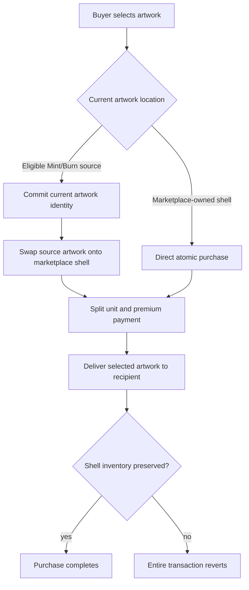
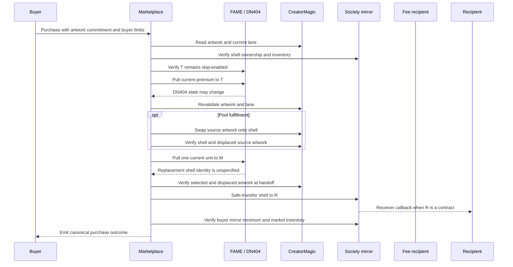

# Universal Pool Art Marketplace - Plan

## Goal Capsule

- **Objective:** Replace manual gallery rotation and listings with a Base Sepolia marketplace contract that makes every currently market-reachable Society artwork purchasable while preserving marketplace shell inventory.
- **Product authority:** Current on-chain ownership, CreatorMagic eligibility, artwork identity, global pricing, and transaction execution are authoritative.
- **Open blockers:** None for implementation planning. Deployment remains blocked until unit, fork, fuzz, and invariant tests prove atomic rollback, payment splitting, and shell-inventory preservation.

---

## Product Contract

### Summary

Build a listing-free marketplace with two atomic fulfillment paths.
Gallery-held artwork sells directly, while eligible Mint or Burn Pool artwork is swapped onto a marketplace-owned Society NFT shell and sold in the same transaction.

### Problem Frame

The existing closed-loop gallery proves that a contract can own Society NFT shells, rotate their metadata through CreatorMagic, accept a DN404 payment, deliver a selected NFT, and preserve aggregate shell inventory.
It also requires an administrator to rotate each artwork, create a token-specific listing, and maintain its premium before anyone can buy it.

The gallery-owned shell set removes the original obstacle to universal pool access.
A pool token is not owned NFT inventory, but it is a live artwork locator that CreatorMagic can swap onto a shell the marketplace already owns.
The remaining product requirement is to compose selection, metadata commitment, payment, swap, delivery, and rollback into one permissionless purchase.

“Every currently market-reachable artwork” means artwork on a marketplace-owned Society NFT plus artwork at a currently eligible Mint or Burn Pool source.
Artwork owned by an outside collector is unavailable until it later returns to the marketplace or an eligible pool.

### Key Decisions

- **Use universal reach instead of physical featured rotation** (session-settled: user-directed — chosen over periodically rotating a finite gallery set: owned fulfillment shells make the complete live Mint/Burn catalog purchasable without administrator preparation).
- **Make artwork the buyer's selection and shell identity a fulfillment detail** (session-settled: user-directed — chosen over buyer-selected or optionally overridden shells: the collector is buying the reviewed artwork, while any valid marketplace shell can deliver it).
- **Commit the exact artwork and fail safely on races** (session-settled: user-directed — chosen over accepting whatever metadata remains at a source or maintaining a reverse artwork index: a stale purchase reverts and refreshes without moving payment, metadata, or an NFT).
- **Present one Available Art market** (session-settled: user-directed — chosen over permanent Mint and Burn catalogs: those labels describe current execution eligibility and are not immutable provenance).
- **Use global underlying-token pricing** (session-settled: user-directed — chosen over per-art pricing and direct multi-asset settlement: every purchase uses the deployment's DN404 token and one owner-set global premium, while existing swap infrastructure remains separate).
- **Send premium revenue directly to a skip-enabled fee recipient** (session-settled: user-directed — chosen over marketplace accrual, temporary `SKIP_MANAGER` authority, and configurable fee custody: the marketplace receives one DN404 unit for replenishment, the fee leg cannot consume a selected pool source, and no fee-withdrawal lifecycle is needed).
- **Keep one real on-chain pause and a compact owner surface** (session-settled: user-directed — chosen over an always-live contract or separate path pauses: setup and emergencies need one named contract state, while routine per-art administration disappears).
- **Limit this slice to the contract and Base Sepolia deployment** (session-settled: user-directed — chosen over a full vertical slice or a Base mainnet launch: WWW work and production deployment begin only after the contract is source-verified and passes unit, fork, fuzz, and invariant testing).

### Actors

- A1. **Buyer:** Selects artwork, pays with the deployment's underlying DN404 token, and submits a purchase for a recipient.
- A2. **Recipient:** Receives the delivered Society NFT and may be the buyer or another contract-valid address.
- A3. **Owner:** Configures the global premium and fee recipient, pauses or unpauses purchases, and controls contract ownership.
- A4. **Marketplace:** Holds Society NFT shells, validates purchase terms, invokes CreatorMagic when materialization is required, splits payment, delivers the NFT, and enforces shell-inventory preservation.
- A5. **CreatorMagic and DN404 stack:** Supplies current pool eligibility, metadata identity, bidirectional metadata swaps, underlying-token payment behavior, and mirror NFT ownership.
- A6. **Fee recipient:** Receives each premium directly and must remain in DN404 skip-NFT mode while configured.

### Requirements

**Market reach and artwork selection**

- R1. Every artwork currently held by the marketplace or located at an eligible Mint or Burn Pool source must have a permissionless purchase path.
- R2. Collector-owned artwork, holder listings, consignment, and peer-to-peer orders are not marketplace inventory.
- R3. Marketplace-held artwork must be purchasable directly without a metadata swap, persistent listing, or per-token premium.
- R4. Pool artwork must be purchasable by atomically swapping it onto a marketplace-owned shell and delivering that shell.
- R5. The buyer selects artwork, while the caller supplies a candidate marketplace shell that the contract validates at execution.
- R6. Mint and Burn Pool labels must be treated as current execution lanes rather than historical provenance.
- R7. The contract must derive or validate the applicable current pool lane from canonical CreatorMagic state rather than trusting a frontend label.
- R8. Art Pool token IDs must be rejected by the pool-purchase mutation path regardless of frontend filtering or upstream predicate differences.
- R9. A pool swap must place the fulfillment shell's displaced artwork at the selected pool source and verify that placement before delivery. Ownership or further metadata actions initiated by recipient code after delivery begins are valid composition, not failed settlement.

**Artwork identity and atomic settlement**

- R10. Every purchase must commit to the exact artwork identity reviewed by the buyer, using the current CreatorMagic metadata result rather than a shell or source token ID alone.
- R11. If the selected shell or source no longer contains the committed artwork, the purchase must revert without partial effects.
- R12. Pool eligibility, artwork identity, fulfillment-shell ownership, global premium, recipient validity, and market pause state must be revalidated during execution.
- R13. Metadata materialization, payment, premium delivery, Society NFT delivery, and inventory verification must succeed or revert as one transaction.
- R14. Any failed purchase must leave metadata assignments, token balances, NFT ownership, and market configuration unchanged.
- R15. Purchases must be permissionless and may deliver to any nonzero recipient that can accept the Society NFT.

**Pricing, payment, and shell inventory**

- R16. One owner-configured positive global premium no greater than `type(uint96).max` must apply to every direct and pool purchase, including artwork that becomes reachable after the premium is set.
- R17. A buyer must supply a maximum acceptable premium and a minimum acceptable final buyer mirror balance. A lower current premium succeeds at the lower amount, a higher current premium reverts, and final buyer mirror ownership below the supplied minimum reverts. A zero mirror minimum explicitly opts out of that protection.
- R18. The marketplace must accept only the deployment's underlying DN404 token and must not route USDC, WETH, ETH, or other assets.
- R19. Each successful purchase must send one current DN404 unit to the marketplace and the current global premium directly to the configured fee recipient. When buyer and fee recipient are the same account, the premium leg is economically satisfied without a DN404 self-transfer.
- R20. The configured fee recipient must have `getSkipNFT(feeRecipient) == true` when configured and immediately before every premium transfer. The marketplace must never receive `SKIP_MANAGER` authority or temporarily alter another account's skip posture.
- R21. The marketplace must not accrue protocol fees or require a fee-withdrawal workflow.
- R22. A purchase must revert unless marketplace mirror-NFT inventory after all settlement effects is at least its inventory before the purchase.
- R23. The contract must not promise which replacement Society token ID the DN404 payment supplies to the marketplace.

**Setup and administration**

- R24. A new deployment must begin paused so its dependencies, DN404 posture, authority, premium, fee recipient, and seed inventory can be established before purchases.
- R25. Setup must configure the underlying DN404 token, mirror, CreatorMagic dependency, global premium, and a nonzero skip-enabled fee recipient distinct from the marketplace.
- R26. Setup must establish the marketplace's non-skip NFT posture and seed at least one marketplace-owned Society NFT shell.
- R27. Setup must grant only the CreatorMagic authority needed for Mint and Burn Pool swaps, must not grant Art Pool purchase authority, and must not grant the marketplace FAME `SKIP_MANAGER`.
- R28. The owner must be able to pause or unpause all purchases, change the global premium, change the fee recipient, and transfer ownership. Ownership renunciation must revert with a named error.
- R29. Paused purchases must revert with a named contract error while public reads and owner administration remain available.
- R30. No listing, unlisting, per-token repricing, scheduled rotation, accrued-fee withdrawal, or routine per-art preparation may be required after setup.

**Readability and deployment evidence**

- R31. Public reads must expose the market's pause state, global premium, fee recipient, immutable dependencies, and current Society shell inventory.
- R32. Successful purchases must emit enough information to identify the buyer, handoff recipient, delivered shell, fulfillment path, pool source when applicable, committed artwork, unit, premium, and shell inventory before and after settlement.
- R33. Contract failures must distinguish paused state, unavailable shell, ineligible source, Art Pool exclusion, artwork mismatch, excessive premium, invalid recipient, invalid fee-recipient skip posture, insufficient final buyer mirror balance, disabled ownership renunciation, transfer failure, and broken inventory.
- R34. The Base Sepolia deployment must use TEST as its underlying DN404 token and the existing deployed test CreatorMagic stack.
- R35. The deployed source and ABI must be verified on the Base Sepolia explorer.
- R36. Unit, fork, fuzz, and invariant tests must cover both fulfillment paths, administrative state, DN404 side effects, race handling, rollback, and shell-inventory preservation before deployment is considered complete.

### Fulfillment Model



The two paths share pricing, payment splitting, recipient delivery, inventory verification, pause state, and outcome evidence.
They differ only in whether the selected artwork already resides on the delivered shell or must first be materialized from a live pool source.

### Key Flows

- F1. Initial market setup
  - **Trigger:** A new Base Sepolia successor contract is deployed.
  - **Actors:** A3, A4, A5.
  - **Steps:** Configure dependencies, a bounded global premium, and a skip-enabled fee recipient; establish marketplace non-skip posture; grant narrow CreatorMagic authority without `SKIP_MANAGER`; seed at least one shell; verify canonical readiness; unpause.
  - **Outcome:** Every currently reachable artwork can be purchased without any per-art listing or rotation.
  - **Covered by:** R24-R30, R34-R36.

- F2. Direct artwork purchase
  - **Trigger:** The selected artwork currently resides on a marketplace-owned Society NFT.
  - **Actors:** A1, A2, A4, A5, A6.
  - **Steps:** Validate and lock shell ownership, artwork commitment, fee-recipient posture, buyer limits, and purchase terms; transfer the premium to the fee recipient; repeat canonical checks; pull one DN404 unit into the marketplace; verify the selected artwork; hand the shell to the recipient; verify the buyer's mirror minimum and marketplace shell inventory.
  - **Outcome:** The marketplace hands the selected artwork to the recipient, recipient code may compose after handoff, and the marketplace retains at least its starting shell count.
  - **Covered by:** R3, R10-R23, R31-R33.

- F3. Pool artwork purchase
  - **Trigger:** The selected artwork currently resides at an eligible Mint or Burn Pool source.
  - **Actors:** A1, A2, A4, A5, A6.
  - **Steps:** Validate and lock pool eligibility, Art Pool exclusion, the artwork commitment, fee-recipient posture, buyer limits, and fulfillment-shell ownership; transfer the premium to the fee recipient; repeat canonical checks; materialize and verify the bidirectional artwork swap; pull one DN404 unit into the marketplace; reverify selected and displaced artwork; hand the shell to the recipient; verify the buyer's mirror minimum and marketplace shell inventory.
  - **Outcome:** The marketplace hands exactly the reviewed artwork to the recipient after placing the shell's displaced artwork at the source. Recipient code may then forward the shell or naturally consume the source.
  - **Covered by:** R4-R14, R16-R23, R31-R33.

- F4. Stale artwork race
  - **Trigger:** Another transaction moves or purchases the selected artwork before the pending transaction executes.
  - **Actors:** A1, A4, A5.
  - **Steps:** Execution observes changed ownership, eligibility, or artwork identity and reverts before any state survives.
  - **Outcome:** The buyer keeps funds, no metadata or NFT transfer persists, and a caller may refresh canonical state before trying again.
  - **Covered by:** R10-R14, R33.

- F5. Market pause or configuration change
  - **Trigger:** The owner pauses the market or updates global configuration.
  - **Actors:** A3, A4.
  - **Steps:** Apply the owner action on-chain and emit the corresponding state change; subsequent purchases use the new canonical state.
  - **Outcome:** Paused purchases fail at the contract boundary, and price or fee-recipient changes affect every later execution without rewriting artwork state.
  - **Covered by:** R16-R17, R24-R30.

### Acceptance Examples

- AE1. **Direct purchase succeeds.**
  - **Covers:** R1, R3, R13, R19, R22.
  - **Given:** The market is unpaused and owns a Society shell displaying artwork A.
  - **When:** A funded buyer purchases artwork A within the current global premium.
  - **Then:** The marketplace transfers that shell displaying artwork A to the recipient, the fee recipient receives the premium, and market shell inventory does not decrease. A contract recipient may forward or use the shell during its callback.

- AE2. **Mint Pool artwork materializes and sells atomically.**
  - **Covers:** R4-R14, R19, R22.
  - **Given:** Artwork A is at a current Mint Pool source, artwork B is on a marketplace shell, and the buyer commits artwork A's current identity.
  - **When:** The buyer purchases artwork A.
  - **Then:** Before delivery, the shell displays artwork A and the source displays artwork B; payment settles and the shell is handed to the recipient. Recipient-controlled composition after handoff is allowed, while rejection, reentry, broken buyer limits, or broken marketplace inventory rolls the complete transaction back.

- AE3. **Burn Pool artwork uses the same market promise.**
  - **Covers:** R1, R4, R6-R9.
  - **Given:** Artwork A is at a current Burn Pool source outside Art Pool.
  - **When:** A buyer purchases artwork A.
  - **Then:** The contract uses the Burn Pool mutation path and produces the same pricing, delivery, and inventory guarantees as a Mint Pool purchase.

- AE4. **A consumed source cannot silently deliver different art.**
  - **Covers:** R10-R14.
  - **Given:** A buyer commits artwork A at source Y, and another transaction swaps artwork A away before the first purchase executes.
  - **When:** The stale purchase reaches the contract.
  - **Then:** The transaction reverts for artwork mismatch even if Y remains pool-eligible, and no payment or metadata change persists.

- AE5. **Art Pool remains unreachable through the market.**
  - **Covers:** R7-R8, R27, R33.
  - **Given:** A caller supplies an Art Pool token ID or a source that is not currently eligible for Mint or Burn Pool mutation.
  - **When:** The caller attempts a pool purchase.
  - **Then:** The contract reverts with a named eligibility error before payment or metadata mutation.

- AE6. **The buyer's payment and mirror limits are honored.**
  - **Covers:** R16-R17.
  - **Given:** A buyer authorizes a maximum premium of P and a minimum final buyer mirror balance of M.
  - **When:** The current global premium is less than or equal to P.
  - **Then:** The purchase charges the lower current premium and succeeds only when all other conditions hold and the buyer's final mirror balance is at least M. Setting M to zero opts out.

- AE7. **A higher premium or paused market stops settlement.**
  - **Covers:** R14, R17, R24, R29.
  - **Given:** The current global premium exceeds the buyer's maximum, or the market is paused.
  - **When:** The buyer attempts either fulfillment path.
  - **Then:** The transaction reverts without moving payment, metadata, or an NFT.

- AE8. **Broken replenishment rolls back the purchase.**
  - **Covers:** R13-R14, R19, R22-R23.
  - **Given:** The market's DN404 posture or payment side effects do not preserve its starting shell inventory.
  - **When:** A purchase reaches final inventory verification.
  - **Then:** Artwork materialization, payment splitting, delivery, and all intermediate state revert.

- AE9. **The fee recipient remains skip-enabled.**
  - **Covers:** R19-R21.
  - **Given:** The owner proposes a fee recipient, or a configured fee recipient later changes its DN404 posture.
  - **When:** Configuration or purchase execution observes `getSkipNFT(feeRecipient) == false`.
  - **Then:** The contract reverts with the named fee-recipient posture error before premium movement. The marketplace never receives `SKIP_MANAGER` to change the posture itself.

### Success Criteria

- Every marketplace-held artwork and every current eligible Mint/Burn Pool artwork has a contract-authoritative purchase path without a listing.
- An administrator can finish one-time setup and leave normal artwork availability hands-off.
- A successful purchase hands exactly the selected artwork to the recipient; recipient-controlled actions after handoff are composable, while a failed or raced purchase leaves no partial marketplace settlement state.
- Direct and pool purchases use the same global premium, underlying-token payment boundary, premium destination, recipient behavior, and shell-inventory guarantee.
- Art Pool sources are unreachable through both authority and execution checks.
- The Base Sepolia deployment is explorer-verified and backed by passing unit, fork, fuzz, and invariant suites.

### Scope Boundaries

**Deferred for later**

- Public and admin WWW experiences.
- Base mainnet deployment using production FAME.
- A featured weekly lens or new-art auction lane.
- Production checkout orchestration through the existing USDC, WETH, ETH, and FAME swap infrastructure.

**Outside this product's identity**

- Art Pool purchases or Art Pool management authority.
- Holder-owned listings, consignment, seller orders, or peer-to-peer settlement.
- Per-art premiums, persistent listings, reservations, or reverse artwork indexing.
- A promise that collector-owned artwork remains purchasable.
- Multi-asset settlement inside the marketplace.

### Dependencies and Assumptions

- CreatorMagic remains the canonical metadata and Mint/Burn eligibility authority.
- The marketplace can hold Society NFTs, operate in non-skip NFT mode, and receive only the narrow CreatorMagic authority required for Mint/Burn swaps.
- The underlying DN404 unit transfer can replenish shell inventory under the configured Base Sepolia posture; the contract still treats measured post-settlement inventory as authoritative and reverts otherwise.
- Pool-source token IDs are temporary artwork locators, not owned marketplace NFTs or permanent provenance identifiers.
- The deployed Base Sepolia TEST, mirror, CreatorMagic, and renderer stack remains available for fork and live deployment validation.
- Existing swap infrastructure remains the only path for converting other payment assets into the underlying marketplace token.
- A later WWW checkout must re-read artwork ownership after any swap transaction. If the swap's DN404 output already minted the committed artwork to the buyer, the flow completes as an acquisition without submitting a now-ineligible marketplace purchase.

### Outstanding Questions

**Resolve before planning**

- None.

**Deferred to planning**

- Choose the successor contract name and the exact public purchase surface while preserving the two fulfillment paths.
- Define deployment sequencing and validation tooling for dependency checks, non-skip posture, narrow CreatorMagic authority, seed inventory, explorer verification, and unpause.
- Determine which existing current-gallery owner controls should be retained for safe recovery without reintroducing routine listing or rotation work.

### Sources

- `docs/ideation/2026-06-21-creator-magic-fame-society-marketplace-ideation.html`
- `docs/plans/2026-06-22-001-feat-closed-loop-gallery-swap-plan.md`
- `src/ClosedLoopGallerySwap.sol`
- `src/CreatorArtistMagic.sol`
- `src/DN404.sol`
- `src/Fame.sol`
- `test/ClosedLoopGallerySwap.t.sol`
- `test/ClosedLoopGallerySwapForkBaseSepolia.t.sol`

---

## Planning Contract

**Product Contract review amendments:** The implementation review preserves the listing-free universal market while adding an enforced skip-enabled fee recipient, a positive `uint96` premium bound, optional buyer mirror-balance protection, and disabled ownership renunciation.
F2/F3 are aligned with the authoritative DN404 settlement order. Safe ERC721 delivery is the handoff boundary: the marketplace proves selected and displaced artwork immediately before handoff, then permits recipient-controlled composition while preserving reentrancy, configuration-lock, buyer-limit, and marketplace-inventory guarantees.

### Context and Research

The new contract should be a successor rather than an extension of `ClosedLoopGallerySwap`.
The predecessor's per-token listings, operator role, manual rotations, fee accrual, and withdrawal lifecycle are exactly the machinery this Product Contract removes.
It remains deployed and useful as a validation reference, but no migration or compatibility shim belongs in the successor.

The implementation is constrained by four repo facts:

- `CreatorArtistMagic.banishToMintPool` and `banishToBurnPool` require the caller to own the fulfillment shell and perform bidirectional metadata swaps.
- `BANISHER` alone satisfies both Mint and Burn mutation functions; `ART_POOL_MANAGER` is unnecessary and deliberately excluded.
- `isTokenInMintPool` and `isTokenInBurnedPool` exclude Art Pool, but the deployed Mint mutation does not independently repeat the Art Pool check.
  The marketplace must therefore enforce the exclusion itself before calling the deployed dependency.
- FAME transfers are DN404 mutations.
  Premium and unit transfers may burn buyer NFTs, mint or directly transfer replacement NFTs, and change pool eligibility or source ownership during settlement.
  A skip-enabled fee recipient prevents the premium leg from consuming a selected source; the buyer's minimum final mirror balance bounds remaining payer-side NFT effects.

Repository deployment precedent also fixes the operational shape:

- Public addresses and non-secret deployment facts live in `config/fame-public.env`.
- RPC URLs, explorer credentials, and signer secrets remain in Doppler.
- Foundry commands use the `base_sepolia` alias.
- Generated `broadcast/` logs are operational output and must not be added to the implementation diff.

Current Foundry guidance materially shapes the verification contract:

- Fuzz and invariant runs use explicit campaign parameters rather than machine defaults.
- Pinned-block forks provide reproducibility, while current-head forks catch dependency drift.
- Handler metrics must show meaningful successful calls; an invariant campaign dominated by ignored reverts is not useful evidence.
- Explorer completion means verified source and ABI are visible, not merely that a verification request was submitted.

### Key Technical Decisions

- KTD1. **Create `UniversalPoolArtMarketplace` as a new contract.**
  Leave `ClosedLoopGallerySwap`, `CreatorArtistMagic`, FAME, and DN404 unchanged.
  A separate successor avoids carrying obsolete listing and fee-accounting storage into a contract with a different product identity.
  Covers R1-R9, R21, R24-R30.

- KTD2. **Expose two explicit purchase entry points backed by shared settlement phases.**
  `purchaseHeld(shellId, expectedArtworkHash, maxPremium, minBuyerMirrorBalanceAfter, recipient)` handles artwork already on a marketplace shell.
  `purchasePool(shellId, sourceId, expectedArtworkHash, maxPremium, minBuyerMirrorBalanceAfter, recipient)` handles current Mint or Burn sources.
  Separate entry points own path-specific validation and pool materialization.
  Shared internal phases own term snapshots, premium transfer, unit transfer, pre-handoff artwork checks, safe delivery, buyer mirror protection, and final inventory checks so common behavior cannot drift without collapsing the contract into an enum-driven monolith.
  Covers R1-R7, R10-R23, R31-R33.

- KTD3. **Define artwork identity as `keccak256(bytes(creatorMagic.tokenURI(locationId)))`.**
  Token IDs are temporary artwork locators, not artwork identity.
  Both paths compare the buyer's commitment before payment, after DN404 side effects, and immediately before safe delivery.
  The pool path additionally snapshots the shell's displaced artwork hash and verifies that exact artwork at the source after materialization and again immediately before handoff.
  Because the mirror delegates display to FAME's mutable renderer, purchases also fail closed unless `creatorMagic.fame()`, `fame.fameMirror()`, and `fame.renderer()` describe the configured stack before payment and immediately before delivery.
  Once recipient code begins executing through `onERC721Received`, later ownership or metadata changes are recipient-controlled composition rather than marketplace settlement drift.
  Covers R9-R14, R32-R33 and AE2-AE4.

- KTD4. **Derive the pool lane on-chain and reject Art Pool before mutation.**
  The pool path first rejects the inclusive `artPoolStartIndex()` through `artPoolEndIndex()` range, then evaluates current Mint and Burn predicates.
  Exactly one eligible lane selects the corresponding CreatorMagic mutation; neither or ambiguous eligibility reverts.
  Frontend labels and historical provenance are never transaction inputs.
  Covers R6-R8, R12, R27, R33 and AE3/AE5.

- KTD5. **Order settlement around DN404 state changes and repeat canonical checks.**
  After initial checks and settlement locking, require the snapshotted fee recipient to remain skip-enabled, transfer the snapshotted premium directly from buyer to that recipient, then revalidate artwork and pool eligibility.
  When buyer and fee recipient are the same account, the premium leg is a net-zero payment and must not invoke DN404 self-transfer.
  For pool purchases, materialize and verify the bidirectional swap.
  Pull exactly the current `fame.unit()` into the marketplace, revalidate the delivered and displaced artwork plus stack coherence, safe-transfer the shell, then verify the buyer's supplied final mirror minimum and nondecreasing marketplace inventory.
  Every external-call failure bubbles; no `try/catch` converts a failed dependency into partial success.
  The enforced fee-recipient posture prevents the premium transfer from consuming the selected source. If a preceding swap transaction naturally minted the committed source to the buyer, initial pool validation observes that the buyer already owns it and no marketplace payment moves.
  The Product Contract's fulfillment diagram is semantic; this KTD is the authoritative EVM interaction order.
  Covers R10-R23, R32-R33 and AE1-AE9.

- KTD6. **Verify displaced-art placement at the marketplace handoff boundary.**
  After materialization and the unit-side effect, the selected source must still display the shell's displaced artwork immediately before delivery.
  Once recipient callback execution begins, the recipient may naturally mint that source, forward the delivered shell, or perform other authorized metadata actions.
  The marketplace does not reject valid composition merely because the source or shell has a different owner after the callback.
  Covers R9, R13-R14, R22-R23 and AE2/AE3/AE8.

- KTD7. **Separate delivery handoff from marketplace-owned final state.**
  Immediately before `safeTransferFrom`, the fulfillment shell must display the buyer's committed artwork and pool fulfillment must have the displaced artwork at the selected source.
  A successful return requires the buyer's mirror balance to satisfy `minBuyerMirrorBalanceAfter` and marketplace inventory to satisfy `inventoryAfter >= inventoryBefore`.
  Contract recipients may forward, stake, or otherwise use the delivered shell during their callback; `nonReentrant` and the settlement lock protect marketplace-owned behavior without policing recipient-owned state.
  Covers R12-R15, R22-R23, R32-R33.

- KTD8. **Use owner-only administration with an explicit settlement lock.**
  Use Solady `Ownable` and `ReentrancyGuard`, not operator roles.
  Purchases are `nonReentrant`; pause, premium, fee-recipient, ownership-handover, and recovery mutations are blocked while settlement is active so a privileged receiver cannot change snapshotted terms during callback.
  Override `renounceOwnership()` to revert with `OwnershipRenunciationDisabled`; ownership remains transferable through the guarded direct and handover paths.
  Covers R16-R17, R24-R30, R33.

- KTD9. **Start paused and initialize non-skip posture in the constructor.**
  Validate nonzero/code-bearing dependencies, derive and retain the mirror from FAME, reject a zero, self, or non-skip fee recipient, require a positive premium no greater than `type(uint96).max`, store it as `uint96`, call `fame.setSkipNFT(false)`, initialize ownership, and leave purchases paused.
  `setFeeRecipient` repeats the nonzero, non-self, and skip-posture checks; each purchase repeats the posture check before premium movement.
  Implement ERC721 receiving only for the canonical Society mirror so paused deployment can seed shells without accepting arbitrary safe transfers as market inventory.
  Deployment validation must independently prove all constructor assumptions against mined state.
  Covers R24-R29, R31, R33-R36.

- KTD10. **Keep recovery narrow and unavailable during normal operation.**
  While paused, the owner may rescue unrelated ERC20 or ERC721 assets accidentally sent to the contract.
  Recovery must reject the underlying FAME/TEST token and the Society mirror, so it cannot become an alternate fee-withdrawal or shell-removal path.
  Covers R21-R22, R28-R30.

- KTD11. **Use a single purchase event with an explicit fulfillment path.**
  The event records buyer, handoff recipient, delivered shell, path, optional pool source, committed artwork hash, unit, premium, and inventory before/after.
  It describes the marketplace's safe-transfer handoff and does not claim that recipient code retained the shell after its callback.
  Configuration changes and recovery actions emit dedicated events; each named failure maps to a distinct Product Contract error category.
  Covers R31-R33.

- KTD12. **Reuse the deployed Base Sepolia TEST stack and deploy only the successor.**
  The deployment script reads the existing FAME, mirror, and CreatorMagic addresses, requires the configured fee recipient to be skip-enabled, deploys the marketplace paused, grants only CreatorMagic `BANISHER`, seeds two shells, and leaves activation to a separate owner action after validation.
  It must prove the marketplace lacks CreatorMagic `CREATOR`/`ART_POOL_MANAGER` and FAME `SKIP_MANAGER`.
  Deployment, role grant, each seed transfer, and activation are separately mined transaction prefixes; read-only validation and source verification are explicit recorded gates between those prefixes.
  A retry may continue only from a recognized canonical prefix; otherwise the address stays paused, residual BANISHER is revoked when possible, and the run stops for explicit recovery or abandonment.
  Covers R24-R30, R34-R36 and F1.

- KTD13. **Separate reproducible, fresh, and mined-state validation.**
  A pinned Base Sepolia fork proves repeatable integration behavior.
  A current-head fork rehearses deployment and both purchase paths against live dependency state.
  A strict deployed-address fork plus read-only script validates the mined contract before activation.
  A bounded smoke and independent result validator exercise direct, Mint, and Burn behavior without asserting a particular replacement ID.
  Covers R34-R36 and AE1-AE9.

- KTD14. **Pin the deployment compilation profile and test campaign.**
  Add a dedicated `universal_marketplace` Foundry profile using Solidity 0.8.28, EVM Cancun, optimizer enabled with 200 runs, and `via_ir = false`.
  Release fuzzing runs 10,000 cases per target with at most 65,536 rejects.
  Invariants run 512 campaigns at depth 128 with `fail_on_revert = true`, metrics enabled, and at least one successful call for every direct, Mint, Burn, administration, and adversarial selector.
  Record the final compiler, optimizer, `via_ir`, constructor arguments, source commit, and explorer URL in deployment evidence.
  Covers R35-R36.

### High-Level Technical Design



Any failed check or external call reverts the full call tree.
Callbacks may observe and compose with the delivered shell after handoff.
They cannot reenter settlement, mutate marketplace configuration during settlement, make the buyer violate an opted-in mirror minimum, or reduce marketplace shell inventory.

The execution phases are intentionally explicit:

| Phase | Shared behavior | Direct path | Pool path |
|---|---|---|---|
| Snapshot and lock | Validate pause, recipient, buyer limits, skip-enabled fee recipient, stack coherence, shell ownership, artwork commitment, and starting inventory | Selected art is on shell | Selected art is on current source; snapshot displaced shell art and lane |
| Premium side effect | Pull current premium directly to the snapshotted skip-enabled fee recipient, or no-op when buyer equals fee recipient | Revalidate shell art and stack | Revalidate source art, lane, Art Pool exclusion, shell, and stack |
| Path fulfillment | None | No metadata mutation | Invoke Mint/Burn swap and verify selected/displaced art |
| Unit side effect | Pull exactly one current unit into the marketplace | Revalidate shell art and stack | Revalidate shell art, displaced source art, and stack |
| Delivery and callback | Safe-transfer shell to recipient after exact-art verification | Recipient may forward or use the shell | Recipient may also naturally consume the displaced source |
| Finalization | Verify buyer mirror minimum and nondecreasing marketplace inventory; emit the handoff outcome | Direct path | Derived Mint or Burn path |

### State and Authority Model

| Concern | Authority | Mutable state | Purchase behavior |
|---|---|---|---|
| Dependencies | Constructor | Immutable FAME, mirror, CreatorMagic | Re-read canonical dependency state as needed |
| Premium | Owner | One positive `uint96` global premium | Snapshot, compare with buyer maximum, charge current lower amount |
| Fee destination | Owner | One nonzero, non-self, skip-enabled recipient | Snapshot, recheck skip posture, and transfer premium directly |
| Pause | Owner | One boolean, initially paused | Both purchase paths revert with the same named paused error |
| CreatorMagic mutation | Marketplace contract | External metadata registry | BANISHER-only Mint/Burn swap; no Art Pool mutation |
| Shell custody | Marketplace contract | DN404/mirror balances | Safe delivery only after canonical validation |
| Inbound shell receipt | Society mirror only | Marketplace mirror inventory | Accepted while paused or active; unrelated ERC721 safe receipts revert |
| Ownership handover | Current/pending owner | Solady owner/handover state | Transfer, request, cancel, and completion paths respect the settlement lock; renunciation always reverts |
| Recovery | Owner while paused | Unrelated accidental assets only | FAME and Society mirror are never recoverable through rescue |

### Deployment State Model

| State | Canonical meaning | Allowed next action |
|---|---|---|
| Not deployed | No successor code at the predicted address | Refresh nonce/dependency facts and simulate |
| Deployed paused | Code exists, owner/config match, but role or seed setup may be incomplete | Continue only the missing canonical prefix or abandon |
| Ready paused | Code, BANISHER-only authority, non-skip posture, seed inventory, validator, strict fork, and explorer verification all match | Simulate and authorize activation |
| Active | Owner unpause is mined and post-activation validation matches | Run bounded smoke or continue TEST operation |
| Paused after failure | Emergency pause is mined after an activation/smoke discrepancy | Validate final state, revoke residual authority if abandoning, and do not auto-resume |

No chain deployment is reversible.
Rollback means preventing further purchases with a mined pause, not pretending already-mined role, custody, metadata, or purchase transactions disappeared.

### System-Wide Impact

- **Contract ABI:** Adds a new marketplace ABI without changing the deployed gallery ABI.
- **CreatorMagic roles:** Adds one Base Sepolia role holder with `BANISHER` only.
  No broad creator or Art Pool authority is introduced.
- **DN404 custody:** The successor is explicitly non-skip and holds at least two Society shells.
  Buyer skip posture remains external.
  The fee recipient must remain skip-enabled, while the marketplace has no `SKIP_MANAGER` authority to force that state.
- **Metadata state:** Pool purchases mutate two CreatorMagic token metadata assignments atomically; direct purchases do not mutate metadata before delivery.
- **Deployment configuration:** Adds public Base Sepolia marketplace address, owner, fee recipient, premium, pinned fork block, and deployment evidence fields.
  Secrets remain outside version control.
- **Existing gallery and WWW:** No existing code, ownership, renderer configuration, route, generated binding, or frontend behavior changes.
  The only intentional shared-chain changes are the successor's BANISHER grant, seeded shell custody, and bounded smoke metadata/purchase outcomes.
- **Operational tail:** The mined contract address and verified ABI become inputs to the later WWW implementation plan.

### Security and Failure Boundaries

- All purchase inputs are untrusted.
  Shell ownership, source eligibility, artwork hashes, recipient behavior, premium bounds, and pause state are checked on-chain.
- FAME and CreatorMagic addresses are immutable, but their renderer/role wiring is mutable.
  Purchases fail closed on stack-coherence drift before payment and immediately before delivery; deployment validators independently inspect code, wiring, and roles.
- `SafeTransferLib` handles nonstandard ERC20 return behavior, but the deployment validator still proves that the immutable token address contains the expected TEST code and mirror.
- Recipient callbacks and DN404 external dependencies are interaction points.
  Safe delivery intentionally permits recipient-controlled composition, while reentrancy, the settlement lock, buyer-supplied mirror protection, and final marketplace-inventory checks remain mandatory.
- Owner authority can pause and change global economic configuration.
  It cannot list art, rotate art manually through this marketplace, withdraw premium custody, or rescue market FAME/Society inventory.
- No failure is converted into a partial result.
  Reverts preserve metadata assignments, balances, ownership, and configuration.

### Risks and Dependencies

| Risk | Impact | Mitigation and verification |
|---|---|---|
| FAME renderer or CreatorMagic wiring changes after deployment | Artwork commitment could differ from what the Society mirror displays | Runtime stack-coherence checks before payment and immediately before delivery; current-head and deployed-state validators |
| Fee recipient disables skip-NFT mode | Premium receipt could consume the selected pool source | Reject non-skip configuration and recheck the snapshotted fee recipient before every premium leg; grant no marketplace `SKIP_MANAGER` |
| Premium or unit transfer changes DN404 NFT state | Source eligibility, ownership, or buyer mirror balance may change | Premium-first ordering, immediate source/art revalidation, buyer-supplied final mirror minimum, and complete rollback on failed limits |
| Unit replenishment produces an unexpected token ID | Exact replacement assumptions could reject valid settlement | Promise only aggregate inventory; verify selected/displaced artwork immediately before handoff without requiring a particular replacement ID |
| Contract recipient composes during safe delivery | Recipient may forward the shell or naturally consume the displaced source | Treat safe transfer as the handoff boundary; allow recipient-owned effects while blocking reentry and marketplace configuration mutation |
| CreatorMagic roles drift | Pool purchase can fail or gain unintended mutation authority | Require BANISHER and absence of CREATOR/ART_POOL_MANAGER in deployment/current-head validators; pause on drift |
| Partial deployment prefix mines | Contract may hold authority or shells without being ready | Keep paused, recognize exact mined prefix, resume only missing canonical steps, otherwise revoke/abandon |
| Live TEST stack is mutable | Hardcoded token IDs or old state can invalidate rehearsals | Pinned regression plus fresh captured-block campaigns that discover candidates canonically |
| Large on-chain `tokenURI` payloads increase gas | Exact-art checks may approach practical gas limits | Gas snapshots for direct/Mint/Burn TEST metadata; deployment smoke confirms the real renderer path remains executable |
| Explorer verification mismatches local build | Published ABI/source may not describe deployed bytecode | Pin compiler profile; compare local runtime/ABI artifacts with mined code and explorer output before activation |
| Owner key compromise | Attacker can pause or change global terms/fee recipient | Keep owner surface narrow, emit all changes, preserve buyer max premium, and transfer later production ownership only under a separate mainnet plan |

### Sequencing

1. Establish the contract ABI, storage, administration, errors, events, and read surface.
2. Implement the direct purchase path and shared settlement/finalization primitives.
3. Add Mint/Burn lane derivation, Art Pool exclusion, materialization, and exact displaced-art placement before handoff.
4. Prove callback composability, rollback behavior, fuzz properties, and invariant handlers.
5. Add pinned/current-head Base Sepolia forks and deployment validation.
6. Add paused deployment, source verification, explicit activation, bounded smoke, and durable evidence.
7. Hand the verified address and ABI to a later WWW plan without changing WWW in this slice.

### Resolved During Planning

- The successor contract is named `UniversalPoolArtMarketplace`.
- Direct and pool purchases use separate public functions with one private settlement core.
- Artwork commitments hash the complete canonical CreatorMagic token URI bytes.
- The contract derives Mint/Burn lane and repeats Art Pool exclusion itself.
- The configured fee recipient must remain skip-enabled; the marketplace receives no `SKIP_MANAGER`.
- Buyer mirror-balance slippage protection is explicit and optional through a zero minimum.
- Safe ERC721 delivery is the recipient-composition boundary rather than a final-owner assertion.
- Ownership can transfer but cannot be renounced.
- Recovery supports unrelated accidental assets only while paused and blocks FAME and Society shells.
- Deployment and activation are separate operations; the constructor and deploy script never make purchases live.
- Existing CreatorMagic, DN404, current gallery, and WWW code remain unchanged.

### Deferred to Follow-Up Work

- Production Base deployment values, ownership, fee recipient, premium, audit posture, and multisig activation.
- WWW discovery, artwork catalog normalization, shell selection, swap-router checkout, transaction presentation, and verified outcome rendering.
- Featured/new-art auction behavior and weekly merchandising.
- Contract migration or decommissioning policy for the current closed-loop gallery.

### Planning Sources

- `src/ClosedLoopGallerySwap.sol` - immutable dependency, settlement lock, custody, event, error, and deployment precedent.
- `src/CreatorArtistMagic.sol` - canonical metadata reads, Mint/Burn predicates, Art Pool bounds, and bidirectional swap behavior.
- `src/DN404.sol` and `src/DN404Mirror.sol` - unit-transfer NFT side effects and safe receiver callback behavior.
- `script/DeployBaseSepoliaGalleryTestStack.s.sol` and `script/ValidateBaseSepoliaGalleryTestStack.s.sol` - fail-closed deployment and read-only validation patterns.
- `test/ClosedLoopGallerySwap.t.sol` and `test/ClosedLoopGallerySwapForkBaseSepolia.t.sol` - local invariant and Base Sepolia fork patterns.
- `docs/solutions/workflow-issues/public-config-doppler-foundry-aliases-2026-05-12.md` - public config, Doppler, and alias conventions.
- `docs/solutions/workflow-issues/keep-generated-deployment-artifacts-out-of-repo-2026-05-15.md` - deployment artifact hygiene.
- [Foundry invariant testing](https://getfoundry.sh/forge/advanced-testing/invariant-testing/) - handler targeting, campaign configuration, and metrics.
- [Foundry fork testing](https://getfoundry.sh/forge/tests/fork-testing/) - pinned and live fork mechanics.
- [Foundry scripting](https://getfoundry.sh/guides/scripting-with-solidity/) - simulation, broadcast, and script execution model.
- [Foundry contract verification](https://getfoundry.sh/forge/reference/verify-contract/) - explorer source and ABI verification.
- [Solidity security considerations](https://docs.soliditylang.org/en/latest/security-considerations.html#use-the-checks-effects-interactions-pattern) - interaction ordering and reentrancy guidance.
- [ERC-721](https://eips.ethereum.org/EIPS/eip-721) - safe transfer and receiver callback contract.

---

## Implementation Units

### U1. Add the successor contract foundation and owner surface

- **Goal:** Establish immutable dependencies, initially-paused state, global pricing, owner controls, reads, errors, events, settlement locking, and narrow recovery without any listing machinery.
- **Requirements:** R16-R17, R21, R24-R33.
- **Flows and examples:** F1, F5; AE6, AE7, AE9.
- **Decisions:** KTD1, KTD8-KTD11, KTD14.
- **Files:**
  - Create `src/UniversalPoolArtMarketplace.sol`.
  - Create `test/UniversalPoolArtMarketplace.t.sol`.
  - Modify `foundry.toml` with a dedicated deployment/test profile.
- **Approach:**
  - Use Solady `Ownable`, `ReentrancyGuard`, and `SafeTransferLib`.
  - Store immutable FAME, mirror, and CreatorMagic references; mutable positive `uint96` global premium, skip-enabled fee recipient, and pause state.
  - Initialize non-skip NFT posture from the constructor and expose `artworkHash(tokenId)` plus current mirror inventory reads.
  - Override transfer, handover request/cancel/completion, and every marketplace setter so no owner mutation can occur during settlement.
  - Override `renounceOwnership()` to always revert with `OwnershipRenunciationDisabled`.
  - Reject zero premium and `uint256` premium inputs above `type(uint96).max` before storing; reject a zero, self, or non-skip fee recipient in both constructor and setter.
  - Accept safe ERC721 receipt only from the immutable Society mirror; this is shell custody, not a generic NFT receiver.
  - Allow unrelated ERC20/ERC721 rescue only while paused; reject FAME and Society mirror recovery.
- **Test scenarios:**
  - Constructor rejects zero/non-contract dependencies, zero/self/non-skip fee recipient, zero/oversized premium, and zero owner.
  - Constructor exposes correct dependency wiring, owner, `uint96` premium, skip-enabled fee recipient, paused state, and marketplace non-skip posture.
  - Unauthorized administration reverts; authorized updates emit exact events and affect all later reads.
  - Transfer and handover mutations respect the settlement lock; ownership renunciation always reverts with its named error.
  - Society shell safe receipt succeeds while arbitrary ERC721 safe receipt reverts.
  - Paused recovery accepts unrelated assets and rejects FAME/Society assets.
  - Owner/config/recovery mutation attempted during the settlement lock reverts.
- **Verification:** Focused tests prove the contract begins paused, has no listing/operator/accrual API, and exposes only the Product Contract owner surface.

### U2. Implement direct marketplace-held artwork purchases

- **Goal:** Sell artwork already on a marketplace-owned shell using the shared global settlement contract.
- **Requirements:** R1-R3, R10-R23, R31-R33.
- **Flows and examples:** F2, F4, F5; AE1, AE4, AE6-AE9.
- **Decisions:** KTD2, KTD3, KTD5, KTD7-KTD11.
- **Files:**
  - Modify `src/UniversalPoolArtMarketplace.sol`.
  - Modify `test/UniversalPoolArtMarketplace.t.sol`.
  - Create `test/mocks/ReentrantUniversalPoolMarketplaceRecipient.sol`.
- **Approach:**
  - Add the held-art entry point with shell ID, expected artwork hash, maximum premium, minimum final buyer mirror balance, and recipient.
  - Snapshot current premium and fee recipient after pause/input validation; require the snapshotted fee recipient to remain skip-enabled before premium movement.
  - Skip the DN404 premium transfer when buyer equals fee recipient because that payment is net-zero; otherwise transfer the exact premium directly.
  - Prove stack coherence, revalidate shell ownership/artwork/wiring after DN404 side effects, pull one current unit, and verify exact artwork immediately before safe transfer.
  - Treat safe transfer as handoff: recipient forwarding or other recipient-owned behavior may complete, while purchase reentry and marketplace mutation remain blocked.
  - Verify the buyer's final mirror minimum and nondecreasing market inventory before emitting the handoff outcome.
- **Test scenarios:**
  - Direct purchase sends exact premium to a skip-enabled fee recipient, sends one unit through market replenishment, and hands off exact artwork.
  - Fee-recipient posture drift reverts before premium movement; buyer-equals-fee-recipient performs no DN404 self-transfer.
  - Existing allowance above the total succeeds; the contract does not require exact allowance.
  - Current premium below or equal to maximum succeeds at current premium; above maximum reverts before any surviving transfer.
  - Fractional buyer balances cover one- and two-NFT entitlement changes; `minBuyerMirrorBalanceAfter` either permits the measured result or rolls the complete purchase back, and zero opts out.
  - Paused, zero recipient, non-market shell, stale artwork, insufficient balance/allowance, transfer failure, and rejecting receiver all roll back.
  - Renderer or dependency wiring drift fails before payment or handoff.
  - The shared recipient mock proves reentry and marketplace owner/config mutation fail, receiver rejection rolls back, and recipient-controlled shell forwarding succeeds after exact-art handoff.
- **Verification:** Exact balance, handoff artwork, buyer mirror minimum, inventory, event, recipient-composition, and rollback assertions cover the direct path.

### U3. Implement atomic Mint/Burn materialization purchases

- **Goal:** Make every current eligible Mint/Burn artwork purchasable without prior admin rotation or listing.
- **Requirements:** R1, R4-R23, R31-R33.
- **Flows and examples:** F3-F5; AE2-AE8.
- **Decisions:** KTD2-KTD7, KTD11.
- **Files:**
  - Modify `src/UniversalPoolArtMarketplace.sol`.
  - Modify `test/UniversalPoolArtMarketplace.t.sol`.
- **Approach:**
  - Add the pool entry point with fulfillment shell, source, expected artwork hash, maximum premium, minimum final buyer mirror balance, and recipient.
  - Reject the explicit Art Pool range before deriving current Mint or Burn eligibility.
  - Snapshot displaced shell art, enforce fee-recipient skip posture, transfer premium, and repeat source artwork/lane validation before CreatorMagic mutation.
  - Execute the selected bidirectional swap and verify selected art on shell plus displaced art at source.
  - Pull one unit, then reverify selected art on the shell, displaced art at the source, and stack coherence immediately before delivery.
  - Safe-transfer the shell, permit recipient-controlled forwarding or natural source consumption, then verify the buyer's final mirror minimum and nondecreasing marketplace inventory.
- **Test scenarios:**
  - Mint and Burn sources each materialize exact selected art, move displaced art to source, settle payment, and deliver successfully.
  - Art Pool, owned collector token, End-of-Mint token, source equal to shell, unavailable shell, and no/ambiguous lane revert with named errors.
  - A source consumed or remutated before execution reverts for eligibility or artwork mismatch.
  - A preceding FAME swap that naturally minted the committed source to the buyer makes the source ineligible before payment; the contract moves no premium and the later WWW handoff records that canonical ownership should end the queued flow.
  - Premium transfer changes DN404 source state; the repeated eligibility/artwork checks either adapt to canonical state or roll back.
  - Unit replenishment produces any replacement ID while selected/displaced artwork is correct at handoff and marketplace inventory remains valid.
  - A contract recipient forwards the delivered shell or naturally mints the displaced source during callback; both may succeed because recipient-owned effects occur after handoff.
- **Verification:** Both lane-specific CreatorMagic calls, pre-handoff artwork placement, buyer limits, and marketplace-owned postconditions are asserted without reverse indexing or replacement-ID assumptions.

### U4. Add adversarial unit and fuzz coverage

- **Goal:** Stress payment boundaries, callback behavior, stale commitments, pool edges, and atomic rollback beyond hand-authored examples.
- **Requirements:** R10-R23, R29, R33, R36.
- **Flows and examples:** F2-F5; AE1-AE9.
- **Decisions:** KTD3-KTD10, KTD14.
- **Files:**
  - Create `test/UniversalPoolArtMarketplaceFuzz.t.sol`.
  - Modify `test/mocks/ReentrantUniversalPoolMarketplaceRecipient.sol`.
  - Modify `foundry.toml`.
- **Approach:**
  - Use bounded fuzz inputs for `uint96` premium/`uint256` max-premium, buyer mirror minimum, recipient forms, shell/source IDs, pool boundaries, balances, allowance, and buyer skip posture.
  - Extend callbacks that attempt purchase reentry and admin mutation or exercise valid shell forwarding, source consumption, metadata use, and receiver rejection.
  - Assert full before/after snapshots for every expected revert: metadata hashes, FAME balances, mirror owners/counts, premium, fee recipient, owner, and pause.
- **Test scenarios:**
  - Fuzz current premium at zero boundary, one, unit fractions, unit crossings, `maxPremium`, `type(uint96).max`, and `type(uint96).max + 1`.
  - Fuzz Art Pool and Mint/Burn boundary IDs plus stale source/shell artwork hashes.
  - Fuzz buyer, recipient, and fee-recipient aliasing, including contract recipients, buyer fractional-unit balances, and fee-recipient posture drift.
  - Every expected failure preserves all snapshotted state.
  - Successful fuzz cases satisfy exact premium delta, pre-handoff artwork placement, buyer mirror minimum, and marketplace inventory floor; callback forwarding and natural source consumption remain valid.
- **Verification:** The dedicated profile completes 10,000 cases per fuzz target, records the actual seed, preserves any failing counterexample, and exits with no unresolved failure.

### U5. Add stateful invariant campaigns

- **Goal:** Prove the hands-off marketplace preserves its global properties across long mixed sequences rather than isolated calls.
- **Requirements:** R1-R23, R24-R33, R36.
- **Flows and examples:** F2-F5; AE1-AE9.
- **Decisions:** KTD5-KTD8, KTD10, KTD14.
- **Files:**
  - Create `test/UniversalPoolArtMarketplaceInvariant.t.sol`.
  - Modify `foundry.toml`.
- **Approach:**
  - Target a dedicated handler with multiple buyers/recipients, direct and pool purchases, premium/fee/pause changes, funding, and adversarial attempts.
  - Keep valid-action selectors productive and catch expected failures inside adversarial handler actions so `fail_on_revert=true` remains meaningful.
  - Track ghost purchase counts, premium paid, selected/displaced artwork hashes at handoff, buyer mirror limits, callback handoffs, and initial/minimum marketplace inventory.
- **Test scenarios:**
  - Market shell inventory never drops below the campaign floor after successful calls.
  - Marketplace never retains premium revenue beyond unit-backed transient settlement.
  - Every non-forwarding successful recipient owns the committed artwork at return; forwarding recipients record that the callback observed the committed shell before composing with it.
  - Every pool purchase places the displaced artwork at the selected source before handoff; later recipient-controlled source consumption is allowed.
  - Every successful purchase satisfies its buyer-supplied final mirror minimum.
  - Art Pool state and authority are untouched.
  - Handler metrics show calls and successes for direct, Mint, Burn, administration, and expected-failure paths.
- **Verification:** 512 invariant runs at depth 128 complete with `fail_on_revert=true`, metrics enabled, and at least one successful call for every direct, Mint, Burn, administration, and adversarial selector.

### U6. Add Base Sepolia fork and deployment validation

- **Goal:** Prove the successor against the real TEST/DN404/CreatorMagic stack before any live activation.
- **Requirements:** R24-R36.
- **Flows and examples:** F1-F5; AE1-AE9.
- **Decisions:** KTD4-KTD7, KTD9, KTD12-KTD14.
- **Files:**
  - Create `test/UniversalPoolArtMarketplaceForkBaseSepolia.t.sol`.
  - Create `script/ValidateBaseSepoliaUniversalPoolArtMarketplace.s.sol`.
  - Create `test/UniversalPoolArtMarketplaceDeploymentValidation.t.sol`.
  - Modify `config/fame-public.env` with public configuration fields.
- **Approach:**
  - Implement four independent fresh-fork modes in one harness: pinned integration at a fixed block/hash, current-head ephemeral deployment at one captured block/hash, strict deployed-address validation, and post-activation validation.
  - Complete the pinned and current-head campaigns in U6. The deployed-address and post-activation modes remain executable but are run by U7 only after a mined address and activation exist.
  - Discover eligible Mint/Burn sources and marketplace shells from canonical state rather than hardcoding mutable IDs.
  - Rehearse deploying the successor, setting marketplace non-skip, requiring fee-recipient skip, granting BANISHER only, seeding shells, validating paused configuration, activating, and exercising all three fulfillment paths.
  - The read-only validator checks chain identity, code, dependencies, FAME name/symbol/unit/mirror, active CreatorMagic, owner, `uint96` premium, skip-enabled fee recipient, pause, marketplace non-skip, inventory, BANISHER presence, and absence of CREATOR/ART_POOL_MANAGER/SKIP_MANAGER.
- **Test scenarios:**
  - Pinned fork reproduces direct, Mint, Burn, Art Pool rejection, fee-recipient collision prevention, buyer-pre-mint handling, callback handoff/composition, reentrancy rollback, and inventory behavior.
  - Current-head rehearsal fails clearly on dependency, role, renderer, balance, pool-candidate, or posture drift.
  - Each campaign starts from a fresh fork, records its own block/hash, prohibits broadcast, and cannot reuse state from another campaign.
  - Validation rejects wrong chain/address/code/wiring, zero inventory, wrong marketplace or fee-recipient skip posture, unexpected role, owner/config mismatch, and premature activation.
  - Strict deployed-address mode fails instead of silently skipping when required public values are missing.
- **Verification:** Pinned and current-head gates pass without storage surgery, shared-chain mutation, or assumptions about exact replacement token IDs.

### U7. Add paused deployment, activation, and explorer verification workflow

- **Goal:** Deploy a configured but inactive Base Sepolia marketplace, validate it independently, verify source/ABI, and activate only after those checks pass.
- **Requirements:** R24-R36.
- **Flows and examples:** F1, F5; AE5-AE9.
- **Decisions:** KTD9, KTD12-KTD14.
- **Files:**
  - Create `script/DeployBaseSepoliaUniversalPoolArtMarketplace.s.sol`.
  - Create `script/ActivateBaseSepoliaUniversalPoolArtMarketplace.s.sol`.
  - Modify `test/UniversalPoolArtMarketplaceForkBaseSepolia.t.sol`.
  - Modify `test/UniversalPoolArtMarketplaceDeploymentValidation.t.sol`.
  - Modify `config/fame-public.env` after deployment.
  - Create `docs/gallery/base-sepolia-universal-pool-art-marketplace.md`.
- **Approach:**
  - Validate chain, signer, nonce, existing stack identity, owner, skip-enabled fee recipient, bounded premium, balances, and required authority before broadcast.
  - Deploy only the successor, grant BANISHER, seed two shells, and leave paused.
  - Treat deploy, role grant, each seed transfer, and activation as explicit prefix states; a rerun inspects mined state and performs only the next missing canonical action.
  - Run the read-only validator and strict deployed fork against mined state.
  - Verify source and ABI with the pinned compiler profile and record address, transaction hashes, constructor values, source commit, and explorer URL in curated docs.
  - Simulate the activation script, then broadcast the single owner unpause only after validation and source verification.
  - Run the post-activation fork mode from U6 against the confirmed unpaused address.
- **Test scenarios:**
  - Dry run and script tests reject wrong chain, unexpected signer/nonce, stale dependency identity, missing TEST, invalid owner/config, or an unrecognized or mismatched partial prior deployment.
  - Every partial prefix has a tested classification: safe continuation, revoke-and-abandon, or emergency-pause stop.
  - Mined-state validator proves paused readiness before activation and unpaused readiness afterward.
  - Explorer exposes verified source and ABI using the recorded exact build profile.
  - No new or modified `broadcast/` artifact is staged.
- **Verification:** The deployed address is curated in public config/docs, its source/ABI are visibly verified, activation is a separate mined owner action, and strict deployed-address plus post-activation fork modes execute against the mined address.

### U8. Run bounded live smoke and create the WWW handoff

- **Goal:** Exercise direct, Mint, and Burn settlement on the mined Base Sepolia contract and leave durable evidence for later frontend implementation.
- **Requirements:** R1-R23, R31-R36.
- **Flows and examples:** F2-F5; AE1-AE9.
- **Decisions:** KTD6-KTD7, KTD12-KTD14.
- **Files:**
  - Create `script/SmokeBaseSepoliaUniversalPoolArtMarketplace.s.sol`.
  - Create `script/ValidateBaseSepoliaUniversalPoolArtMarketplaceSmokeResult.s.sol`.
  - Create `test/BaseSepoliaUniversalPoolArtMarketplaceSmoke.t.sol`.
  - Modify `docs/gallery/base-sepolia-universal-pool-art-marketplace.md`.
- **Approach:**
  - Keep smoke mutation explicitly confirmed and bounded.
  - Freeze one smoke run to exactly three purchases (direct, Mint, Burn), named buyer/recipient accounts, selected shells/sources/artwork hashes, current unit/premium totals, a bounded allowance/TEST spend, and a finite nonce window.
  - Prepare Burn-pool state through separately enumerated script behavior when necessary; do not add fixture machinery to the marketplace.
  - Recheck every frozen input against canonical state immediately before broadcast.
  - Validate mined receipts and independent final state for the named non-forwarding smoke recipients: recipient ownership/artwork, premium destination, materialization result, inventory, pause/config, buyer mirror bound, and emitted handoff paths.
  - Record the verified contract address, ABI expectations, payment/metadata variation points, and the post-swap canonical ownership short circuit as a later `fls-www` planning input without editing that repo.
- **Test scenarios:**
  - Script rehearsals are deterministic on a fork and cannot broadcast without explicit authorization.
  - A fourth purchase, unbounded approval, different signer/recipient, stale nonce, or changed commitment fails preflight.
  - Independent result validation fails on wrong named smoke recipient/art, fee delta, materialization, buyer mirror bound, inventory, path, or transaction status.
  - Smoke evidence never requires the replenishment token ID to equal the selected pool source.
- **Verification:** All three authorized live paths have mined-success and independent-state evidence, all permanent metadata/custody deltas are recorded, and the contract ends in the documented active posture or is immediately paused after any discrepancy.

---

## Verification Contract

### Local Quality Gates

| Gate | Command | Done signal |
|---|---|---|
| Formatting | `forge fmt --check` | No formatting diff |
| Build | `FOUNDRY_PROFILE=universal_marketplace forge build` | Contract and scripts compile with the pinned profile |
| Focused unit | `FOUNDRY_PROFILE=universal_marketplace forge test --match-path test/UniversalPoolArtMarketplace.t.sol -vvvv` | Direct, pool, admin, event, error, and rollback scenarios pass |
| Fuzz | `FOUNDRY_PROFILE=universal_marketplace forge test --match-path test/UniversalPoolArtMarketplaceFuzz.t.sol` | Explicit fuzz budget completes with no unresolved seed |
| Invariant | `FOUNDRY_PROFILE=universal_marketplace forge test --match-path test/UniversalPoolArtMarketplaceInvariant.t.sol` | Configured runs/depth pass with selector metrics and productive calls |
| Deployment scripts | `FOUNDRY_PROFILE=universal_marketplace forge test --match-path test/UniversalPoolArtMarketplaceDeploymentValidation.t.sol` | Deployment and read-only validation failure matrix passes |
| Smoke scripts | `FOUNDRY_PROFILE=universal_marketplace forge test --match-path test/BaseSepoliaUniversalPoolArtMarketplaceSmoke.t.sol` | Smoke and result-validator rehearsals pass |
| Repository regression | `forge test` | Existing contract suite remains green |

The `universal_marketplace` release profile pins:

| Setting | Required value |
|---|---|
| Solidity | `0.8.28` |
| EVM target | `cancun` |
| Optimizer | enabled, 200 runs |
| Via IR | disabled |
| Fuzz | 10,000 runs per target; 65,536 maximum rejects |
| Invariant | 512 runs; depth 128; `fail_on_revert = true`; metrics enabled |
| Selector floor | At least one successful direct, Mint, Burn, administration, and adversarial handler call |

Record the actual fuzz/invariant seed used by each release run.
Any failing seed remains in Foundry's failure persistence directory and must replay cleanly after a fix.

### Base Sepolia Fork Gates

Load public config before commands that need Doppler secrets:

```sh
set -a
source config/fame-public.env
set +a
```

Run the pinned and current-head fork cases without shared-chain mutation:

```sh
doppler run --config dev -- sh -c 'BASE_SEPOLIA_RPC="$RPC_URL" FOUNDRY_PROFILE=universal_marketplace forge test --match-path test/UniversalPoolArtMarketplaceForkBaseSepolia.t.sol'
```

The fork test must fail rather than skip when strict release inputs are requested.
Run and record each campaign independently:

1. Pinned integration at the public block number/hash in `config/fame-public.env`.
2. Current-head ephemeral deployment at one captured block number/hash.
3. Strict deployed-address fork after deployment confirmation.
4. Post-activation fork after activation confirmation.

Each campaign starts from a fresh fork, prohibits broadcast, records its own inputs/results, and cannot silently substitute state from a prior campaign.

### Deployment and Activation Gates

1. Refresh and record the public deployer nonce and current dependency facts.
2. Simulate deployment without `--broadcast`.
3. Broadcast with source verification only after explicit authorization:

```sh
doppler run --config dev -- sh -c 'BASE_SEPOLIA_RPC="$RPC_URL" FOUNDRY_PROFILE=universal_marketplace forge script --chain 84532 script/DeployBaseSepoliaUniversalPoolArtMarketplace.s.sol:DeployBaseSepoliaUniversalPoolArtMarketplace --rpc-url base_sepolia --verifier etherscan --verify --broadcast'
```

4. Record the mined address in `config/fame-public.env`.
5. Run the read-only validator:

```sh
doppler run --config dev -- sh -c 'BASE_SEPOLIA_RPC="$RPC_URL" FOUNDRY_PROFILE=universal_marketplace forge script --chain 84532 script/ValidateBaseSepoliaUniversalPoolArtMarketplace.s.sol:ValidateBaseSepoliaUniversalPoolArtMarketplace --rpc-url base_sepolia'
```

6. Run the strict deployed-address fork.
7. Confirm the explorer displays verified source and ABI.
   If deployment-time verification is pending, use `forge verify-contract --watch` with the recorded constructor arguments and profile.
8. Simulate, then explicitly broadcast, the activation script.
9. Run the post-activation fork.
10. Run the bounded smoke and independent result validator.
11. If post-activation or smoke validation disagrees with the intended state, submit the owner pause immediately, stop further purchases, validate the paused final state, and do not auto-resume.
12. Inspect `git status` and do not stage generated `broadcast/` changes.

Partial deployment is handled by mined state, not optimistic reruns:

- If the exact predicted contract exists with matching owner/config and is paused, continue only the missing BANISHER/seed/validation prefix.
- If any deployed field or prior transaction differs, leave it paused, revoke BANISHER when possible, document the prefix, and abandon or recover explicitly.
- If activation succeeded but later checks fail, rollback is an emergency pause.
  Already-mined metadata, custody, or purchase transactions are recorded rather than described as reverted.

### Verification Evidence

Curated deployment documentation must record:

- Base Sepolia chain ID and deployed marketplace address.
- Source commit and exact compiler/EVM/optimizer/`via_ir` profile.
- Constructor arguments and configured owner, `uint96` premium, skip-enabled fee recipient, marketplace non-skip posture, and absence of marketplace `SKIP_MANAGER`.
- Local contract artifact hash, local ABI hash, mined runtime code hash, and normalized explorer ABI comparison.
- Deployment, BANISHER grant, shell seed, activation, and smoke transaction hashes.
- Read-only validator result and strict deployed-fork result.
- Explorer URL and timestamp showing verified source and ABI.
- Pinned, current-head, deployed-address, and post-activation fork block numbers/hashes and results.
- Fuzz/invariant parameters, actual seeds, selector metrics, and any replayed counterexample.
- Direct, Mint, and Burn smoke inputs and final canonical outcomes.
- Exact smoke buyer/recipient, transaction/allowance/spend bounds, selected shell/source/artwork commitments, and permanent metadata/custody deltas.
- A statement that no exact replacement token ID is part of the market contract.

---

## Definition of Done

### Unit Completion

- U1 is done when the successor exposes the complete owner/read/error/event surface, begins paused and non-skip, and contains no listing, operator, accrued-fee, Art Pool, or core-asset rescue path.
- U2 is done when direct purchases charge bounded current terms, enforce fee-recipient posture and buyer mirror limits, hand off exact committed art, preserve inventory, permit recipient composition, and roll back every failed marketplace state transition.
- U3 is done when current Mint and Burn artwork materializes and sells atomically, Art Pool is unreachable, and displaced artwork is verified at the selected source before handoff without reverse indexing or replacement-ID assumptions.
- U4 is done when the explicit fuzz budget covers pricing, artwork, source/shell, recipient, buyer mirror, fee-posture, callback-composition, and rollback boundaries with replayable failures.
- U5 is done when productive handler campaigns preserve inventory, exact artwork handoff, premium routing, buyer limits, displaced-art placement, callback composition, and Art Pool exclusion across mixed sequences.
- U6 is done when pinned and current-head Base Sepolia forks plus deployment validation pass without storage surgery or shared-chain mutation.
- U7 is done when the successor is mined paused, independently validated, bytecode/ABI-attested, explorer-verified, recorded in curated config/docs, exercised through strict deployed-address and post-activation fork modes, and activated by a separate owner transaction with explicit partial-prefix recovery.
- U8 is done when the bounded direct, Mint, and Burn live smokes have mined receipts plus independent final-state validation, the final active-or-paused posture is recorded, and a concrete ABI/address handoff exists for later WWW planning.

### Global Completion

- R1-R36, F1-F5, and AE1-AE9 are traceable to implementation units and passing verification.
- Every user-selected artwork path is contract-authoritative, permissionless, listing-free, and exact-art committed.
- Global premium changes affect every future purchase; the positive `uint96` bound, buyer maximum, optional buyer mirror minimum, and lower-current-premium behavior are proven.
- The marketplace accepts only underlying TEST, sends premium directly to a skip-enabled fee recipient, receives no `SKIP_MANAGER`, and never accrues withdrawable protocol fees.
- The marketplace begins paused, has BANISHER only, never reaches Art Pool mutation, and cannot rescue FAME or Society shells.
- Unit, adversarial, 10,000-case fuzz, 512-by-128 invariant, pinned-fork, current-head-fork, deployed-address-fork, post-activation-fork, deployment, and smoke gates pass with recorded seeds/metrics.
- Base Sepolia source and ABI are visibly verified and durable deployment evidence is recorded without committing generated broadcast logs.
- Existing gallery, CreatorMagic, FAME/DN404, and WWW code/ownership/configuration remain unchanged except for the explicitly recorded successor BANISHER grant, shell custody, and bounded smoke metadata/purchase state.
- No abandoned experiments, dead code, unused mocks, stale scripts, or unrelated refactors remain in the implementation diff.
- No launch-blocking open question remains for the Base Sepolia TEST contract slice.
