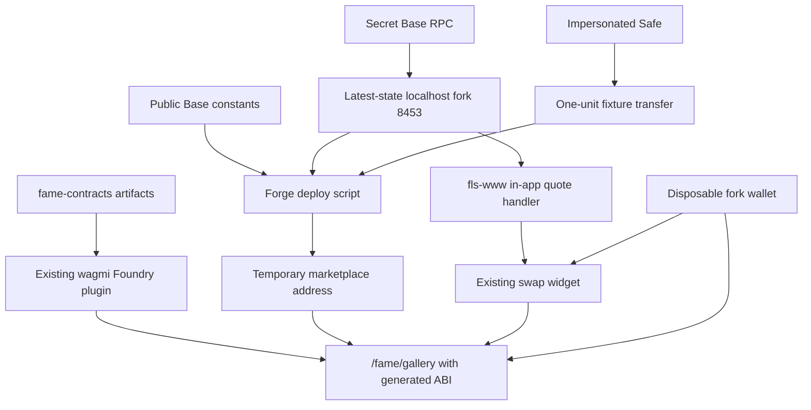
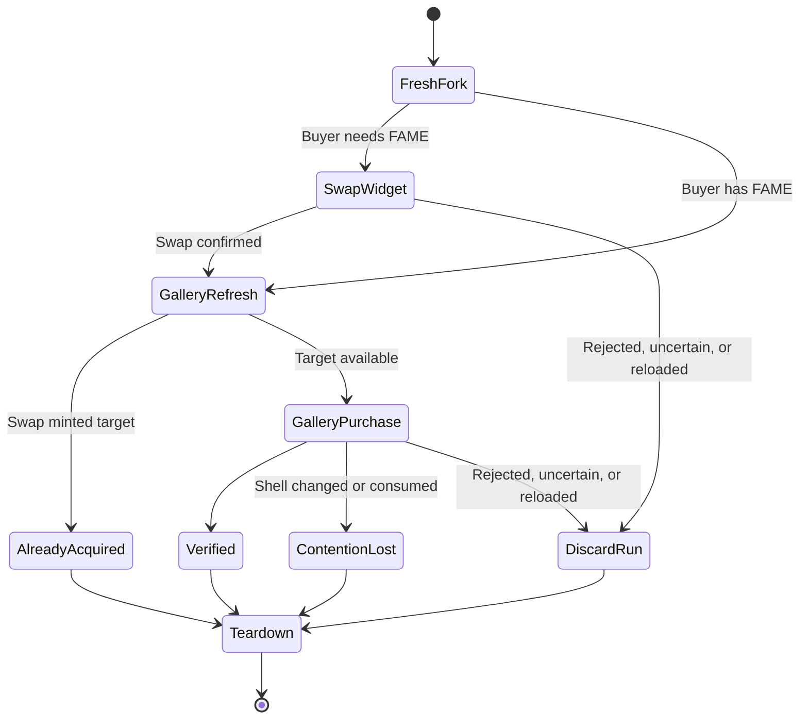

# Base Universal Pool Art Marketplace Production Readiness - Plan

## Goal Capsule

| Field | Contract |
| --- | --- |
| Objective | Deploy the production-configured marketplace on a disposable Base fork, activate it from the developer/deployer account, exercise the real `fls-www` gallery and existing swap widget, and leave trustworthy fork-test evidence without broadcasting to Base. |
| Authority | This plan carries forward `docs/handoffs/base-universal-pool-art-marketplace-production-implementation.md`; session-settled decisions in this plan override its formerly open deployer, owner, seed, Safe-handoff, and route-exposure questions. |
| Execution profile | Deep, two-repository code work across `fame-contracts` and `fls-www`, with a local Base fork and dedicated test wallet. |
| Stop conditions | Stop before any Base broadcast, production Safe signature collection, live ownership handoff, public route promotion, or production inventory transfer. |
| Completion posture | This milestone proves fork behavior only. Production seeding, live deployment, live activation, post-deploy testing, and the later 7-of-14 Safe handoff remain separate decisions. |
| Tail ownership | The implementer owns focused tests, both repository quality gates, a disposable browser campaign, preservation of existing `fls-www` edits, and cleanup of all fork-only generated state. |

---

## Product Contract

### Summary

Run the existing `UniversalPoolArtMarketplace` and working `fls-www` gallery against a reproducible local fork of Base.
The fork deploys paused, receives one FAME unit to mint one Society shell, activates from the developer/deployer account, and supports contention testing around that single shell.
The buyer campaign uses the existing FAME swap widget to acquire FAME through local fork RPC reads, then uses the gallery's existing FAME purchase flow.

### Problem Frame

Base Sepolia proved the marketplace model, but the production stack uses different canonical contracts, a real Base liquidity graph, a future threshold Safe owner, and a browser wallet on chain ID `8453`.
The production inventory source and three-unit transfer are intentionally deferred until after fork testing.
The fork therefore needs only one marketplace shell, a simple fork-only fixture transfer to the deployer, local-only quote reads, generated wagmi bindings, a plain contract address, and a disposable testing workflow.

### Actors

- A1. Developer/release engineer — runs the fork, controls the deployer account on that fork, activates the marketplace, and performs the browser campaign.
- A2. Initial owner/deployer — `0xD52E2A6bBcEba9673440e4D7843Db6713E9B6FD9`; owns and activates both the fork deployment and the eventual live deployment before any handoff begins.
- A3. Future long-term owner and fee recipient — Safe `0xC952C53D8B63919e372caa2E6FEe605ee24E4D3D`; receives premiums now but does not gate fork or live activation.
- A4. Buyer — a dedicated disposable wallet connected only to the local Base fork.
- A5. Reviewer — checks contract state, browser behavior, receipts/events, and explicit deferred production work.

### Requirements

#### Configuration and authority

- R1. Public Base constants must live in `config/fame-public.env`; RPC URLs, private keys, mnemonics, explorer keys, and wallet keys remain in Doppler or disposable local state. Fork deployment, funding, and activation use Anvil impersonation or unlocked fork accounts and never request production private keys.
- R2. The deployer and active owner must be `0xD52E2A6bBcEba9673440e4D7843Db6713E9B6FD9`; the fee recipient and future long-term owner must both be `0xC952C53D8B63919e372caa2E6FEe605ee24E4D3D`, represented as separate roles even though the latter values match.
- R3. Fork setup must impersonate the FAME-holding Safe only to transfer exactly one FAME unit (`1,000,000 FAME`) to the deployer, then transfer that exact unit from the deployer to the marketplace to create one shell; the production three-unit transfer and its funding source remain deferred.
- R4. Deployment scripts and tests must check Base chain ID `8453`, the canonical FAME/mirror/CreatorMagic/child-renderer stack, `Society`/`FAME`, a `1,000,000 FAME` unit, a `30,000 FAME` premium, initial pause state, and `BANISHER`-only marketplace authority without adding validation logic to the marketplace contract.

#### Fork lifecycle

- R5. Each fork run must start from the latest available Base state and record the resolved block number and hash used for that run.
- R6. Fork setup must deploy paused, grant only `BANISHER`, seed one unit from the deployer, validate one marketplace-owned shell, activate from the deployer, and leave the deployer as owner throughout this milestone.
- R7. Safe ownership handoff must not gate fork activation, fork acceptance, eventual live activation, or initial live testing; it begins only after the live contract has been deployed, activated, and tested successfully.
- R8. `fls-www` must generate the marketplace ABI/hooks from the local `fame-contracts` project with wagmi generation and accept the plain fork marketplace address in its local runtime so the route can be tested; no deployment-manifest protocol or artifact-hash scheme is required.
- R9. Fork setup may fail naturally when a required local input is unavailable; do not add negative-path tests, preflight frameworks, or acceptance gates for disposable-fork setup failures.

#### Production route and local RPC

- R10. `fls-www` must expose `/fame/gallery` as a direct Base route while leaving it absent from both app site menus; `/fame/gallery/test` remains unchanged.
- R11. TEST and Base routes must select the correct contract addresses, labels, metadata behavior, and explorer links through existing configuration patterns rather than a runtime network selector or cross-repository manifest.
- R12. Fork mode must point the app, its in-process quote handler, and the browser wallet at a localhost Base RPC; it must disable the external indexed quote service and public Base RPC fallbacks for that run. No additional node fingerprint or fork-attestation protocol is required.
- R13. The Base gallery must reuse existing `fls-www` client-side Society metadata machinery: batch on-chain `tokenURI` reads, browser-side decoding, and direct use of the published image value. It must add no server-side metadata fetcher or image proxy and must keep Art Pool entries absent.

#### Buyer testing

- R14. Direct-FAME checkout must preserve the existing gallery flow: refresh terms, skip sufficient approvals, submit exact insufficient approvals, purchase, and reconcile receipt, event, ownership, artwork, inventory, and fee state.
- R15. ETH, USDC, and supported WETH payment testing is part of this slice and must use the existing `fls-www` quoter and swap widget against the local fork to acquire FAME before the existing FAME marketplace purchase; this plan adds no direct alternative-token acceptance to the Solidity contract, target-output sizing, or combined gallery checkout.
- R16. Swap and gallery purchase are separate user flows. A page reload or uncertain transaction state ends that fork attempt; the tester tears down the fork, resets the disposable wallet, and starts again rather than resuming from persisted artifacts.
- R17. After using the swap widget, the tester must refresh the gallery's canonical ownership, artwork, pool, shell, FAME balance, allowance, unit, premium, and pause reads before purchasing.
- R18. If the swap mints the selected Society artwork to the buyer, the refreshed gallery must show that acquisition and the tester must not submit a marketplace purchase or pay the premium.
- R19. The existing direct-FAME buyer/recipient behavior remains in scope; swap-widget funding does not introduce new gifting behavior.
- R20. One-shell inventory must support deliberate contention testing: two prepared buyers or stale browser states may compete for the same shell, and exactly one valid settlement may succeed.

#### Verification and release posture

- R21. The contract matrix must cover held, Mint Pool, Burn Pool, Art Pool rejection, one-shell contention, stale shell, metadata drift, premium increase/decrease, pause races, distinct recipient, exact fee routing, DN404 acquisition, and inventory preservation.
- R22. The browser campaign must prove direct FAME plus ETH and USDC acquisition through the existing widget; WETH is required only when the existing fork-visible route supports it.
- R23. Evidence must identify both repository revisions, record concise scenario outcomes, and make clear that fork success does not authorize production deployment or ownership handoff.

### Key Flows

- F1. Disposable fork startup
  - **Trigger:** A1 begins a test run.
  - **Actors:** A1, A2
  - **Steps:** Start Anvil from latest Base state on localhost, impersonate the Safe to transfer one FAME unit to A2, deploy paused from A2, grant `BANISHER`, seed that unit from A2, validate one shell, and activate from A2.
  - **Outcome:** One active, deployer-owned marketplace shell is available for browser and contention tests.
  - **Covered by:** R1, R3, R4, R5, R6, R9

- F2. Generated frontend contract access
  - **Trigger:** The fork marketplace address is known.
  - **Actors:** A1
  - **Steps:** Run the existing wagmi generation against `fame-contracts`, supply the fork address through ordinary local configuration, and start `/fame/gallery`.
  - **Outcome:** The Base gallery uses generated marketplace bindings without a deployment manifest.
  - **Covered by:** R8, R10, R11

- F3. Direct-FAME purchase
  - **Trigger:** A4 has enough FAME for unit plus premium.
  - **Actors:** A4
  - **Steps:** Refresh terms, approve exactly when needed, submit the existing gallery purchase, and reconcile the acquired result.
  - **Outcome:** Held, Mint, or Burn artwork reaches the recipient and the one-shell invariant is preserved.
  - **Covered by:** R14, R19, R20, R21

- F4. Existing swap widget then gallery purchase
  - **Trigger:** A4 needs FAME.
  - **Actors:** A4
  - **Steps:** Use the existing widget with ETH, USDC, or supported WETH; quote through the app's local-RPC path; wait for the swap; refresh the gallery; then perform the normal FAME purchase if the target is still available.
  - **Outcome:** The real existing swap and gallery surfaces are tested without building a new combined checkout.
  - **Covered by:** R12, R15, R16, R17, R18, R22

- F5. One-shell contention
  - **Trigger:** Two buyers or two stale views prepare against the same shell.
  - **Actors:** A1, A4
  - **Steps:** Freeze both attempts, submit them in controlled order or near-concurrently, and reconcile both receipts and final ownership.
  - **Outcome:** One purchase succeeds, the stale contender fails safely, and no duplicate delivery or fee occurs.
  - **Covered by:** R20, R21

- F6. Teardown and review
  - **Trigger:** A scenario or campaign ends.
  - **Actors:** A1, A5
  - **Steps:** Record concise results, stop the independently run app and Anvil processes, reset the disposable wallet, and classify deferred production work.
  - **Outcome:** The disposable fork is discarded; no recovery journal survives into the next run.
  - **Covered by:** R9, R16, R23

### Acceptance Examples

- AE1. One-shell active prefix
  - **Covers:** R3, R4, R6
  - **Given:** A fresh latest-state fork where the Safe holds at least one FAME unit.
  - **When:** The Safe-to-deployer fixture transfer, deployment, role grant, deployer-to-marketplace seed, validation, and activation complete.
  - **Then:** The marketplace is active, deployer-owned, has exactly one Society shell, retains only `BANISHER`, and routes premium to the fee Safe.

- AE2. External quote service disabled
  - **Covers:** R12, R15
  - **Given:** `fls-www` is running in fork mode.
  - **When:** The swap widget requests a quote.
  - **Then:** The in-app handler uses loopback `BASE_RPC_URL`, does not call the external indexed service, and does not fall back to public Base.

- AE3. Swap mints the selected artwork
  - **Covers:** R17, R18
  - **Given:** A4 selects artwork and then acquires FAME through the widget.
  - **When:** DN404 mints that artwork to A4.
  - **Then:** Refresh shows A4 already owns it, no marketplace purchase is sent, and no premium is charged.

- AE4. One-shell contention
  - **Covers:** R20, R21
  - **Given:** Two buyers prepare against the only available marketplace shell.
  - **When:** Both attempts are submitted.
  - **Then:** One succeeds and the stale attempt reverts or refreshes without duplicate ownership, duplicate fee, or corrupted inventory.

- AE5. Reload during a transaction
  - **Covers:** R16, R23
  - **Given:** A transaction is pending or its outcome is uncertain.
  - **When:** The tester reloads or loses the fork session.
  - **Then:** The run is abandoned, recorded as incomplete, and restarted from a clean fork and reset wallet; no automatic resume or replay occurs.

- AE6. Hidden route
  - **Covers:** R10
  - **Given:** The Base gallery is configured.
  - **When:** A reviewer opens `/fame/gallery` directly and inspects both site menus.
  - **Then:** The route works and neither menu contains a Gallery entry.

### Success Criteria

- The production-configured marketplace deploys, receives one shell, activates, and passes focused contract tests against latest Base state under deployer ownership.
- `wagmi generate` produces marketplace bindings from the local `fame-contracts` project, and the gallery uses a plain fork contract address.
- The existing swap widget quotes and swaps through local fork RPC without contacting the external indexed quote service.
- Direct FAME, ETH, USDC, supported WETH, DN404 acquisition, and one-shell contention scenarios produce reconciled evidence.
- Teardown discards the fork and the report leaves production transfer, deployment, activation, and Safe handoff explicitly deferred.

### Scope Boundaries

#### Included

- Production-specific Base deployment/validation/activation tooling for local fork use.
- One-unit deployer seeding and one-shell contention testing.
- Existing wagmi generation from `fame-contracts` plus a plain marketplace address.
- Direct but unlisted `/fame/gallery`.
- Existing swap widget configured for local RPC-only fork quotes and swaps.
- Preservation and integration of current uncommitted `fls-www` gallery work.

#### Deferred

- Selecting and funding the production source for three FAME units.
- Any live Base deployment, activation, verification submission, or buyer testing.
- Starting and completing the 7-of-14 Safe ownership handoff after the live deployment has passed developer testing.

#### Excluded

- Safe-gated fork activation, Safe transaction rehearsal, or Safe ownership transfer in this milestone.
- A deployment manifest, artifact hash/proof protocol, fork sentinel, target-output quote sizing, combined swap-and-gallery queue, persisted fork recovery journal, or marketplace-bytecode changes made only to validate the disposable fork.
- Runtime network selector, Art Pool support, off-chain order book, automatic inventory management, or swap-back.
- A navigation link or public `/fame/gallery` promotion.

### Dependencies and Assumptions

- Canonical Base contracts and liquidity remain readable through the `base` Foundry alias with secrets supplied by Doppler.
- Each run forks latest Base state and records the block number and hash selected when Anvil starts.
- The FAME-holding Safe has at least one unit in the selected fork state; Anvil impersonation transfers exactly that unit to the deployer without loading a production key.
- `fls-www`'s existing quote handler can run its live-RPC adapters against loopback `BASE_RPC_URL` with the external indexed helper disabled.
- The existing wagmi Foundry plugin continues to read `../fame-contracts`; the first implementation step confirms generation before other frontend refactors.

### Outstanding Questions

- **Deferred, production-only:** Which source will supply the three production FAME units, and when will those funds be available to the deployer?
- **Deferred, post-launch:** When enough Safe owners are available, what schedule and operator will coordinate the 7-of-14 ownership handoff?

### Sources

- `docs/handoffs/base-universal-pool-art-marketplace-production-implementation.md`
- `docs/plans/2026-07-17-001-feat-universal-pool-art-marketplace-plan.md`
- `fls-www: docs/plans/2026-07-19-001-feat-universal-pool-art-marketplace-plan.md`
- `docs/gallery/base-sepolia-universal-pool-art-marketplace.md`

---

## Planning Contract

### Context and Research

- `script/DeployBaseSepoliaUniversalPoolArtMarketplace.s.sol` and `script/ValidateBaseSepoliaUniversalPoolArtMarketplace.s.sol` provide the guarded deployment-prefix pattern, but production fork setup intentionally uses one shell and keeps the deployer as owner.
- `test/UniversalPoolArtMarketplaceForkBaseSepolia.t.sol` provides the existing Sepolia purchase matrix to adapt for latest-state Base.
- `fls-www: wagmi.config.ts` already uses `foundry({ project: "../fame-contracts" })`; the marketplace needs to be added to the Foundry include list before generation.
- `fls-www: src/app/api/fame/swap/quote/handler.ts` can use `BASE_RPC_URL` and live RPC quote adapters, while its external indexed helper must be disabled for fork runs.
- `fls-www: src/features/fame-gallery/` already implements canonical catalog, fulfillment, purchase, and receipt behavior; this plan avoids replacing it with a combined swap flow.

### Key Technical Decisions

- KTD1. Keep deployer/owner, fee recipient, and future long-term owner as separate configuration concepts even when addresses coincide. (session-settled: user-directed — chosen over one generic “owner Safe” field: the same address can hold different responsibilities at different lifecycle stages)
- KTD2. Use `0xD52E2A6bBcEba9673440e4D7843Db6713E9B6FD9` as deployer and active owner through fork testing and initial live testing. (session-settled: user-directed — chosen over beginning with a multisig: the developer must activate and validate the deployment before handoff)
- KTD3. Keep `0xC952C53D8B63919e372caa2E6FEe605ee24E4D3D` as fee recipient and intended long-term owner, but defer all handoff work until the live deployer-owned contract has passed testing. (session-settled: user-directed — chosen over transfer-before-activation: 7-of-14 coordination must not block activation or validation)
- KTD4. Seed the fork with exactly one FAME unit from the deployer and defer the three-unit production transfer. (session-settled: user-directed — chosen over reproducing production inventory on the fork: one shell is sufficient and improves contention testing)
- KTD5. Make `/fame/gallery` directly reachable but omit it from both app menus. (session-settled: user-directed — chosen over removing the route or advertising it: hidden means unlisted)
- KTD6. Activate from the deployer on the fork and on the eventual live deployment, then begin Safe handoff only after successful live testing. (session-settled: user-directed — chosen over Safe-gated activation: signer availability and coordination are deferred release work)
- KTD7. Generate marketplace bindings through the existing wagmi Foundry plugin and pass a plain contract address at runtime. (session-settled: user-directed — chosen over a versioned deployment manifest: the existing two-repo setup already supplies ABI generation)
- KTD8. Pass the fork marketplace address into the local `fls-www` runtime for testing, but do not commit it as the future live Base address. No manifest hashes, runtime proofs, or cross-repository schema are introduced.
- KTD9. In fork mode, keep the existing in-app quote handler but force it onto localhost `BASE_RPC_URL` and disable the external indexed helper and public fallback.
- KTD10. Include ETH, USDC, and supported WETH payment in this slice by using the existing quoter and exact-input swap widget before the existing FAME-only gallery purchase. No direct alternative-token acceptance, target-output sizing, or new combined checkout is added. (session-settled: user-directed — chosen over a gallery-specific quote/search flow: swap behavior is already settled in `fls-www`)
- KTD11. Treat every fork as disposable. State lives only for the current in-memory run; reload, uncertainty, or failure means teardown and restart. (session-settled: user-directed — chosen over a persisted recovery journal: fork artifacts should not survive a discarded test)
- KTD12. Use localhost app/server RPC configuration plus a dedicated harmless test wallet manually pointed at the fork. Do not add a sentinel, node fingerprint, runtime-hash handshake, or browser fork proof.
- KTD13. Reuse the gallery's existing receipt/event/state reconciliation rather than building a new settlement snapshot abstraction; add only contention and swap-then-refresh coverage needed by this fork.
- KTD14. Run Anvil, Forge deployment, wagmi generation, and `fls-www` as separate ordinary commands; curate only concise results and transaction identifiers needed to understand the campaign.
- KTD15. Keep stack, authority, role, and prefix checks in deployment scripts and tests. (session-settled: user-directed — chosen over marketplace-level validation: the fork is disposable and must not pay runtime gas for rehearsal guardrails)

### High-Level Technical Design

The diagrams show the intended boundaries without prescribing implementation details.

#### Fork and frontend flow



#### Activation and later handoff

```mermaid
sequenceDiagram
  participant D as Developer deployer
  participant M as Marketplace
  participant S as Future Safe owner
  D->>M: Deploy paused on fork
  D->>M: Seed one FAME unit
  D->>M: Activate and test fork
  Note over D,M: Fork ends; no ownership handoff
  D->>M: Future live deploy, activate, and test
  Note over D,S: Separate later coordination
  S-->>M: Ownership handoff only after live tests pass
```

#### Browser campaign state



### State and Data Integrity

- Deployment prefixes remain explicit: absent, deployed-paused, `BANISHER`-granted, one-shell ready-paused, and active under the deployer.
- The developer passes the localhost RPC and temporary marketplace address to `fls-www` through ordinary local configuration; no orchestration launcher or marker-owned environment protocol is introduced.
- TEST and Base gallery state remain isolated by their existing chain/address-aware query and storage keys.
- Each purchase result reconciles the receipt, marketplace event, shell owner/artwork, premium destination, and final inventory.
- Contention tests record both attempts so the expected stale failure cannot masquerade as a second success.

### System-Wide Impact

- **Contract tooling:** Adds Base-specific deployment, one-unit fork seeding, script/test validation, activation, and tests without changing `UniversalPoolArtMarketplace` bytecode or runtime gas.
- **Ownership:** Keeps the deployer in control through this milestone; the intended Safe remains a documented future owner rather than a test dependency.
- **Frontend generation:** Extends the existing wagmi Foundry include list and generated output instead of adding a new manifest system.
- **RPC behavior:** Adds a fork-only switch that disables external indexed quote data and public Base fallback while keeping the existing local quote handler and widget.
- **Gallery behavior:** Adds a Base address/config route, refresh-after-swap coverage, and one-shell contention handling without combining swap and purchase.
- **Operations:** Uses clean fork teardown and a reset wallet rather than persisted recovery state.
- **Working tree:** The implementer must snapshot and preserve existing modified/untracked gallery files before refactoring around them.

### Risks and Dependencies

| Risk | Mitigation |
| --- | --- |
| Quote handler reaches the external indexed service | Explicit fork-only disable switch with a test that fails if the external client is called |
| App falls back to public Base | Loopback-only `BASE_RPC_URL` and `NEXT_PUBLIC_BASE_RPC_URL_1` in fork mode with public fallbacks disabled |
| Browser wallet points to public Base | Dedicated valueless test key, manually configured local Base RPC, visible local marketplace address, and teardown after every run |
| One shell is consumed by another attempt | Refresh before submission, verify stale failure, and make contention an intentional acceptance case |
| Reload loses transaction context | Abandon and tear down the disposable run; never auto-resubmit |
| Wagmi generation changes unrelated output | Run generation first, inspect the generated diff, and isolate only expected marketplace additions |
| Existing dirty frontend work is overwritten | Record SHA/status/diff and untracked hashes first; preserve and integrate those edits |
| Production metadata rewrites media URLs | Preserve metadata-provided image URLs exactly |

### Sequencing

1. Confirm the marketplace and gallery branches, then verify the current wagmi generation baseline.
2. Adapt the existing Base Sepolia deployment, one-unit lifecycle, and purchase machinery for latest-state Base.
3. Extend wagmi generation as needed and wire a plain fork marketplace address into the Base gallery route.
4. Force app and quote RPC reads onto localhost and disable external indexed/public fallbacks in fork mode.
5. Reuse the existing quoter/widget for ETH, USDC, and supported WETH funding, then run the existing FAME gallery purchase.
6. Run disposable automated and browser campaigns with independently started tools, discard each fork, and curate concise evidence.

### Planning Sources

- [Wagmi CLI Foundry plugin](https://wagmi.sh/cli/api/plugins/foundry)
- [Foundry `createSelectFork`](https://getfoundry.sh/reference/cheatcodes/create-select-fork)
- [Anvil reference](https://getfoundry.sh/reference/anvil/anvil)
- [wagmi contract generation](https://wagmi.sh/cli/getting-started)
- [viem transaction receipt behavior](https://viem.sh/docs/actions/public/waitForTransactionReceipt)

---

## Implementation Units

### U1. Add Base fork configuration and guarded lifecycle tooling

- **Goal:** Adapt the existing Base Sepolia machinery to represent production Base facts and deploy, validate, seed one unit, and activate against a latest-state localhost fork.
- **Requirements:** R1, R2, R3, R4, R5, R6, R9
- **Dependencies:** None
- **Files:**
  - `config/fame-public.env`
  - `script/DeployBaseUniversalPoolArtMarketplace.s.sol`
  - `script/ValidateBaseUniversalPoolArtMarketplace.s.sol`
  - `script/ActivateBaseUniversalPoolArtMarketplace.s.sol`
  - `test/UniversalPoolArtMarketplaceDeploymentValidationBase.t.sol`
- **Approach:** Adapt the Base Sepolia deployment script for chain `8453`, production identities, separate role fields, paused deployment, exact premium, one required shell, `BANISHER`-only authority, and deployer activation. Use Anvil impersonation to transfer exactly one FAME unit from the Safe to the deployer, then seed from the deployer. The Solidity deployment script only deploys; fixture funding, role grant, seeding, validation, and activation remain separate script/test steps. Keep all checks in scripts/tests, change no marketplace runtime logic, load no production key, include no production broadcast command, and include no Safe handoff.
- **Test scenarios:**
  - Correct inputs reuse the existing Sepolia lifecycle to deploy paused and validate the canonical stack on Base.
  - Safe-to-deployer impersonated fixture transfer supplies exactly one unit; the deployer then seeds exactly one marketplace-owned shell.
  - Activation succeeds only from the deployer/owner and final validation shows active, deployer-owned state.
- **Verification:** Focused deployment-validation tests pass and a local Anvil run reaches the exact one-shell active prefix without Base mutation.

### U2. Add latest-state one-shell Base fork behavior and contention tests

- **Goal:** Prove production contract behavior with one shell and make competition for that shell a first-class test.
- **Requirements:** R5, R20, R21
- **Dependencies:** U1
- **Files:**
  - `test/UniversalPoolArtMarketplaceForkBase.t.sol`
  - `test/UniversalPoolArtMarketplaceContentionBase.t.sol`
- **Approach:** Reuse the Base Sepolia purchase matrix against the latest Base state selected when the test starts. Record the resolved block/hash, seed one shell, run held/Mint/Burn paths, and prepare two buyers against the same shell for ordered and near-concurrent settlement.
- **Test scenarios:**
  - Latest-state canonical stack checks execute with zero required skips and record the selected block/hash.
  - Held, Mint Pool, and Burn Pool purchases preserve one-shell marketplace inventory; Art Pool is rejected.
  - Two attempts against one shell yield one success and one stale/reverted attempt with one fee and one recipient.
  - Premium increase/decrease, pause, stale artwork, stale shell, and distinct recipient produce expected outcomes.
- **Verification:** Fork and contention suites pass with receipt/event/state reconciliation and no skipped required mode.

### U3. Run existing marketplace regressions unchanged

- **Goal:** Keep established marketplace unit, fuzz, invariant, and DN404 protections green without expanding them for already-covered behavior.
- **Requirements:** R18, R20, R21
- **Dependencies:** U1, U2
- **Files:** No changes expected; run the existing marketplace suites.
- **Approach:** Run the existing unit, fuzz, invariant, and DN404 coverage unchanged. Put new Base-specific one-shell lifecycle and contention behavior in U2 rather than duplicating generic regression cases.
- **Test scenarios:**
  - Existing unit, fuzz, invariant, and DN404 suites pass at their established budgets.
  - Any failure introduced by the Base-specific work is fixed without broadening unrelated test machinery.
- **Verification:** Focused unit, fuzz, and invariant suites pass at configured budgets.

### U4. Document the minimal manual fork workflow

- **Goal:** Keep Anvil, Forge deployment, wagmi generation, and `fls-www` as independent commands with ordinary local RPC/address configuration.
- **Requirements:** R5, R9, R12, R16, R23
- **Dependencies:** U1, U2, U3
- **Files:**
  - `docs/gallery/base-universal-pool-art-marketplace-fork-report.md`
- **Approach:** Document the small operator sequence: start a latest-state Base fork on localhost, run the separate Forge lifecycle steps, run `yarn wagmi generate` only when needed, pass the localhost RPC and temporary marketplace address to `fls-www`, start the app separately, and discard the fork after testing. Add no orchestration launcher, marker protocol, node fingerprint, or browser proof.
- **Test scenarios:**
  - App and server receive the same local RPC and marketplace address.
  - Reload/uncertainty is handled by stopping and discarding the run rather than resuming it.
- **Verification:** The documented independent commands reach an active one-shell fork without printing secrets or committing the temporary fork address.

### U5. Generate marketplace bindings and add the direct Base route

- **Goal:** Use the existing wagmi Foundry plugin and a plain contract address to run the working gallery on Base.
- **Requirements:** R8, R10, R11, R13, R23
- **Dependencies:** U4
- **Files:**
  - `fls-www: wagmi.config.ts`
  - `fls-www: src/wagmi/index.ts`
  - `fls-www: src/features/fame-gallery/contract.ts`
  - `fls-www: src/features/fame-gallery/metadata/`
  - `fls-www: src/app/fame/gallery/page.tsx`
  - `fls-www: src/features/appbar/components/SiteMenu.tsx`
  - `fls-www: src/features/appbar/components.app/SiteMenu.tsx`
- **Approach:** Run the existing generation baseline when needed, add `UniversalPoolArtMarketplace.sol/**` to the Foundry include list, inspect the generated diff, and supply the fork address through ordinary local configuration. Reuse the Base Sepolia gallery code for the non-testnet route. Load Society metadata with existing client-side on-chain `tokenURI` read/decoding patterns; add no metadata server or image proxy.
- **Test scenarios:**
  - Wagmi generation produces the marketplace ABI/hooks without unrelated generated churn.
  - TEST keeps its existing address, labels, and metadata; Base uses production stack plus the local marketplace address.
  - Base metadata is read from the Society contract, decoded in the browser, preserves published image values exactly, and never uses a server-side metadata or image-proxy route.
  - Art Pool entries remain absent.
  - `/fame/gallery` loads directly and neither site menu contains a Gallery entry.
- **Verification:** Generated output is reproducible, focused route/config/metadata tests pass, and both TEST and Base routes render correctly.

### U6. Force fork quotes and app reads onto local RPC

- **Goal:** Reuse the existing quote handler and widget without contacting the separately deployed indexed quote service or public Base.
- **Requirements:** R12, R15
- **Dependencies:** U4, U5
- **Files:**
  - `fls-www: src/viem/baseRpcUrls.ts`
  - `fls-www: src/viem/baseRpcUrls.test.ts`
  - `fls-www: src/app/api/fame/swap/quote/handler.ts`
  - `fls-www: src/app/api/fame/swap/quote/handler.test.ts`
  - `fls-www: src/features/fame-swap/solver/quotes/`
- **Approach:** Add an explicit fork-only mode that requires loopback `BASE_RPC_URL` and `NEXT_PUBLIC_BASE_RPC_URL_1`, disables public RPC fallbacks, disables construction/calls of the external indexed quote client, and retains the existing live-RPC adapters against Anvil.
- **Test scenarios:**
  - Fork quote uses local RPC and the external indexed client is never constructed or called.
  - Missing/non-loopback RPC or attempted public fallback fails closed.
  - Normal production quote behavior remains unchanged when fork mode is off.
  - ETH, USDC, and available WETH exact-input quotes use existing widget semantics.
- **Verification:** Existing quote-handler and transport tests cover the fork-mode local-RPC branch; no browser fork-proof or request-trap machinery is added.

### U7. Add ETH, USDC, and supported WETH payment through the existing quoter

- **Goal:** Include ETH, USDC, and supported WETH payment in this slice by acquiring FAME through the existing quoter/widget before the existing marketplace purchase.
- **Requirements:** R15, R16, R17, R22
- **Dependencies:** U5, U6
- **Files:**
  - `fls-www: src/features/fame-swap/components/FameSwapWidget.tsx`
  - `fls-www: src/features/fame-gallery/components/GalleryView.tsx`
  - `fls-www: src/features/fame-gallery/hooks/useGalleryPurchase.ts`
  - `fls-www: src/features/fame-gallery/hooks/useGalleryPurchase.test.ts`
- **Approach:** Reuse the existing exact-input selection, quoter, approval, and swap behavior. After a confirmed swap, use the existing gallery and its ordinary on-chain reads before the FAME purchase. Add no combined checkout, target-output solver, cross-page state machine, or new post-event UI framework.
- **Test scenarios:**
  - ETH and USDC swaps complete through the existing widget; WETH completes when its current route is available.
  - Existing gallery reads see the new FAME balance and current allowance/terms before purchase.
  - Rejection, revert, timeout, or reload ends the attempt and requires a fresh fork instead of automatic resume.
  - No target-output search or combined transaction queue appears in gallery code.
- **Verification:** Existing swap tests remain green and focused coverage proves ETH, USDC, and supported WETH can fund the ordinary FAME marketplace path without new checkout machinery.

### U8. Run disposable browser campaigns and curate fork evidence

- **Goal:** Demonstrate the real Base route, existing widget, and one-shell marketplace behavior while leaving no reusable fork artifacts.
- **Requirements:** R5, R9, R10, R12, R14, R16, R18, R19, R20, R21, R22, R23
- **Dependencies:** U2, U3, U4, U5, U6, U7
- **Files:**
  - `docs/gallery/base-universal-pool-art-marketplace-fork-report.md`
  - `fls-www: docs/fame-gallery/base-universal-pool-art-marketplace-browser-campaign.md`
- **Approach:** Use a dedicated browser profile/key, restart from latest Base state for destructive scenarios, run direct-FAME and widget-funded cases, record concise receipts/events/state/screenshots or notes, then discard the fork and reset. Reuse existing Sepolia gallery presentation rather than adding new handoff, refresh-state, post-event, or accessibility frameworks. Keep production deployment and Safe handoff visibly outside the result.
- **Test scenarios:**
  - Direct-FAME held, Mint, Burn, sufficient allowance, exact approval, and distinct-recipient flows pass.
  - ETH and USDC widget swaps fund later gallery purchases; WETH is tested when the existing route supports it.
  - DN404 target acquisition stops before marketplace purchase.
  - Two buyers contend for one shell and produce one verified success plus one safe stale failure.
  - Direct route works, both menus omit Gallery, local-only quote behavior is visible, and teardown removes fork state.
- **Verification:** The report records concise scenario outcomes and states that fork success authorizes neither Base deployment nor Safe handoff.

---

## Verification Contract

### `fame-contracts` Quality Gates

| Gate | Command | Required outcome |
| --- | --- | --- |
| Build | `FOUNDRY_PROFILE=universal_marketplace forge build` | Contract and Base fork scripts compile with the pinned profile |
| Scoped format | `FOUNDRY_PROFILE=universal_marketplace forge fmt --check script/DeployBaseUniversalPoolArtMarketplace.s.sol script/ValidateBaseUniversalPoolArtMarketplace.s.sol script/ActivateBaseUniversalPoolArtMarketplace.s.sol test/UniversalPoolArtMarketplaceDeploymentValidationBase.t.sol test/UniversalPoolArtMarketplaceForkBase.t.sol test/UniversalPoolArtMarketplaceContentionBase.t.sol` | Changed Solidity is formatted without claiming unrelated repository format debt |
| Unit and deployment | `FOUNDRY_PROFILE=universal_marketplace forge test --match-path 'test/UniversalPoolArtMarketplace*.t.sol' -vvv` | Marketplace, deployment, and one-shell tests pass |
| Fuzz | `FOUNDRY_PROFILE=universal_marketplace forge test --match-path test/UniversalPoolArtMarketplaceFuzz.t.sol -vvv` | The configured 10,000 cases pass |
| Invariant | `FOUNDRY_PROFILE=universal_marketplace forge test --match-path test/UniversalPoolArtMarketplaceInvariant.t.sol -vvv` | The configured 512 runs by 128 depth pass |
| Repository regression | `forge test` | Existing suite remains green; unrelated existing failures are reported precisely |

### Environment-Backed Fork Gates

Load `config/fame-public.env` first, then run through Doppler with the `base` Foundry alias.
A sandbox-only DNS, keychain, Doppler, RPC, or local-service failure must be rerun with real local visibility before diagnosis.

| Gate | Command | Required outcome |
| --- | --- | --- |
| Doppler context | `doppler configure get project` and `doppler configure get config` | The intended project/config resolve without exposing secrets |
| Latest-state Base fork | `FOUNDRY_PROFILE=universal_marketplace forge test --match-contract UniversalPoolArtMarketplaceForkBaseTest -vvv` | The selected latest Base block/hash is recorded and the one-shell lifecycle and purchase matrix execute with zero required skips |
| Manual rehearsal | Start Anvil, run the separate Forge lifecycle steps, then start `fls-www` with the localhost RPC and temporary address | The independently run tools reach the active one-shell prefix and the app uses the intended local values |

The production three-unit transfer and ownership handoff remain `not executed`.

### `fls-www` Quality Gates

| Gate | Command | Required outcome |
| --- | --- | --- |
| Wagmi baseline | `yarn wagmi generate` before and after adding the marketplace include | Generation succeeds against `../fame-contracts` and the diff contains only expected marketplace bindings |
| Focused gallery/quote tests | `bun test src/features/fame-gallery src/app/api/fame/swap/quote src/viem/baseRpcUrls.test.ts` | Route, metadata, contention, refresh, quote-handler, and local-RPC tests pass |
| Existing swap tests | `bun test src/features/fame-swap` | Existing widget and quote behavior remain green |
| Types | `yarn tsc --noEmit --pretty false` | TypeScript passes |
| Lint | `yarn lint` | ESLint passes or unrelated pre-existing debt is isolated and reported |
| Production build | `doppler run -- yarn build` | The production Next build completes with its real environment |
| Browser campaign | Run `/fame/gallery` and the existing swap widget with the independently started localhost fork and disposable wallet | Direct FAME, ETH, USDC, supported WETH, DN404, contention, and teardown cases produce reconciled evidence |

### Evidence Gates

- Record the latest-state block identity selected when the fork starts, both repository revisions, deployment address, constructor values, owner, fee recipient, role posture, pause state, and one-shell inventory.
- Record transaction identifiers for deployment, role grant, seed, activation, swaps, approvals, purchases, contention attempts, and acquired results where applicable.
- Reconcile purchase receipts with marketplace events, final owner/artwork, one-shell inventory, and exact fee transfer.
- Keep raw Foundry broadcasts/caches and production secrets uncommitted; discard the local fork after testing.

---

## Definition of Done

### Unit Completion

- U1 is complete when the exact production stack reaches an active, deployer-owned, one-shell prefix on local Anvil.
- U2 is complete when the latest-state fork and one-shell contention tests pass without required skips and record the selected block/hash.
- U3 is complete when the existing unit, fuzz, invariant, and DN404 safety coverage passes unchanged at configured budgets.
- U4 is complete when the documented independent commands reach the active fork and app without an orchestration launcher or committed fork address.
- U5 is complete when wagmi generation adds marketplace bindings and `/fame/gallery` uses a plain local address while remaining unlisted.
- U6 is complete when fork quote and app reads use the localhost RPC branch with the external indexed helper disabled.
- U7 is complete when ETH, USDC, and supported WETH use the existing quoter/widget to fund later FAME gallery purchases without direct alternative-token contract support or new checkout machinery.
- U8 is complete when the browser campaign and concise fork report cover every required scenario and the fork is discarded.

### Global Completion

- All applicable Verification Contract gates execute; environment-backed gates are never represented as passing when skipped or unavailable.
- The fork marketplace is deployed paused, seeded with exactly one FAME unit, activated by the deployer, and tested while remaining deployer-owned.
- The generated wagmi surface, plain marketplace address, app RPC, quote RPC, and disposable wallet all operate against the intended local fork.
- Direct FAME, ETH, USDC, supported WETH, DN404 acquisition, and one-shell contention evidence reconcile with contract state.
- `/fame/gallery` is directly accessible and absent from both site menus; `/fame/gallery/test` remains intact.
- The selected marketplace and gallery branch baselines are preserved.
- No Base broadcast, Safe gating, ownership transfer, production seed, external fork quote request, persisted recovery journal, or public launch is present.
- `UniversalPoolArtMarketplace` runtime behavior and gas are unchanged; rehearsal-only validation lives in scripts and tests.
- The fork is discarded after testing, and abandoned experiments or dead code are removed.
- The report states that production deployment, three-unit funding, live activation/testing, and the later Safe handoff require separate authorization and evidence.
