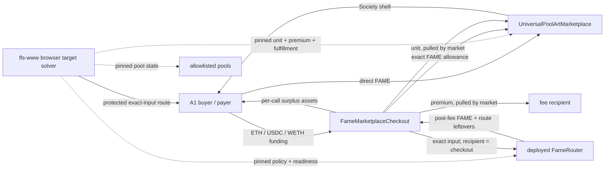
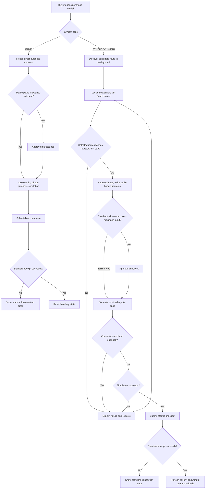

# Atomic Marketplace Checkout - Plan

## Goal Capsule

Add one atomic Base checkout that lets a buyer pay with ETH, USDC, or WETH, routes that exact input through the deployed `FameRouter`, completes a Universal Pool artwork purchase, and refunds transaction-local surplus FAME. Preserve the marketplace's direct-FAME purchase path.

Authority, in descending order:

1. The Product Contract in this plan defines user-visible payment, purchase, refund, and failure behavior.
2. Session-settled KTDs define the contract boundaries and execution model.
3. Current marketplace and router invariants remain authoritative unless a requirement in this plan changes them.
4. Implementation details not fixed here follow the existing patterns in each repository.

Execution spans two repositories:

- `fame-contracts` owns the marketplace seam, checkout contract, Foundry deployment tooling, and contract/fork proof.
- `fls-www` owns browser-side target-output sizing for this fork phase, `wagmi generate`, its `contracts.ts` address registry, the gallery integration, and browser proof.

Before WWW implementation begins, reconcile current `main` into `codex/feat-base-sepolia-test-gallery` without discarding the branch's marketplace-fork work. At planning time, that branch is at `943e152`, 21 commits behind and 37 commits ahead of `main`; re-check the relationship before integration.

Stop and return to planning if implementation would require changing `FameRouter` execution semantics, supporting an additional input asset, allowing an unauthorized caller to choose the marketplace buyer, or weakening the existing artwork, premium, or inventory checks.

Tail ownership includes contract tests, latest-state Base fork execution, a disposable-wallet browser campaign, and curated evidence. A skipped RPC/browser gate is `not executed`, never passing.

---

## Product Contract

### Summary

The gallery will offer direct FAME checkout and an alternative atomic checkout for ETH, USDC, or WETH. During fork testing, WWW finds and sizes the route in the browser. Its protected post-router-fee FAME output covers the marketplace unit plus the buyer-authorized maximum premium; the checkout spends the quoted exact input, performs the metadata purchase in the same transaction, and returns surplus FAME to the payer.

### Problem Frame

The current router and WWW quote stack are exact-input: the user specifies an input amount and receives a protected minimum output. A gallery purchase instead has a known FAME obligation. WWW needs a bounded inverse-sizing loop that selects one route topology, establishes a sufficient input, and then refines that input rather than repeatedly rediscovering routes. A failed or partial two-transaction swap-then-purchase flow also leaves the user holding FAME while the selected artwork or premium may have changed.

### Actors

- A1. Buyer/payer — the connected wallet that supplies ETH, USDC, WETH, or FAME and authorizes the purchase.
- A2. Recipient — the address that receives the purchased Society shell; current WWW and the first checkout release bind it to A1.
- A3. Marketplace owner — the Safe-controlled operator that deploys, wires, validates, pauses, and activates the marketplace stack.
- A4. Target solver — the browser-side WWW module used in fork mode to discover, size, and materialize a protected executable route; moving this module behind the production quote router is a later phase.

### Requirements

#### Payment and atomicity

- R1. The Base gallery must preserve the existing direct-FAME purchase path as its default without routing it through the checkout contract.
- R2. The alternative checkout must accept only native ETH, canonical Base USDC, or canonical Base WETH as its input asset.
- R3. An alternative checkout must execute the swap and marketplace purchase atomically, so any quote, route, funding, premium, artwork, shell, inventory, transfer, or refund failure reverts the entire transaction.
- R4. The alternative checkout must fund the route's exact declared input as A1's authorized maximum; it must report measured input consumption and return any input residue that `FameRouter` returns rather than representing the route as exact-output execution.
- R5. The checkout must return transaction-local surplus FAME and any route-local asset leftovers returned by `FameRouter` to A1 before the transaction completes.

#### Quote and purchase protection

- R6. A checkout quote must target protected post-router-fee FAME of at least `fame.unit() + maxPremium`, using the buyer-authorized maximum premium rather than only the currently displayed premium.
- R7. The quote result must contain the exact input, protected FAME floor, current market unit and premium, maximum premium, route deadline, route provenance, and the marketplace/checkout addresses used to produce it.
- R8. Once A1 locks a purchase selection, the quote path must use one concrete block for market, router-policy, readiness, pool, candidate, and materialization reads. It must retain the first sufficient route witness, enforce mathematically bounded evaluations plus cancelable RPC/wall-clock safeguards, and spend remaining budget refining the input downward rather than discarding a valid witness.
- R9. WWW must simulate each newly produced quote once to surface reverts. It need not force another simulation immediately before submission while the quote is unexpired and all consent-bound inputs are unchanged; the wallet's standard simulation remains an additional check. Consent binds account, chain, payment asset, selected artwork and fulfillment, buyer/recipient, marketplace, checkout, `maxPremium`, and maximum input. After A1 confirms a quote, increasing either cap, changing any bound identity or purchase field, or replacing its route with a different topology requires fresh confirmation; a same-route adjustment within the approved caps does not.
- R10. The marketplace must continue enforcing pause state, maximum premium, fee-recipient buyer premium waiver, expected artwork hash, eligible shell/source, fulfillment path, buyer mirror-balance floor, and inventory invariants for both direct and checkout purchases.

#### Identity and trust boundaries

- R11. The checkout caller must be A1, and the marketplace must record A1 as the semantic buyer even though the checkout contract supplies FAME to the marketplace.
- R12. The first checkout release must require A2 to equal A1; the marketplace seam may keep payer, buyer, and recipient explicit so direct settlement semantics remain correct.
- R13. Only the marketplace's configured `authorizedCheckout` address may invoke the purchase-for seam; the owner may set, clear, or rotate it only while paused and outside settlement, every change must emit `AuthorizedCheckoutChanged(previous, current)`, and direct marketplace entrypoints remain permissionless. This is one address check under the marketplace's existing ownership model, not a new role framework.
- R14. The checkout must bind the deployed `FameRouter`, marketplace, FAME, USDC, and WETH dependencies and reject routes with a different input class, output token, recipient, or funding amount.

#### Accounting and token safety

- R15. Refund accounting must use per-call balance deltas for every distinct route asset and must never transfer balances that existed before the call.
- R16. Native balance accounting must exclude the current call's `msg.value` from its baseline, and a failed native refund must revert the atomic checkout.
- R17. The checkout must remain in DN404 skip-NFT mode so receiving purchase-sized FAME cannot mint a Society shell into the coordinator.
- R18. The checkout must grant `FameRouter` only the current exact route input and the marketplace only the current unit plus actual premium, then clear both residual allowances before returning.
- R19. A1's ERC-20 payment approvals must target the checkout, not `FameRouter`; the checkout must receive the declared input delta, while native ETH requires no approval and exact `msg.value`.
- R20. The checkout must be ownerless after construction and expose no rescue operation. Ambient assets sent outside a checkout call remain stranded and excluded from every caller's delta accounting.

#### Evidence and configuration

- R21. The contracts must emit enough measured settlement data for deterministic tests and fork diagnostics, while WWW must use the repository-standard transaction modal and wagmi receipt handling rather than introducing a bespoke cross-contract proof or transaction-recovery state machine.
- R22. For this fork-only phase, Foundry must emit temporary deployment addresses at runtime and WWW must consume them through its `contracts.ts` boundary without committing them or treating them as production facts. RPC URLs, keys, and explorer credentials remain in Doppler. Any later public deployment must follow the repository's curated public-configuration rules, but that deployment is outside this plan.
- R23. Base Sepolia TEST must remain direct-FAME-only until a real checkout is intentionally deployed and configured there.
- R24. Completion requires deterministic contract/WWW tests, latest-state Base fork proof for direct FAME and all three alternative inputs, and a real disposable-wallet browser campaign.
- R25. In this fork-only phase, target sizing must run in the browser against the configured local fork RPC and must not add a public marketplace quote endpoint. The solver boundary must remain reusable so it can later move behind the production quote router without changing its route-first sizing semantics.
- R26. WWW must use its existing transaction modal and wagmi lifecycle for simulation, submission, replacement, receipt, revert, and error handling. It must not add automatic transaction retries, persisted `confirmed_unverified` recovery, or a parallel proof framework.

### Key Flows

#### F1. Direct FAME purchase

1. A1 selects an artwork; WWW binds and displays the connected account as the recipient.
2. WWW resolves fresh held/pool fulfillment and freezes existing marketplace protections.
3. A1 approves the marketplace if needed and submits the existing direct purchase through the standard transaction modal.
4. On receipt, WWW refreshes the normal marketplace and catalog state.

Covers R1, R10, R21, and R24.

#### F2. Alternative-asset quote

1. A1 selects ETH, USDC, or WETH.
2. WWW may begin cancelable route discovery as soon as the page or payment selection supplies enough context, and restarts that speculative work when relevant selection state changes.
3. Once A1 locks the purchase selection, WWW pins a fresh block-scoped context, tests the selected route within A1's maximum input, and retains the first input whose protected net FAME satisfies R6. Only a proven inability to reach the target, route invalidity/liquidity exhaustion, or A1's cap permits trying another route.
4. If budget remains, WWW range-refines the retained route toward a smaller sufficient input. Budget exhaustion returns the retained sufficient witness rather than failing.
5. WWW shows maximum input funded as the primary cost, the marketplace FAME charge, estimated input residue, protected FAME floor, estimated surplus FAME, route expiry, and a plain-English explanation that excess swap output is returned to the wallet as FAME depending on execution-time liquidity.

Covers R2, R4, R6-R8, and R25.

#### F3. Atomic alternative checkout

1. WWW uses an unexpired quote whose consent-bound inputs remain unchanged; each fresh quote has already been simulated once for diagnostic errors.
2. For USDC or WETH, A1 approves the checkout for the exact input if needed; ETH skips approval.
3. WWW submits through the repository-standard transaction modal and wagmi lifecycle.
4. The checkout validates and funds the route, receives FAME, approves the exact marketplace charge, and invokes the authorized typed held or pool purchase-for seam with A1 as buyer and recipient.
5. The checkout clears allowance and refunds per-call surplus assets to A1.
6. WWW follows the standard receipt state and refreshes the normal marketplace/catalog data after success.

Covers R2-R5 and R9-R21.

#### F4. Stale or failed checkout

1. A quote expires, the premium exceeds `maxPremium`, fulfillment changes, the route under-delivers, an allowance/funding check fails, or a refund recipient rejects native ETH.
2. The transaction reverts before any swap or purchase state persists.
3. WWW reports the failure through the existing transaction modal. It may produce a new quote at the user's direction but never retries a transaction automatically.

Covers R3, R8-R10, R16, and R21.

### Acceptance Examples

- AE1. Given a held artwork where actual premium equals `maxPremium` and a protected ETH route that produces exactly the unit plus that premium, the transaction buys the selected shell for A1 and returns zero FAME. Covers R2-R6, R10-R12, and R21.
- AE2. Given a USDC route that produces more FAME than the actual marketplace charge, the transaction buys the artwork and returns only the per-call FAME surplus to A1. Covers R3-R5, R15, and R19.
- AE3. Given a WETH route and a premium that decreased after quoting but remains below `maxPremium`, the purchase succeeds and the difference remains part of A1's FAME refund. Covers R5, R6, and R10.
- AE4. Given a premium above `maxPremium`, changed artwork hash, unavailable shell, stale pool source, or protected output below the target, the entire checkout reverts and A1 retains the input asset. Covers R3, R6, and R10.
- AE5. Given FAME, ETH, USDC, WETH, or native currency already stranded on the checkout, a later buyer can receive only deltas created by that buyer's call. Covers R15, R16, and R20.
- AE6. Given a non-payable smart-account payer and a route that returns native leftovers, the checkout reverts atomically and WWW reports the refund failure rather than a purchase. Covers R3 and R16.
- AE7. Given Base Sepolia TEST without a checkout address, the gallery continues to offer only direct FAME and never substitutes a fake or Base address. Covers R1 and R23.
- AE8. Given a submitted checkout, WWW uses the existing transaction modal and wagmi lifecycle for replacement, receipt, revert, and wallet errors, performs no automatic retry, and refreshes the normal gallery state after success. Covers R21 and R26.

### Success Criteria

- A buyer can complete a held or pool artwork purchase in one transaction from each supported alternative asset on a current Base fork.
- The buyer sees the maximum input, marketplace FAME charge, estimated input residue, and understands that excess swap output is returned as FAME depending on execution-time liquidity.
- No tested path can drain ambient checkout balances, mint a Society shell to the checkout, misattribute the buyer, or leave marketplace allowance behind.
- The existing direct-FAME marketplace behavior remains green.

### Scope Boundaries

In scope:

- One auxiliary Base checkout contract.
- Narrow marketplace `authorizedCheckout` support using its existing owner rather than a new role framework.
- Exact-output-style quote sizing backed by exact-input router execution.
- ETH and USDC as primary UI choices, with WETH supported.
- Held, mint-pool, and burn-pool gallery fulfillment.
- Deployment, validation, fork, UI, receipt, and browser work in both repositories.

Out of scope:

- True exact-output execution or venue-specific exact-output adapters in `FameRouter`.
- Changing router fees, venue allowlists, or schema.
- Additional payment assets, cross-chain checkout, bridging, fiat, or Permit2.
- Delegated/meta-transaction buyers.
- A Base Sepolia checkout deployment.
- Production deployment or activation; this plan stops at deployable, fork-proven code.
- Hosting target sizing behind the production quote router or adding a public marketplace quote endpoint.
- General exact-output mode on the standalone swap page.

### Dependencies and Assumptions

- The deployed Base `FameRouter` remains exact-input and enforces `minAmountOutAfterFee`.
- Canonical Base FAME, USDC, and WETH addresses are already public configuration facts.
- The marketplace is not deployed, so its ABI, deployment order, and paused wiring can change without migration.
- The current WWW marketplace branch must be reconciled with current `main` before feature work.
- Base fork and browser proof require reachable RPC/Doppler/local services; sandbox-only connectivity failures are not environment diagnoses.

### Sources

- `src/FameRouter.sol`
- `src/router/FameRouterTypes.sol`
- `src/UniversalPoolArtMarketplace.sol`
- `docs/router/fame-router-schema.md`
- `docs/gallery/base-universal-pool-art-marketplace-fork-report.md`
- `docs/plans/2026-07-19-001-feat-base-universal-pool-art-marketplace-production-readiness-plan.md`
- `docs/solutions/workflow-issues/public-config-doppler-foundry-aliases-2026-05-12.md`
- `docs/solutions/workflow-issues/keep-generated-deployment-artifacts-out-of-repo-2026-05-15.md`
- `fls-www: docs/solutions/performance-issues/fame-swap-quote-solver-timeouts-native-wrap-routing-2026-05-15.md`
- `fls-www: docs/solutions/architecture-patterns/fame-swap-indexed-pool-state-quote-helper-2026-05-19.md`
- `fls-www: docs/fame-gallery/base-universal-pool-art-marketplace-browser-campaign.md`

---

## Planning Contract

### Context and Research

The prior production-readiness plan explicitly excluded target-output sizing and combined swap/purchase checkout. This plan supersedes that boundary while preserving the prior marketplace lifecycle, fork-safety, and receipt-verification decisions.

`FameRouter.executeRoute` snapshots route assets, pulls one exact input, enforces per-leg floors and a final post-fee floor, transfers the final output to the route recipient, and returns route-local leftovers to its caller. It has no exact-output execution mode. The auxiliary checkout therefore becomes both router caller and route recipient, then settles the marketplace and forwards only per-call surplus.

WWW already computes router fees, protected net output, per-leg floors, and `minAmountOutAfterFee`. The missing capability is a reusable inverse-sizing seam that keeps one selected route topology, finds a sufficient upper witness, and then refines its input. It runs in the browser against the local fork for this phase and can later move behind the quote router.

The current marketplace uses `msg.sender` as payer and buyer. Checkout support must separate marketplace payer, semantic buyer, and shell recipient while reusing one internal settlement path so direct and authorized-checkout purchases cannot drift.

### Key Technical Decisions

- KTD1. Keep `FameRouter` exact-input and add a separate checkout coordinator. (session-settled: user-approved — chosen over changing or redeploying the router: the existing post-fee floor already provides the execution guarantee this purchase needs.) Governs R2-R6 and R14-R20.
- KTD2. Add one revocable marketplace-configured `authorizedCheckout` address and shared internal settlement logic for direct and purchase-for calls. Market entrypoints never accept a payer: payer is always `msg.sender`, and only the authorized checkout may supply the semantic buyer. This uses the marketplace's existing owner and a single address check, not a new role framework; configuration changes emit `AuthorizedCheckoutChanged`. (session-settled: user-approved — chosen over embedding swap behavior in the marketplace: the market should own artwork settlement while the coordinator owns payment conversion.) Governs R1, R10-R14, and R18.
- KTD3. Offer target-output sizing but execute the returned route as exact-input, then refund surplus FAME. (session-settled: user-approved — chosen over venue-specific exact-output adapters: this reaches atomic checkout without redesigning every router venue.) Governs R4-R9.
- KTD4. Present ETH and USDC as primary payment choices and support WETH as an additional ERC-20 choice. (session-settled: user-directed — chosen over a WETH-first interface: most buyers hold native ETH or USDC.) Governs R2 and R19.
- KTD5. Use route-first, range-bounded sizing. WWW may discover a candidate topology speculatively when the page loads or the payment asset changes. After A1 locks the purchase selection, create one fresh pinned context, test the selected route within A1's maximum input, and retain the first sufficient witness. Refine that same route downward while budget remains; return the sufficient witness if refinement exhausts the budget. Try a different topology only when the selected route cannot reach the target within A1's cap, becomes invalid, or exhausts liquidity. Candidate evaluation is tri-state—insufficient, sufficient, or unavailable—and only numeric evidence moves a bound. Governs R6-R9.
- KTD6. Keep the direct-FAME purchase controller intact and add a separate checkout controller that shares the existing fulfillment and route-encoding primitives while continuing to use the repository-standard transaction modal and wagmi lifecycle. Governs R1, R7-R9, R19, R21, and R26.
- KTD7. Treat A1 as checkout caller, ERC-20 owner, marketplace buyer, shell recipient, and refund recipient. The checkout derives A1 from its caller rather than buyer calldata; market settlement carries payer and buyer separately so transfers use payer while events and buyer protections use A1. Do not expose delegated buyers or gifting in the first checkout release. Governs R11, R12, R15, and R16.
- KTD8. Bind immutable execution dependencies in an ownerless checkout with no rescue surface. Ambient balances remain stranded and excluded by delta-only accounting. Governs R14, R15, R17, and R20.
- KTD9. Wire the marketplace to the checkout while paused, validate both contracts together, then use the existing activation gate. `fame-contracts` owns deployment and wiring; `fls-www` owns `wagmi generate` and its `contracts.ts` address registry. All execution in this plan remains fork-only. Because neither contract is deployed, no compatibility shim or migration path is warranted. Governs R13, R22, and R24.
- KTD10. Run market-aware sizing in the browser against the local fork RPC for this phase. Keep it as a reusable module with explicit evaluation, RPC, and elapsed-time controls so the same route-first engine can later move behind the production quote router. Do not add a public marketplace quote endpoint now. Governs R7, R8, and R25.
- KTD11. Expose separate typed, non-reentrant checkout entrypoints for held and pool purchases, with matching authorized marketplace entrypoints and one shared private settlement path. WWW chooses the entrypoint from catalog fulfillment data; each contract independently validates that choice. Do not accept opaque fulfillment bytes or fields that are inactive for the selected variant. Governs R2-R5 and R14-R21.
- KTD12. Treat the first sufficient upper witness as a usable quote and refinement as an optimization that reduces expected surplus FAME. A1's maximum input is the economic bound; do not add arbitrary surplus thresholds or warnings. Present original-input residue separately from surplus FAME and explain that execution-time liquidity determines the final FAME refund. Governs R4-R9.

### High-Level Technical Design

These sketches establish boundaries and evidence flow, not exact Solidity or TypeScript signatures.



```mermaid
sequenceDiagram
    actor Buyer as A1 buyer/payer
    participant WWW as fls-www
    participant Input as Input token
    participant Checkout as Checkout
    participant Router as FameRouter
    participant Fame as FAME
    participant Market as Marketplace

    Buyer->>WWW: Select artwork and payment asset; confirm fixed recipient
    WWW->>WWW: Discover candidate route while selection develops
    WWW->>WWW: Lock selection; pin context; retain sufficient upper witness
    WWW->>WWW: Refine same route while budget remains; simulate fresh quote once
    WWW-->>Buyer: Maximum input, market FAME charge, residue, FAME refund, expiry
    Buyer->>Input: Approve checkout if ERC-20
    Buyer->>Checkout: Submit protected route + purchase terms
    Checkout->>Checkout: Validate identity, dependencies, funding, baselines
    Checkout->>Input: Pull exact ERC-20 input when applicable
    Checkout->>Input: Approve router for exact input
    Checkout->>Router: Execute exact-input route
    Router->>Fame: Transfer post-fee output to checkout
    Router-->>Checkout: Return measured FAME and route leftovers
    Checkout->>Fame: Approve market for unit + actual premium
    Checkout->>Market: Call authorized held/pool purchase-for for A1
    Market->>Fame: Pull unit and premium from checkout
    Market-->>Buyer: Transfer selected Society shell
    Market-->>Checkout: Return settlement result
    Checkout->>Fame: Refund per-call FAME surplus to buyer
    Checkout->>Input: Refund input residue when present
    Buyer-->>WWW: Standard wagmi transaction lifecycle
    WWW->>WWW: Refresh normal marketplace and catalog state
```



### State and Data Integrity

- The checkout snapshots distinct route-asset baselines before funding. For native ETH, the baseline removes this call's `msg.value`.
- It validates the submitted route against bound dependencies before transferring tokens or calling the router, and it requires measured ERC-20 input and router FAME output to match the declared/returned values.
- The router event will name the checkout as payer and recipient; the checkout settlement event records A1 and measured deltas for contract tests and fork diagnostics; the marketplace event continues to record A1 as buyer.
- The marketplace snapshots current premium, fee recipient, fulfillment, artwork, and inventory using the same settlement lock for direct and authorized-checkout calls; premium waiver follows the semantic buyer rather than the FAME payer.
- Exact temporary allowance and DN404 skip-NFT posture prevent the coordinator from becoming a hidden inventory owner or durable spending authority.

### System-Wide Impact

- Contract ABI: the marketplace gains one `authorizedCheckout` address plus typed held/pool purchase-for entrypoints; WWW runs `wagmi generate` and updates its `contracts.ts` registry after the Solidity ABI stabilizes.
- Quote runtime: fork-mode market-aware sizing runs in the browser against the local RPC; the general exact-input endpoint remains unchanged and no public marketplace endpoint is added.
- Transaction ownership: A1's ERC-20 approval targets the checkout for the alternative flow; the checkout then grants and clears exact temporary allowances to the router and marketplace.
- Transaction handling: the gallery reuses its standard transaction modal and wagmi lifecycle; measured cross-contract events remain available to deterministic tests and fork diagnostics without creating a second frontend proof system.
- Fork runtime: `fame-contracts` deploys and wires the stack; WWW's fork runtime supplies those temporary addresses to its `contracts.ts` boundary and keeps every read and quote on the local fork RPC.
- Operations: marketplace and checkout form one fork deployment unit and must be wired/validated before unpause.

### Risks and Dependencies

| Risk | Consequence | Mitigation |
|---|---|---|
| Target solver repeats expensive live reads | Browser quote work stalls | Discover a candidate early, reuse one block-scoped locked-selection context, cap evaluations mathematically, support cancellation, and retain the first sufficient witness. |
| Route selection changes across candidate inputs | A naive inversion underfunds the purchase or thrashes between routes | Select one topology, prove it at or below A1's cap, range-refine that topology, and reroute only on proven inability, invalidity, or liquidity exhaustion. |
| Ambient token or ETH balances exist | A later buyer drains unrelated funds | Use distinct-asset baselines and delta-only refunds; test forced native and donated tokens. |
| Checkout receives DN404 mirror NFTs | Inventory and artwork state mutate invisibly | Set and validate skip-NFT mode before any route can execute. |
| Premium or fulfillment changes after quote | Buyer overpays or receives the wrong art | Keep `maxPremium`, artwork hash, source, shell, and inventory protections inside the atomic call. |
| Native refund callback rejects ETH | Checkout cannot finish safely | Revert the whole transaction and show a legible WWW error; do not retain the refund. |
| Marketplace trusts an arbitrary buyer value | Caller impersonates another buyer or abuses buyer-specific premium handling | Checkout derives A1 from `msg.sender`; market accepts buyer identity only from `authorizedCheckout`, configured under the existing owner while paused. |
| Allowance survives settlement | Marketplace can spend later FAME | Approve exact charge and clear residual allowance before refund/return. |
| WWW feature branch has diverged from `main` | New work drops release fixes or fork work | Reconcile current `main` first and rerun the branch's existing deterministic tests. |
| Temporary fork addresses leak into public config | A build targets disposable contracts | Inject temporary addresses at runtime; curate only real deployment facts. |

### Sequencing

1. Reconcile and baseline the current WWW fork branch.
2. Refactor marketplace settlement and add authorized-checkout behavior with regressions.
3. Add the checkout coordinator and its accounting/security tests.
4. Wire combined deployment, validation, and Base fork coverage.
5. Add browser-side WWW target-output sizing for fork mode.
6. Add WWW checkout requests using the existing transaction modal and wagmi lifecycle.
7. Execute the complete fork and browser evidence campaign.

### Planning Sources

Use the Product Contract Sources plus these implementation seams:

- `script/DeployBaseUniversalPoolArtMarketplace.s.sol`
- `script/ValidateBaseUniversalPoolArtMarketplace.s.sol`
- `script/ActivateBaseUniversalPoolArtMarketplace.s.sol`
- `test/UniversalPoolArtMarketplace*.t.sol`
- `fls-www: src/app/api/fame/swap/quote/handler.ts`
- `fls-www: src/features/fame-swap/solver/amountSolver.ts`
- `fls-www: src/features/fame-swap/solver/quotes/rankRoutes.ts`
- `fls-www: src/features/fame-swap/solver/materializeRoute.ts`
- `fls-www: src/features/fame-gallery/fulfillment/resolveFulfillment.ts`
- `fls-www: src/features/fame-gallery/transactions/purchaseQueue.ts`
- `fls-www: src/features/fame-gallery/transactions/verifyPurchase.ts`
- `fls-www: scripts/fame-swap-fork-smoke.ts`
- [Solidity security considerations](https://docs.soliditylang.org/en/latest/security-considerations.html)
- [ERC-7631 NFT skipping](https://eips.ethereum.org/EIPS/eip-7631#nft-skipping)
- [Viem `readContract`](https://viem.sh/docs/contract/readContract)
- [Wagmi `useSimulateContract`](https://wagmi.sh/react/api/hooks/useSimulateContract)
- [Wagmi `useWaitForTransactionReceipt`](https://wagmi.sh/react/api/hooks/useWaitForTransactionReceipt)

---

## Implementation Units

### U1. Reconcile and baseline the WWW marketplace branch

**Goal:** Bring current `main` changes into `codex/feat-base-sepolia-test-gallery` while preserving its 37 branch-only commits and establish a clean deterministic baseline.

**Requirements:** R1, R23, R24.

**Decisions:** KTD6.

**Files:**

- `fls-www: package.json`
- `fls-www: src/features/fame-gallery/**`
- `fls-www: src/features/fame-swap/**`
- `fls-www: docs/fame-gallery/base-universal-pool-art-marketplace-browser-campaign.md`

**Approach:** Re-check branch ancestry, integrate current `main` using the repository's normal history policy, resolve conflicts by preserving both current release fixes and fork-only gallery behavior, then record any baseline failures before feature edits. Do not reset, stash, or discard unrelated work.

**Test scenarios:** Test expectation: none for feature behavior; this is a lineage and baseline unit. Existing deterministic gallery and swap suites must run unchanged, and any pre-existing failure must be separated from new work.

**Verification:** The branch contains both histories, the worktree is understood, and the existing gallery/swap tests have an evidence-backed baseline.

### U2. Add authorized checkout settlement without changing direct FAME behavior

**Goal:** Let one configured checkout pay FAME on behalf of A1 while all existing marketplace protections and direct entrypoints share the same settlement logic.

**Requirements:** R1, R10-R13, R18, R21.

**Decisions:** KTD2 and KTD7.

**Files:**

- `src/UniversalPoolArtMarketplace.sol`
- `test/UniversalPoolArtMarketplace.t.sol`
- `test/UniversalPoolArtMarketplaceFuzz.t.sol`
- `test/UniversalPoolArtMarketplaceInvariant.t.sol`
- `test/UniversalPoolArtMarketplaceDeploymentValidation.t.sol`

**Approach:** Add one `authorizedCheckout` address with an owner-only setter guarded by paused and no-active-settlement state. Emit `AuthorizedCheckoutChanged(previous, current)` on set, clear, or rotation; do not add an access-control role framework. External entrypoints derive payer from `msg.sender` and never accept payer calldata. Refactor held/pool execution around explicit internal payer, buyer, and recipient roles. Direct entrypoints use `msg.sender` as payer and buyer. Separate typed authorized held/pool entrypoints require `msg.sender == authorizedCheckout`, accept A1 as the semantic buyer/recipient, pull FAME from the checkout, preserve A1 in `ArtworkPurchased`, apply the premium waiver and mirror-balance floor to A1, and deliver to A1. Keep one settlement lock and one invariant path.

**Test scenarios:**

- Direct held, mint-pool, and burn-pool purchases produce the same events, balances, artwork, and inventory as before.
- A configured checkout can buy for and deliver to A1; the event buyer is A1 and FAME is pulled from the checkout.
- The FAME payer is always the market caller; only `authorizedCheckout` may supply A1 as semantic buyer, and the typed held/pool entrypoints cannot redirect either role.
- When A1 is the fee recipient, direct and authorized-checkout purchases both preserve the premium waiver.
- An unauthorized caller reverts; zero disables checkout settlement while paused; disable/rotation while unpaused or during settlement reverts; every successful change emits the old and new addresses.
- Authorized-checkout purchases still revert on pause, premium cap, artwork mismatch, shell/source races, mirror-balance floor, and inventory violations.
- Reentrant attempts through token/NFT callbacks cannot bypass settlement or configuration guards.

**Verification:** Existing marketplace suites remain green and new tests prove identical direct/authorized settlement invariants with correct payer/buyer attribution.

### U3. Build the atomic checkout coordinator

**Goal:** Convert one supported exact input to FAME, settle one market purchase, and refund only per-call surplus.

**Requirements:** R2-R5 and R11-R21.

**Decisions:** KTD1-KTD4, KTD7, KTD8, KTD11, and KTD12.

**Files:**

- `src/FameMarketplaceCheckout.sol`
- `test/FameMarketplaceCheckout.t.sol`
- `test/FameMarketplaceCheckoutFuzz.t.sol`
- `test/FameMarketplaceCheckoutInvariant.t.sol`

**Approach:** Bind router, market, FAME, USDC, and WETH dependencies at deployment and expose no owner or rescue surface. Initialize and read back DN404 skip-NFT mode. Expose separate typed, non-reentrant `checkoutHeld` and `checkoutPool` entrypoints that derive A1 from `msg.sender`; WWW chooses between them from catalog fulfillment data and both contracts validate the choice. Share route validation, funding, swap, allowance, delta accounting, refund, and settlement cleanup through one private path without accepting opaque fulfillment bytes. Validate route asset, FAME output, checkout recipient, exact funding, protected floor, deadline, and marketplace terms before the first token call. Snapshot every distinct route asset, require the received ERC-20 delta to equal the declared input, approve the router for that exact input, execute it, and require the measured FAME delta to match its return value. Clear router allowance, approve only the current marketplace charge, call the matching authorized marketplace entrypoint, clear market allowance, then refund positive per-call deltas to A1. Emit measured settlement/refund amounts only after balances return to baseline.

**Test scenarios:**

- ETH, USDC, and WETH routes succeed for held, mint-pool, and burn-pool fulfillment with exact funding.
- A delegated buyer, alternate recipient, or alternate refund recipient reverts before funding.
- Held calls cannot encode pool fields; pool calls reject inconsistent shell/source/artwork data before funding.
- Exact target output produces no FAME refund; overproduction and premium decreases produce the correct FAME refund.
- Router-returned input/intermediate leftovers are refunded without touching pre-existing balances.
- Wrong token in/out, route recipient, router/market dependency, amount, `msg.value`, protected floor, deadline, or premium cap reverts before durable state.
- Donated FAME/ERC-20 balances and forced native ETH cannot be claimed by a later buyer.
- The checkout stays in skip-NFT mode and never owns a Society shell after successful settlement.
- Surplus FAME refunds may trigger normal DN404 effects for A1 without being mistaken for the selected marketplace shell.
- Router and marketplace allowances are zero after success and after every reverting external callback path.
- Reentrancy, hostile ERC-20 behavior, non-payable native refund recipients, and failed shell delivery revert atomically.
- No owner or rescue entrypoint exists; ambient donations and forced native ETH remain excluded from caller deltas.
- Final accounting proves router FAME output equals marketplace FAME paid plus FAME refunded, and every tracked asset ends at its pre-call baseline.

**Verification:** Unit, fuzz, and invariant tests reconcile input, router output, market charge, allowance, refund, and ambient balances for every terminal state.

### U4. Deploy, wire, validate, and fork-test the contract stack

**Goal:** Treat the undeployed marketplace and checkout as one paused, validated Base deployment unit.

**Requirements:** R13, R17, R21, R22, R24.

**Decisions:** KTD1, KTD2, and KTD9.

**Files:**

- `script/DeployBaseUniversalPoolArtMarketplace.s.sol`
- `script/ValidateBaseUniversalPoolArtMarketplace.s.sol`
- `script/ActivateBaseUniversalPoolArtMarketplace.s.sol`
- `test/UniversalPoolArtMarketplaceDeploymentValidationBase.t.sol`
- `test/UniversalPoolArtMarketplaceForkBase.t.sol`
- `test/UniversalPoolArtMarketplaceContentionBase.t.sol`
- `test/FameMarketplaceCheckoutForkBase.t.sol`
- `config/fame-public.env`
- `foundry.toml`
- `docs/gallery/base-universal-pool-art-marketplace-fork-report.md`

**Approach:** Extend the `fame-contracts` paused Foundry deployment to create the market and ownerless checkout and configure `authorizedCheckout`. Preserve the existing operator sequence that grants the marketplace CreatorArtistMagic BANISHER role and seeds one FAME unit of inventory before combined validation and activation. Validate immutable dependencies, skip-NFT posture, marketplace owner, fee recipient, role, inventory, router readiness, and mutual addresses. Add latest-state Base fork coverage using configured aliases and Doppler loading rules. Keep temporary addresses in runtime output only. After ABI changes stabilize, `fls-www` runs `wagmi generate` and owns the fork address mapping in its `contracts.ts`; it does not implement a second deployer.

**Test scenarios:**

- Deployment validation rejects wrong router, market, FAME, USDC, WETH, marketplace owner, authorized checkout, skip-NFT state, fee recipient, or unpaused state.
- Validation fails closed when the BANISHER role or one-unit inventory seed is absent.
- Current Base fork direct-FAME behavior remains green.
- Fork ETH, USDC, and WETH checkouts settle held and pool purchases and reconcile all three events and post-state.
- A premium/artwork/shell change between quote state and mining reverts the complete transaction.
- Two buyers contending for one shell yield one success and one clean revert without stranded input or FAME.

**Verification:** A clean latest-state Base fork deploys, wires, validates, activates, and exercises the combined stack. Skipped RPC-backed tests remain unresolved.

### U5. Add market-aware target-output sizing to WWW

**Goal:** In fork mode, produce a browser-side exact-input route whose protected FAME floor covers R6, retaining a workable witness before spending budget on precision.

**Requirements:** R4, R6-R9, and R25.

**Decisions:** KTD3-KTD5, KTD10, and KTD12.

**Files:**

- `fls-www: src/features/fame-swap/solver/types.ts`
- `fls-www: src/features/fame-swap/solver/targetOutput.ts`
- `fls-www: src/features/fame-swap/solver/targetOutput.test.ts`
- `fls-www: src/features/fame-swap/solver/quote.ts`
- `fls-www: src/features/fame-swap/solver/amountSolver.ts`
- `fls-www: src/features/fame-swap/solver/quotes/rankRoutes.ts`
- `fls-www: src/features/fame-swap/solver/materializeRoute.ts`

**Approach:** Add a reusable browser-side target solver around the existing exact-input evaluator and run it only against the local fork RPC in this phase. Start cancelable, low-priority route discovery when the page or payment selection provides enough context. Once A1 locks the purchase selection, create one fresh context owning a concrete block, market terms, router policy/readiness, selected route topology, adapter, caches, and cumulative evaluation/RPC/time budgets. Test the selected route at or below A1's maximum input first. If it reaches R6, retain that input immediately as the fallback witness; use mathematically bounded range refinement to reduce the input while budget remains. If refinement times out, return the retained witness. Try a different topology only if the selected route cannot reach R6 within A1's cap, becomes invalid, or exhausts liquidity. An unavailable evaluation consumes budget but never becomes a numeric bound or displaces a sufficient witness. Re-evaluate and materialize the retained route once against the locked context. Keep the module portable so it can later move behind the production quote router; do not add a public marketplace endpoint now.

**Test scenarios:**

- ETH, USDC, and WETH targets return routes with protected net FAME at or above unit plus `maxPremium`.
- Exact boundary, rounding, fee changes, token decimals, same-route refinement, and surplus output remain conservative.
- No-liquidity, insufficient configured maximum input, stale block, unsupported asset, deadline exhaustion, and final materialization below target return distinct non-ready responses.
- Page-load/payment-selection discovery is cancelable and restarts when relevant selection state changes; block-dependent numeric results are not reused as a fresh executable quote.
- Once the selection locks, candidate evaluations share the pinned context and caches without making public marketplace quote requests.
- Fork mode rejects indexed-helper/public-RPC fallback and reports selected-route provenance from local state.
- Every candidate, supporting read, and final materialization receives the same concrete block number.
- A stale-but-freshness-valid indexed row, mixed-block indexed/live route, or cached router-readiness result from another block is rejected.
- The maximum evaluation count is derived from the configured input range and refinement precision; RPC and elapsed-time safeguards accumulate after selection lock and cannot reset inside an exact-input solve.
- A sufficient upper witness is returned when refinement exhausts its budget; budget exhaustion without any witness returns a typed non-ready result.
- An unavailable/timeout candidate never changes numeric bounds or displaces the last sufficient route witness.
- A route-selection discontinuity cannot cause topology thrash; only proven route inability, invalidity, liquidity exhaustion, or A1's cap permits fallback.

**Verification:** Deterministic solver tests prove the target predicate, route-first behavior, bounded work, retained-witness fallback, cancellation, and fresh materialization. Current-Base fork browser runs demonstrate that a usable witness appears before optional refinement completes.

### U6. Add the WWW checkout transaction and UI path

**Goal:** Let A1 choose FAME, ETH, USDC, or WETH and complete the correct purchase through the gallery's existing transaction handling.

**Requirements:** R1-R12, R19, R21, R23, and R26.

**Decisions:** KTD3, KTD4, KTD6, KTD7, and KTD10-KTD12.

**Files:**

- `fls-www: wagmi.config.ts`
- `fls-www: src/wagmi/index.ts`
- `fls-www: src/features/fame-gallery/contracts.ts`
- `fls-www: src/app/fame/gallery/page.tsx`
- `fls-www: src/features/fame-gallery/config/baseGallery.ts`
- `fls-www: src/features/fame-gallery/config/baseGallery.test.ts`
- `fls-www: src/features/fame-gallery/types.ts`
- `fls-www: src/features/fame-gallery/transactions/checkoutRequests.ts`
- `fls-www: src/features/fame-gallery/transactions/checkoutRequests.test.ts`
- `fls-www: src/features/fame-gallery/transactions/purchaseQueue.ts`
- `fls-www: src/features/fame-gallery/transactions/purchaseQueue.test.ts`
- `fls-www: src/features/fame-gallery/hooks/useGalleryCheckoutPurchase.ts`
- `fls-www: src/features/fame-gallery/hooks/useGalleryCheckoutPurchase.test.ts`
- `fls-www: src/components/TransactionsModal.tsx`
- `fls-www: src/features/fame-gallery/components/GalleryPurchaseModal.tsx`
- `fls-www: src/features/fame-gallery/components/GalleryPurchaseModal.test.tsx`
- `fls-www: src/features/fame-gallery/components/GalleryView.tsx`

**Approach:** Run `wagmi generate` after the contract ABI stabilizes and make the gallery's `contracts.ts` the WWW-owned address boundary. Keep every address in this unit fork-only. Preserve the direct-FAME controller and extend the existing purchase queue/transaction modal for alternative checkout rather than creating a parallel transaction state machine. WWW selects the typed held or pool checkout entrypoint from catalog fulfillment data; the contracts independently reject a mismatched choice. Consent binds chain, account, buyer/recipient, artwork/fulfillment, payment asset, marketplace, checkout, maximum input, and `maxPremium`. Same-route input refinement within those caps does not require reconfirmation; increasing a cap, changing a bound field, or falling back to another route does. Simulate each newly produced quote once for useful pre-wallet diagnostics, but do not make a redundant immediate re-simulation a submission gate while that quote remains unexpired and unchanged. The modal defaults to FAME and presents maximum input first, then marketplace FAME charge, estimated input residue, protected FAME, and estimated surplus FAME with plain copy that execution-time liquidity determines the FAME refund. Use existing wagmi/modal handling for approval, submission, replacement, receipt, revert, and wallet errors. Do not add automatic retries, `confirmed_unverified`, or bespoke receipt proofs. Keep Base Sepolia TEST direct-only.

**Test scenarios:**

- Direct FAME uses the existing queue and marketplace approval without requesting a swap quote.
- ETH shows no approval; USDC/WETH approve the checkout for exact input when allowance is insufficient.
- The UI never approves or submits to `FameRouter` directly for alternative checkout.
- Quote loading, expiry, allowance rejection, diagnostic simulation revert, wallet rejection, replacement, mined revert, and success feed the repository-standard transaction handling.
- Insufficient selected-token balance prevents approval/submission; an approval followed by quote expiry preserves the allowance but requires new payment consent.
- Account/chain mismatch prevents simulation and write; an expired quote or changed consent-bound field requires a fresh quote.
- Cost copy distinguishes maximum input funded, exact marketplace FAME charge, estimated original-input residue, protected FAME, and estimated/actual surplus FAME.
- Surplus copy says excess swap output returns as FAME depending on execution-time liquidity; it does not promise a refund in the original input asset or apply an arbitrary surplus warning threshold.
- Standard wagmi receipt success refreshes the normal gallery/catalog state and never triggers an automatic transaction retry.
- Held catalog fulfillment calls the typed held entrypoint; mint-pool and burn-pool fulfillment call the typed pool entrypoint.
- Missing Base checkout config fails closed; Base Sepolia TEST remains direct-only.

**Verification:** Component, hook, request, queue, configuration, and existing transaction-modal tests prove both controllers, all payment branches, consent invalidation, typed fulfillment selection, and no lowered floor.

**Deferred until UX approval:** Accessibility refinement for the new payment selector, quote status announcements, and cost-summary associations. Do not spend first-implementation scope on this before the user approves the checkout UX.

### U7. Extend fork smoke and run the browser campaign

**Goal:** Prove the complete implementation against a current local Base fork and a real disposable wallet.

**Requirements:** R21-R24 and R26.

**Decisions:** KTD9.

**Files:**

- `fls-www: scripts/fame-swap-fork-smoke.ts`
- `fls-www: scripts/fame-swap-fork-smoke.test.ts`
- `fls-www: scripts/fame-local-dev.ts`
- `fls-www: scripts/fame-local-dev.test.ts`
- `fls-www: scripts/fame-fork-stack.ts`
- `fls-www: scripts/fame-fork-stack.test.ts`
- `fls-www: src/features/fame-gallery/contracts.ts`
- `fls-www: wagmi.config.ts`
- `fls-www: docs/fame-gallery/base-universal-pool-art-marketplace-browser-campaign.md`
- `docs/gallery/base-universal-pool-art-marketplace-fork-report.md`

**Approach:** Keep all deployment and wiring logic in the `fame-contracts` Foundry scripts. The WWW fork harness may invoke that deployment and consume its runtime output, but must not implement a second deployer. Run `wagmi generate` from WWW and bind the resulting fork addresses through WWW's `contracts.ts`. Require the browser solver and wallet client to use the same local fork RPC, then exercise direct plus alternative checkout. Run the browser campaign with a disposable funded wallet, preserve console/network/receipt evidence, and update both curated reports with executed versus unexecuted gates. This remains fork-only.

**Test scenarios:**

- Foundry fork startup produces matching router, market, and checkout addresses consumed by WWW's `contracts.ts` without publishing them as production config.
- Catalog, direct FAME purchase, ETH checkout, USDC checkout, and WETH checkout each complete from quote through the standard receipt lifecycle.
- Held and pool fulfillment, quote expiry/requote, one-shell contention, and one stale-artwork failure behave as specified.
- Browser traffic never escapes the local fork RPC or enables indexed/public Base fallbacks.
- Reload after each success reconstructs canonical ownership, artwork, inventory, and fee state.

**Verification:** The campaign records transaction hashes, route hashes, addresses, relevant contract events/post-state for diagnostics, observed UI states, RPC isolation, and exact failures. Every required lane is executed; omissions are labeled `not executed`.

---

## Verification Contract

### `fame-contracts` deterministic gates

- `FOUNDRY_PROFILE=universal_marketplace forge build`
- `FOUNDRY_PROFILE=universal_marketplace forge test --match-path 'test/UniversalPoolArtMarketplace*.t.sol'`
- `FOUNDRY_PROFILE=universal_marketplace forge test --match-path 'test/FameMarketplaceCheckout*.t.sol'`
- Existing router tests remain green because the router ABI and execution semantics do not change.
- Fuzz and invariant runs must cover checkout asset/refund accounting and marketplace direct/authorized equivalence at the repository's configured campaign depth.

### Environment-backed Base gates

- Load `config/fame-public.env` first, then run fork/deployment validation through Doppler with Foundry's `base` alias.
- Deploy and validate the paused market/checkout pair on a fresh latest-state fork.
- Run direct FAME, ETH, USDC, WETH, held, pool, contention, stale-state, and ambient-balance scenarios.
- RPC, Doppler, or local-service skips are `not executed`; rerun sandbox-like failures with required local access before diagnosing the environment.

### `fls-www` deterministic gates

- Run the focused browser target solver, checkout request/purchase-queue/hook, `contracts.ts`, generated-binding, existing transaction-modal, and fork-harness tests.
- Run the existing FAME swap quote/router tests and gallery direct-purchase tests unchanged.
- Run repository lint, type-check/build, and generated-binding consistency gates.
- Prove route-first target search through instrumentation or test doubles: cancelable speculative discovery, one locked-selection context, mathematically capped evaluations, retained sufficient witness, same-route refinement, and one fresh materialization.
- Prove route fallback occurs only after inability within A1's cap, invalidity, or liquidity exhaustion; browser fork mode never calls a public marketplace quote endpoint or public Base RPC.

### Browser and evidence gates

- Start the latest-state Base fork stack with matching browser solver/wallet local RPC configuration and temporary contract addresses supplied through WWW's `contracts.ts`.
- Use a disposable wallet to execute direct FAME plus ETH, USDC, and WETH checkout.
- Capture route, checkout, and marketplace events plus final ownership, artwork, inventory, fee, allowance, refund, and skip-NFT state as fork evidence; do not turn this campaign logic into a second frontend transaction-proof framework.
- Record network isolation and quote provenance; a rendered catalog without completed transactions is not checkout proof.
- Update curated contract and WWW reports without committing broadcast logs, secrets, or temporary addresses.

---

## Definition of Done

### Unit Completion

- U1: WWW contains current `main` and the fork branch's work, with deterministic baseline results recorded.
- U2: Direct and authorized-checkout marketplace paths share invariants and pass unit/fuzz/invariant regressions.
- U3: Checkout accounting and trust boundaries pass deterministic, fuzz, invariant, reentrancy, ambient-balance, and refund-failure tests.
- U4: The combined stack deploys, wires, validates, activates, and settles purchases on a latest-state Base fork.
- U5: The browser returns a bounded, fresh, protected target quote for each supported asset on the local fork, retaining the first sufficient witness and refining it when budget remains.
- U6: The gallery exposes honest direct/alternative payment states through its existing transaction modal and wagmi lifecycle without inventing retries or receipt proofs.
- U7: The disposable-wallet browser campaign executes every required payment and fulfillment lane and curates the evidence.

### Global Completion

- R1-R26 and AE1-AE8 are demonstrably satisfied.
- Direct FAME, ETH, USDC, and WETH checkout work against a fresh Base fork with real transaction receipts.
- No route can redirect output, underfund the maximum authorized charge, misattribute the buyer, drain ambient balances, retain allowance, or mint a shell to the checkout.
- Quote and transaction failure states are legible and never produce a false purchase-success result.
- Base Sepolia TEST remains direct-only unless separately deployed and configured.
- Public config contains only real public deployment facts; secrets and temporary addresses remain out of git.
- Required environment-backed gates ran rather than skipped.
- Dead-end experiments, duplicate checkout paths, stale generated bindings, debug output, and unreferenced review artifacts are removed from the final diff.
